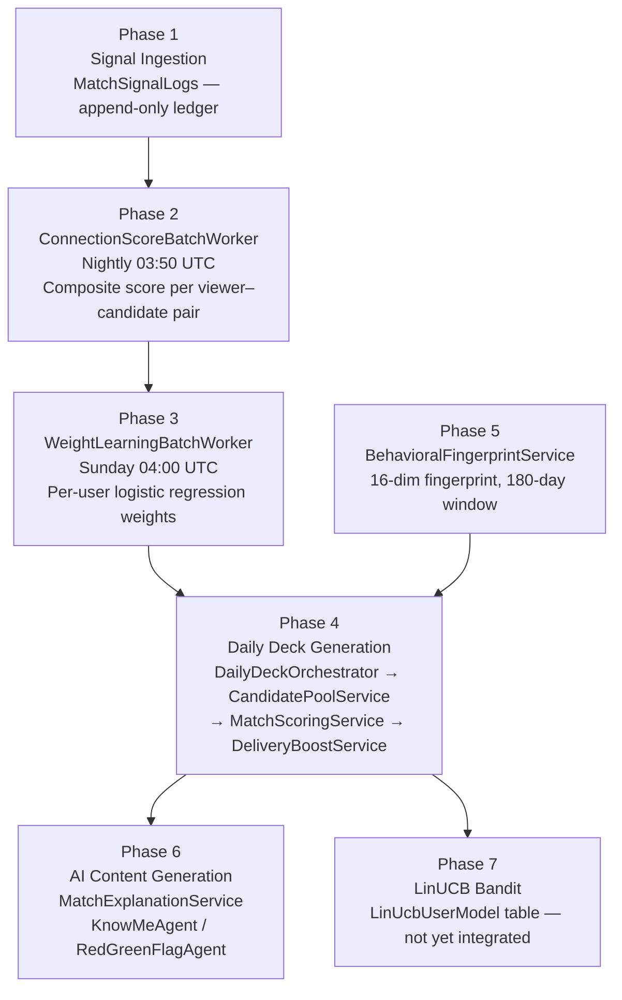
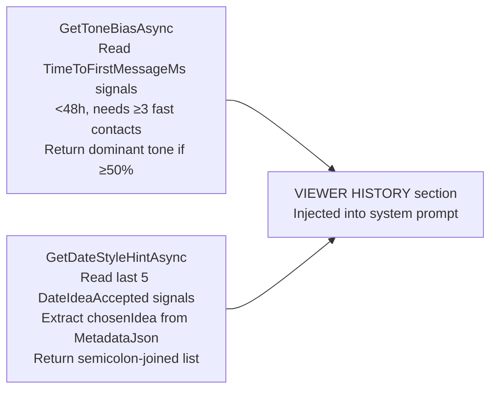
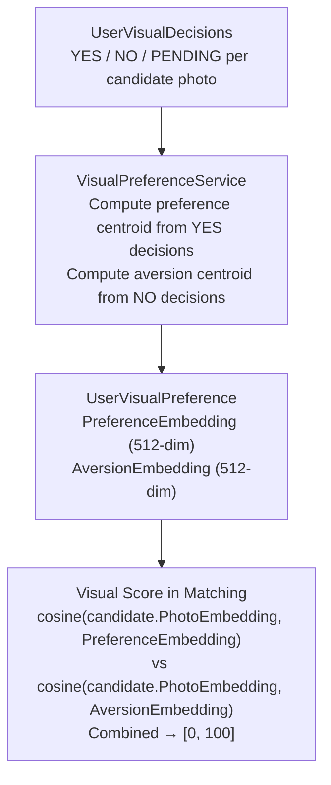

# ECHO: AI Intelligence Deep Dive

> Cross-references: [Signals, Vectors & Scoring](../signals/SIGNALS_VECTORS_SCORING.md) | [AI/ML Documentation](../technical/AI_ML_DOCUMENTATION.md)

---

## What ECHO Is

ECHO is Woven's matching AI pipeline. It does not ask users what they want and then filter candidates to fit those answers. Instead, it watches how users actually behave — what they dwell on, how fast they reply, whether they continue trials, whether games land — and builds a continuously updated model of what each individual genuinely responds to. Stated preferences are one small input; revealed behavior is the primary signal.

Every component of ECHO is invisible to the user. There are no compatibility scores displayed, no "AI pick" labels, no match percentage bars. The intelligence surfaces only as better deck ordering and more relevant date ideas.

---

## Seven Phases of ECHO



### Phase 1 — Signal Ingestion

All behavioral signals write to `MatchSignalLogs`, an append-only ledger. No signal is ever overwritten or deleted. `OccurredAt` is the timestamp field on every row. Signal types are constants defined in `MatchSignalEventTypes`.

Every user action that carries behavioral information — opening a thread, sending a message, reacting with love, finishing a game, listening to a voice note to completion, popping a balloon, picking a date idea — becomes a row in this table. The ledger is the ground truth for every downstream ECHO computation.

See [Signals, Vectors & Scoring — Signal Taxonomy](../signals/SIGNALS_VECTORS_SCORING.md#signal-taxonomy) for the full enumeration of signal types.

### Phase 2 — ConnectionScoreBatchWorker

Runs nightly at 03:50 UTC. For every (viewer, candidate) pair that has any signal activity, it computes a composite `ConnectionScore` in [0, 1] from seven behavioral signals:

1. **BalloonPop** — did the balloon connection get popped at all?
2. **TrialAccepted** — did the trial period result in CONTINUE?
3. **ChatDepthMessages** — message depth in the thread
4. **TimeToFirstMessageMs** — how quickly the viewer sent a first message
5. **DateIdeaAccepted** — did the viewer choose a date idea?
6. **ExplicitFeedback** — explicit positive feedback value
7. **Love reactions** — ChatNoteLove + MessageLove combined

The output is upserted to the `ConnectionScores` table, one row per (viewer, candidate) pair. Pairs where Score ≈ 0.05 — indicating a balloon was popped but no real conversation occurred — are excluded from weight learning by the `MinConnectionScore = 0.08f` threshold in Phase 3.

### Phase 3 — WeightLearningBatchWorker

Runs weekly on Sunday at 04:00 UTC. Calls `WeightLearningService` for every user who has enough qualifying data.

The algorithm is mini-batch logistic regression (gradient ascent on log-likelihood, equivalent to binary cross-entropy minimization):

```
Parameters:
  MinSamples     = 10       (minimum qualifying ConnectionScores to proceed)
  LearningRate   = 0.01
  Iterations     = 100
  L2Lambda       = 0.01     (L2 regularization coefficient)
  MinWeight      = 0.01     (post-normalization floor per component)
  MaxWeight      = 0.50     (post-normalization ceiling per component)
  MinConnectionScore = 0.08 (excludes balloon-only pairs from training)
```

**Algorithm steps:**

1. Load ConnectionScores for the viewer where Score ≥ 0.08
2. If fewer than 10 qualifying scores, skip this user entirely
3. Score those candidates via `MatchScoringService` to produce a 16-dimensional feature vector **x** per candidate
4. Use the ConnectionScore as the pseudo-probability label **y** ∈ [0, 1]
5. Warm start: load existing `UserMatchingWeights` or fall back to `DefaultWeights`
6. Run 100 gradient ascent iterations:
   - gradient = Σ(**y** − sigmoid(**w**·**x**)) × **x**
   - **w** += lr × (gradient/n − 2λ**w**)
   - Clip each weight to [0.01, 0.50]
7. Normalize: **w** = **w** / sum(**w**), then re-clip to [0.01, 0.50]
8. Persist to `UserMatchingWeights` (upsert per component)
9. Log the top-weighted component to `AnalyticsService`

**Weight override rule:** Learned weights replace base weights in scoring only when ≥ 8 of the 16 components have `SampleCount ≥ 5`. Below that threshold, base weights are used unchanged.

### Phase 4 — Daily Deck Generation

`DailyDeckOrchestrator` coordinates three services:

1. **CandidatePoolService** — builds the candidate pool from the database, applying hard filters (blocked users, already-matched users, etc.)
2. **MatchScoringService** — scores each candidate against the viewer using 16 weighted components (see [Scoring Components](#scoring-components) below)
3. **DeliveryBoostService** — applies a 12-step boost/penalty pipeline on top of raw scores to produce final deck ordering

See [AI/ML Documentation — DeliveryBoostService](../technical/AI_ML_DOCUMENTATION.md#deliveryboostservice) for the full boost pipeline.

### Phase 5 — BehavioralFingerprintService

Computes a 16-dimensional behavioral fingerprint per user from a 180-day signal window. This fingerprint captures behavioral style rather than content — how a user moves through the app, how expressive they are, how open they are to different connection types.

Missing data defaults to 0.5 (neutral midpoint) so that sparse users are not unfairly penalized or inflated.

See [Signals, Vectors & Scoring — Behavioral Fingerprint](../signals/SIGNALS_VECTORS_SCORING.md#behavioral-fingerprint) for all 16 dimensions.

### Phase 6 — AI Content Generation

Three services generate AI content informed by the ECHO pipeline:

- **MatchExplanationService** — per-pair headline + bullets + 3 date ideas
- **KnowMeAgent** — personalized trivia questions about the target
- **RedGreenFlagAgent** — provocative statements for the flag game

All three are injected with `PairContext`, which carries the output of profile scoring (shared hobbies, aligned pillars, tone alignment, data quality). All three call `gpt-4.1-mini` via `IOpenAiResilientClient`.

### Phase 7 — LinUCB Bandit (Planned)

The `LinUcbUserModel` table exists in the database. A LinUCB contextual bandit model is planned to handle exploration vs. exploitation in deck ordering — surfacing less-seen candidates when the model is uncertain — but it is not yet integrated into scoring or delivery.

---

## Scoring Components

`MatchScoringService` computes a weighted sum of 16 components. Base weights sum to 1.0:

| # | Component | Base Weight | Embedding / Source |
|---|---|---|---|
| 1 | pillar | 0.19 | 1536-dim cosine (text-embedding-3-small) |
| 2 | intent | 0.12 | 1536-dim cosine |
| 3 | visual | 0.10 | 512-dim cosine (CLIP-style) |
| 4 | expression | 0.09 | 1536-dim cosine |
| 5 | style | 0.09 | 128-dim cosine |
| 6 | lifestyle | 0.08 | Rule-based (see below) |
| 7 | voice | 0.08 | 192-dim cosine (ECAPA-TDNN) |
| 8 | orbit_gravity | 0.08 | OrbitGravity × e^(-0.1×days), log scale, cap +15 |
| 9 | humor | 0.07 | 64-dim cosine |
| 10 | pulse | 0.06 | Weekly vibe alignment |
| 11 | behavioral_lifestyle | 0.05 | Behavioral fingerprint lifestyle dims |
| 12 | shared_tile_affinity | 0.05 | Shared tile embedding similarity (stub — needs CfScore) |
| 13 | emotional_rhythm | 0.04 | 48-dim cosine |
| 14 | preference_affinity | 0.04 | Stated preference affinity |
| 15 | attachment | 0.04 | 4-dim cosine (secure/anxious/avoidant/fearful) |
| 16 | cf | 0.03 | CfScores table (stub — worker not running) |

**CosineSimilarity mapping:** All cosine values are mapped from [-1, 1] → [0, 100].

**Lifestyle scoring rules (rule-based, not embedding):**

| Signal | Effect |
|---|---|
| Children mismatch | -30 |
| Children match | +20 |
| Smoking match | +15 |
| Diet mismatch | -10 |
| Religion match | +10 |
| Drinking | ±8–10 |
| Workout | ±8–10 |

---

## AiProfileService — Profile Intelligence

`AiProfileService` is the foundation for all AI content generation. It computes a profile's data completeness, assigns a quality tier, builds `PairContext` objects, and detects conversation tone.

### Data Completeness Scoring

| Factor | Weight |
|---|---|
| Pillar variance | 40% |
| Tags | 25% |
| Hobbies | 15% |
| Pulse | 10% |
| Intent | 10% |

### Data Quality Tiers

| Tier | Threshold |
|---|---|
| HIGH | completeness ≥ 0.6 |
| MEDIUM | completeness ≥ 0.3 |
| LOW | completeness < 0.3 |

When `DataQuality` is LOW or `UsedCohortDefaults` is true, a cohort fallback is used: 50 users sampled with age ±5, same gender, active in the last 30 days. This cohort's aggregate profile is used for games and explanations instead of the individual's sparse data.

### ConversationTone Detection

Read from pillar data. Four categories:

| Tone | Condition |
|---|---|
| PLAYFUL | High banter + high social capacity |
| THOUGHTFUL | High depth + low banter |
| CALM | Low social + high depth |
| BALANCED | Default — does not fit other categories |

### IntentAlignment Scoring

| Score | Meaning |
|---|---|
| 1.0 | Exact intent match |
| 0.85 | Same intent group (e.g., both long-term) |
| 0.6 | One user is "exploring" |
| 0.3 | Serious/casual mismatch |

### PairContext Object

Injected into all game prompts and explanation prompts:

```
PairContext {
  SharedHobbies: list<string>
  AlignedPillars: list<{ Pillar, similarity }>
  SharedTags: list<string>
  ToneAlignment: string
  UserProfile: { DataQuality, UsedCohortDefaults }
  CandidateProfile: { DataQuality, UsedCohortDefaults }
}
```

### Prompt Injection Protection

Eight regex patterns are screened from all user-provided text before it is embedded in any prompt:

- `ignore previous`
- `system:`
- `endoftext` tokens
- `assistant:`
- `human:`
- `[INST]`
- (and 2 additional patterns)

PII sanitization runs before injection: email addresses and phone numbers are stripped via regex, and all user-provided inputs are truncated to 200 characters.

---

## MatchExplanationService

Generates per-(viewer, candidate) pair explanation content. Stored in `MatchExplanations`.

**Output fields:**
- `Headline` — single string
- `Bullets` — list of strings
- `DateIdeasJson` — JSON array of 3 date ideas, each ≤ 15 words, distinct activity types. At least one idea must incorporate shared hobbies if any exist.
- `DateIdea` — single string, retained for backward compatibility

**Tone feedback loop:**



**Fallback (no OpenAI available):** Hardcoded sets of 3 date ideas per `MatchBucket` (CORE_FIT, etc.).

**OpenAI call:** `_openAi.ExecuteAsync("match-explanation", prompt, useJson: true, ct)` using `gpt-4.1-mini`.

---

## KnowMeAgent

Personalized trivia game where the guesser answers questions about the target based on the target's profile data, then the target answers about themselves. Score = how often guess matches answer.

**Format:** 3 questions per round

**Difficulty calibration:**

| Level | Target guessability |
|---|---|
| EASY | 80% |
| MEDIUM | 50% |
| HARD | 30% |

**Tone modes:** PLAYFUL, THOUGHTFUL, BALANCED

**Anti-generic rules:** The following patterns are explicitly banned from generated questions:
- "weekend vibe"
- "coffee order"
- "stress handling"
- "going out vs staying in"
- (additional patterns)

**Low data fallback (DataQuality = LOW):** Broader exploratory questions rather than profile-specific ones.

**Hardcoded fallback questions (used when OpenAI is unavailable):**
1. "How do you recharge after a long week — alone or with others?"
2. "When you disagree with someone close, what do you usually do?"
3. "What would your ideal first date look like?"

**OpenAI call:** `_openAi.ExecuteAsync("game-knowme", prompt, useJson: true, ct)`

**Response format:**
```json
{
  "questions": [
    {
      "id": "...",
      "text": "...",
      "difficulty": "EASY|MEDIUM|HARD",
      "options": [
        { "id": "...", "text": "...", "isCorrect": true|false }
      ]
    }
  ]
}
```

---

## RedGreenFlagAgent

Flag game where the guesser labels statements about the target as GREEN / YELLOW / RED / DEPENDS. Target then self-labels. Score = alignment count.

**Format:** 3 statements per round about the target person

**Labels:**
- GREEN — positive / attractive
- YELLOW — uncertain / context-dependent
- RED — dealbreaker / unattractive
- DEPENDS — fully situational

**Time limit:** 90 seconds per round

**Statement construction rules:**
- Must reference the target's actual traits, tags, or hobbies
- No heavy topics: trauma, exes, politics, religion, medical/mental health, explicit sex
- Mix: one light lifestyle habit, one social/communication habit, one dating preference
- Short (1 sentence), provocative and fun
- No texting speed, ghosting, reply habits, coffee preferences, exes, or weekend plans

**Data quality check:** If DataQuality is LOW or UsedCohortDefaults is true, statements use broader phrasing: "tends to" / "likely to" language rather than specific traits.

**Post-game insight:** 1–2 sentence dating-app-friendly insight generated from alignment scores.

**Hardcoded fallback statements:**
1. "They'll cancel plans last minute if they're drained — and tell you honestly." (EASY)
2. "They want their partner to have a full life outside the relationship." (MEDIUM)
3. "They'd rather have an awkward honest conversation than let tension sit." (HARD)

**OpenAI call:** `_openAi.ExecuteAsync("game-redflag", prompt, useJson: true, ct)`

**Response format:**
```json
{
  "statements": [
    { "text": "...", "difficulty": "EASY|MEDIUM|HARD" }
  ]
}
```

---

## OpenAI Integration

- **Model:** `gpt-4.1-mini` (all calls)
- **Daily budget:** $50
- **Client:** `IOpenAiResilientClient`
  - Circuit breaker
  - Retry with exponential backoff
  - Per-operation cost tracking (tagged by operation name: `"game-knowme"`, `"game-redflag"`, `"match-explanation"`)
- **Call pattern:** `ExecuteAsync(operationName, prompt, useJson, ct)`

---

## Visual Preference System



`AttachmentProxyService` computes a 4-dimensional attachment proxy (secure / anxious / avoidant / fearful) from pillar answers. This feeds into the `attachment` scoring component.

---

## What Is Not Yet Built

| Gap | Impact |
|---|---|
| CfScore batch job | `CollaborativeFilteringService` exists but no worker runs it — `cf` score component is always 0 |
| SharedTileAffinity | Stub only — requires CfScore data, not computed |
| PreferenceEmbedding from ChatNotes | Worker stub exists but is not wired |
| LinUCB bandit | Table exists (`LinUcbUserModel`) — not integrated into scoring |
| Ambition pillar | No foundational question covers this pillar — pillar embedding is incomplete |

---

> See also: [Signals, Vectors & Scoring](../signals/SIGNALS_VECTORS_SCORING.md) | [AI/ML Documentation](../technical/AI_ML_DOCUMENTATION.md)
