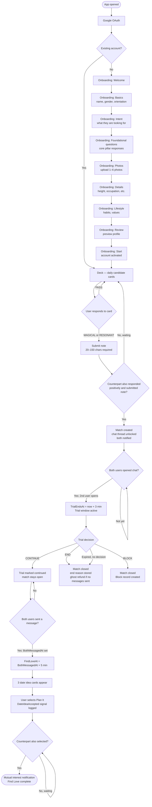
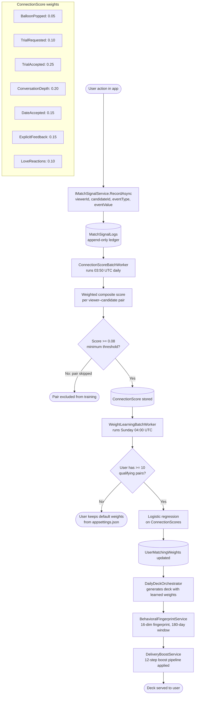
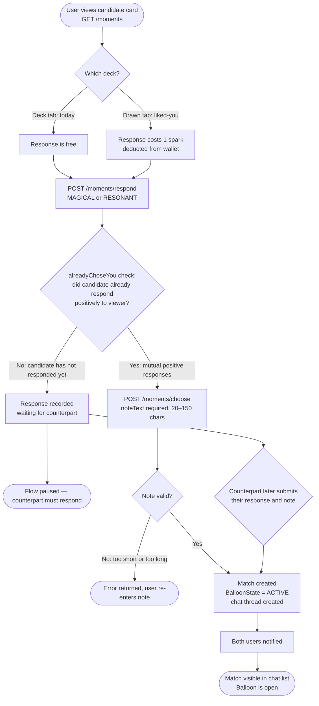
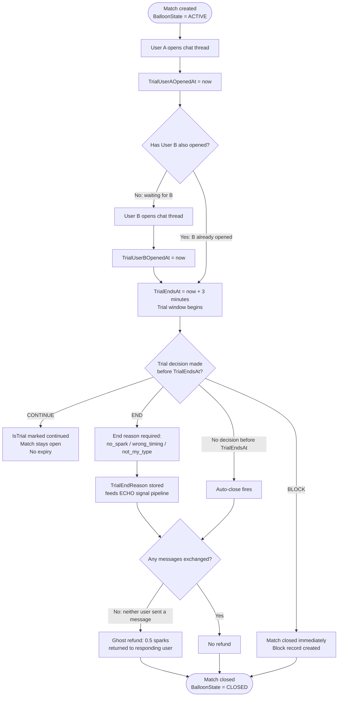
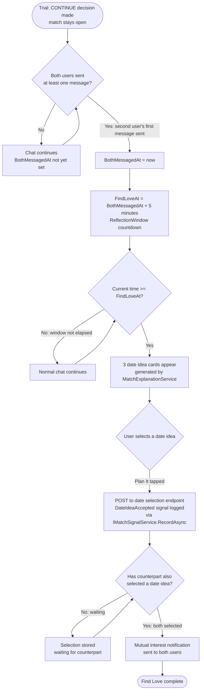

# Woven — System Flowcharts

All diagrams use Mermaid syntax. Render with any Mermaid-compatible viewer (GitHub, GitLab, Obsidian, mermaid.live).

---

## Flowchart 1: User Lifecycle

---

## Flowchart 2: ECHO ML Pipeline

---

## Flowchart 3: Balloon Pop — Match Creation

---

## Flowchart 4: Trial Period

---

## Flowchart 5: Find Love Flow

