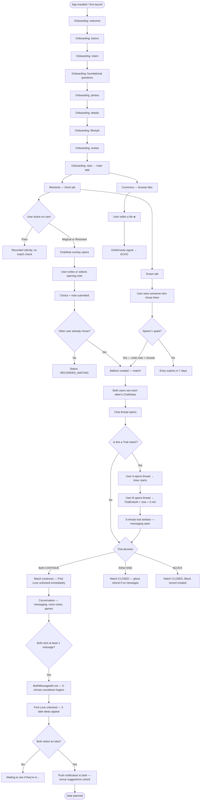
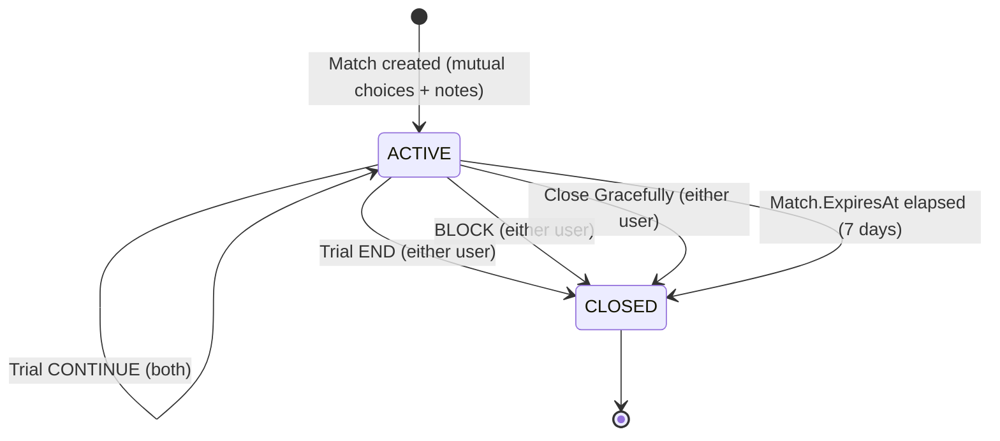

# Woven — User Lifecycle

This document traces the complete journey of a Woven user from first launch to a planned date. Each stage is described in detail with the decision points, state transitions, and ECHO signals involved.

---

## Full Lifecycle Overview



---

## Stage 1: Onboarding

Onboarding is a sequential, gate-checked flow. Users cannot access any main app surface until onboarding is complete. The OnboardingGate component at `/app` reads the user's current step and redirects accordingly.

### Steps in Order

| Step | Route | What Happens |
|---|---|---|
| welcome | `/onboarding/welcome` | Introduction screen |
| basics | `/onboarding/basics` | Name, gender, pronouns, birthday, city/state collected |
| intent | `/onboarding/intent` | Relationship intent selected; 1-sentence reflection written and encrypted |
| foundational | `/onboarding/foundational` | AI-generated questions covering 5 pillar dimensions answered |
| photos | `/onboarding/photos` | Profile photo(s) uploaded |
| details | `/onboarding/details` | Optional fields (hobbies, etc.) filled |
| lifestyle | `/onboarding/lifestyle` | Diet, workout, children preference, drinking, smoking, religion |
| review | `/onboarding/review` | Summary of full profile shown for confirmation |
| start | `/onboarding/start` | Final step; user enters main app |

### What the Foundational Step Produces

The foundational questions are AI-generated and cover 5 pillar dimensions. The answers produce a pillar score vector that ECHO uses as a baseline for compatibility scoring from the user's first day. This is the only structured preference data ECHO collects at onboarding — everything else is learned from behavior.

---

## Stage 2: First Day in the App

After completing onboarding, the user lands in Moments. Their daily Deck is ready — curated by ECHO using the pillar scores from onboarding plus any available collaborative filtering signals from similar users.

### Day 1 Deck Experience

On day 1, ECHO has only pillar scores and demographics to work with. As the user responds to cards (even Passes), ECHO begins accumulating behavioral signals. Visual preference learning begins on the first MAGICAL or RESONANT response.

A new user will see up to 5 profiles. Each card shows:
- Name
- Verification badge (if verified)
- Match explanation: a headline and 2–3 bullets explaining why ECHO surfaced this person
- ◈ Magical and ◇ Resonant action buttons
- — Pass

### Day 1 Commons Experience

The user can browse Commons tiles at any time. Orbiting (◈) a tile sends OrbitGravity into ECHO immediately. Dwell time on tiles is also captured. Both signals begin improving ECHO's candidate pool ranking for (viewer, tile owner) pairs from day 1.

---

## Stage 3: From Response to Match

### Submitting a Choice

When a user taps ◈ Magical or ◇ Resonant on a deck card:

1. The ChatNote overlay opens
2. The user writes 20–150 characters (or selects a starter phrase: "Your photo made me want to say…", "I'd love to talk about…", "Something tells me we'd…")
3. The choice and note are submitted together

### After Submission

The status of the (viewer, candidate) pair enters one of several states:

| State | Meaning |
|---|---|
| RECORDED_WAITING | Viewer chose positively; candidate has not responded yet |
| WAITING_FOR_OTHER_NOTE | Candidate chose positively; they have not written their note yet |
| PURE_MATCH_CREATED | Mutual match — both chose same type (both Magical or both Resonant) |
| EDGE_MATCH_CREATED | Mutual match — different types chosen |

When a match is created, both users receive navigation to the chat thread and can see each other's opening ChatNotes for the first time.

### Drawn Tab Path

If the viewer is responding to someone in the Drawn tab (someone who already chose them):
- The same ChatNote requirement applies
- 1 spark is deducted from SparkWallet before the choice is processed
- If the spark wallet is at 0, the action cannot be completed

---

## Stage 4: The Chat Thread

Once a Balloon exists, the chat thread is the primary interaction surface. All of the following are available in the thread:

- Text messaging
- Voice notes (hold-to-record, up to 180 seconds)
- ◈ reactions on messages and ChatNotes
- Games (Know Me, Red Flag / Green Flag)
- Availability signal ("I'm free: {text}", up to 200 characters) — pushes notification to partner
- Nudge prompts from the NudgeService (dismissible for 48 hours)
- Close Gracefully option (ends match without ghosting penalty)

### Trial Period (if applicable)

If the match is a Trial match (IsTrial = true):

1. When User A opens the thread: `TrialUserAOpenedAt` is set
2. When User B opens the thread: `TrialUserBOpenedAt` is set; `TrialEndsAt = now + 3 minutes`
3. For 3 minutes, the thread functions normally
4. After 3 minutes, the trial decision UI appears for both users:
   - **CONTINUE**: I want to keep talking
   - **END**: This isn't right (reason: no_spark / wrong_timing / not_my_type)
   - **BLOCK**: Close and block immediately
5. If both CONTINUE → match continues; `FindLoveAt = now`
6. If either ENDs → match CLOSED (UNMATCH); ghost refund fires if no messages exchanged
7. BLOCK → match CLOSED (BLOCK); Block record created

ECHO captures the trial decision and end reason as behavioral signals. These inform future candidate scoring without being shown to either user.

---

## Stage 5: Find Love

Find Love is the final stage before a date.

### Trigger Conditions

- Both users must have sent at least 1 message in the thread
- 5 minutes must have elapsed since `BothMessagedAt`

During the 5-minute window, `showBalloonTimer = true` — the user sees a countdown.

### When Find Love Unlocks

`showFindLove = true`. Three date ideas appear in the thread. Each idea:
- Is under 15 words
- Covers a distinct activity type (one active, one social, one casual)
- Incorporates shared hobbies if detected
- Is personalized using the viewer's history: prior date idea choices, conversation tone, speed of first contact

Each user selects one idea by tapping "Plan It." Until both have selected, each sees "Waiting to see if they're in…"

When both select → push notification fires to both users, venue suggestions unlock.

### Fallback Behavior

If OpenAI is unavailable when date ideas are generated, ECHO falls back to hardcoded ideas keyed to the match bucket type.

---

## Stage 6: Match Closure

Matches close via one of several paths. The Balloon (BalloonState) transitions to CLOSED.

### Close Paths

| Path | Who Initiates | Ghost Refund |
|---|---|---|
| Close Gracefully | User action in thread | Yes, if no messages exchanged |
| Trial END decision | User selects END | Yes, if no messages exchanged |
| Auto-close (trial expired, no CONTINUE) | System | Yes, if no messages exchanged |
| BLOCK | User action | No |
| Balloon expiry (7 days) | System (Match.ExpiresAt elapsed) | Depends on message state |

### Ghost Refund

When a match closes with no messages exchanged, both users receive 0.5 sparks back. This partial refund fires on three paths: Close Gracefully, trial END decision, and auto-close of an expired trial.

The refund exists to make ghost matching less costly to both parties — but not free. The 0.5 spark loss (from the original 1-spark Drawn action, if applicable) remains as a small penalty for entering a match passively.

---

## ECHO Signal Accumulation Across the Lifecycle

Each stage of the lifecycle produces behavioral signals that ECHO accumulates:

| Lifecycle Stage | Signals Produced |
|---|---|
| Onboarding (foundational) | Pillar answer vectors |
| Deck response (Magical/Resonant) | Visual preference signal, photo embedding feedback |
| Deck response (Pass) | Implicit negative signal |
| Commons Orbit | OrbitGravity |
| Commons dwell | Implicit interest signal |
| Trial CONTINUE / END | TrialContinued / TrialEndedNoSpark etc. |
| Trial end reason | no_spark / wrong_timing / not_my_type |
| First message speed | TimeToFirstMessageMs |
| Message count | ChatDepthMessages |
| Voice note listen | VoiceNoteListenComplete |
| Mutual voice exchange | MutualVoiceExchange |
| Date idea selection | DateIdeaAccepted (idea text + index) |

ECHO's weight learning batch runs weekly (Sunday 04:00 UTC), using logistic regression on composite outcome scores computed nightly (03:50 UTC). After enough lifecycle data, the candidate ranking for each user is shaped by their personal behavioral history — not a shared global ranking function.

---

## Lifecycle States — Balloon State Machine



---

## Returning User Loop

After a user has been in the app for some time, their daily routine in Woven looks like this:

```
Open app
  │
  ├── Moments / Deck: up to 5 responses today
  │     ├── Write notes for Magical/Resonant choices
  │     └── ECHO learns from each response
  │
  ├── Commons: browse tiles, orbit what resonates
  │     └── OrbitGravity and dwell signals feed ECHO
  │
  ├── Chats: check active threads
  │     ├── New messages, voice notes, reactions
  │     ├── Trial decisions (if applicable)
  │     ├── Find Love date ideas (if unlocked)
  │     └── Games with match
  │
  └── Drawn: respond to people who chose them
        └── Costs 1 spark; note required
```

---

*See also: [PRODUCT_STORY.md](PRODUCT_STORY.md) | [HIGH_LEVEL_DESIGN.md](HIGH_LEVEL_DESIGN.md) | [FEATURES.md](FEATURES.md)*
