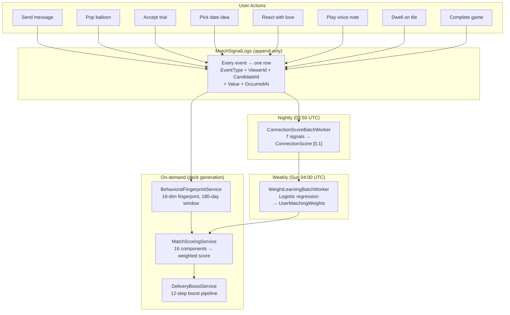
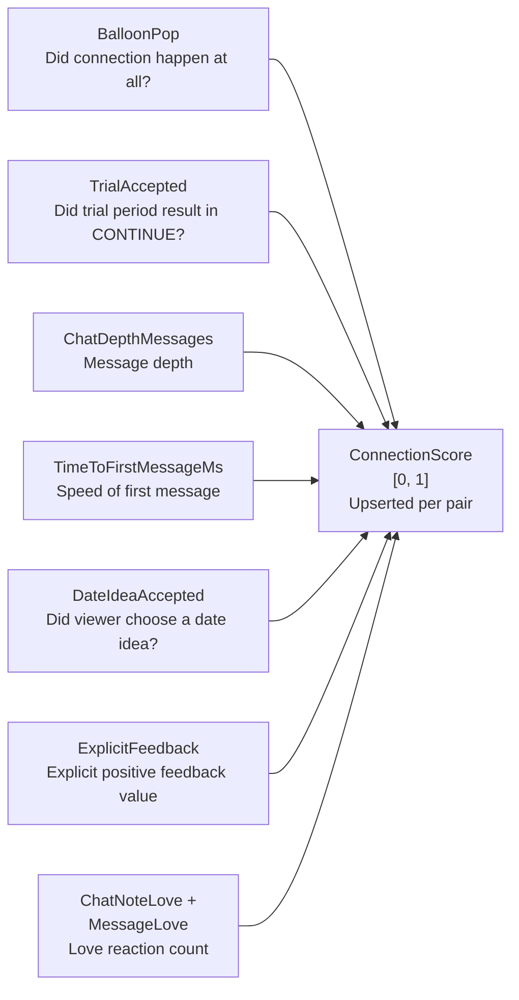
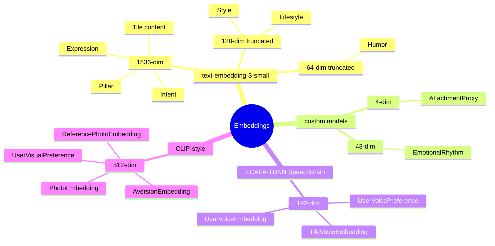
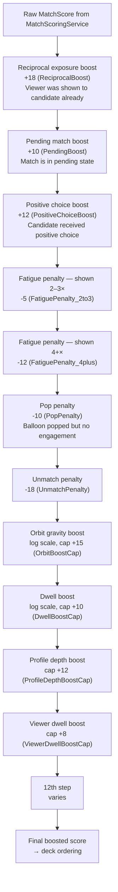
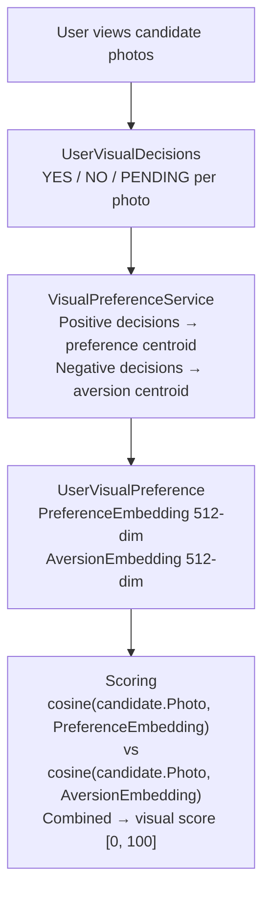

# Signals, Vectors & Scoring

> Cross-references: [AI Intelligence Deep Dive](../ai_intelligence/AI_INTELLIGENCE_DEEP_DIVE.md) | [AI/ML Documentation](../technical/AI_ML_DOCUMENTATION.md)

---

## Overview

The ECHO matching pipeline has two distinct data foundations:

1. **Behavioral signals** — timestamped events in `MatchSignalLogs`, capturing what users actually do
2. **Vector embeddings** — high-dimensional numeric representations of who users are (text, voice, visual)

Scoring combines both: embeddings drive the 16 cosine-similarity components in `MatchScoringService`, while behavioral signals drive `ConnectionScoreBatchWorker`, `WeightLearningService`, and `BehavioralFingerprintService`. Neither works without the other.

---

## Signal Taxonomy

All signals are written to `MatchSignalLogs` (append-only) via `IMatchSignalService.RecordAsync(...)`. The `OccurredAt` field is the timestamp. Signal types are constants in `MatchSignalEventTypes`.

### Complete Signal Type Reference

| EventType | What It Captures | Used In |
|---|---|---|
| `TimeToFirstMessageMs` | Speed of first message after match | ConnectionScore, BehavioralFingerprint (dims 9), WeightLearning labels |
| `ChatDepthMessages` | Total message count in thread | ConnectionScore |
| `MessageSent` | Individual message sent event | BehavioralFingerprint (dim 1) |
| `MessageResponseLatencyMs` | Per-message response time | BehavioralFingerprint (dim 0) |
| `SelfDisclosureRatio` | How much user reveals about themselves [0,1] | BehavioralFingerprint (dims 2, 3) |
| `ChatNoteLove` | Love reaction on a ChatNote | ConnectionScore, BehavioralFingerprint (dim 5) |
| `MessageLove` | Love reaction on a message | ConnectionScore, BehavioralFingerprint (dim 5) |
| `ExplicitFeedback` | Explicit positive/negative feedback value | ConnectionScore, BehavioralFingerprint (dim 6) |
| `TileDwell` | Dwell time on a commons tile (ms) | BehavioralFingerprint (dim 7) |
| `VoiceDwell` | Dwell time on a voice note (ms) | BehavioralFingerprint (dim 8) |
| `ProfileVisitDepth` | How far viewer scrolled on a match profile (tile count) | BehavioralFingerprint (dim 11) |
| `GameCompleted` | Game session completed | BehavioralFingerprint (dim 12) |
| `BalloonPop` | Balloon connection popped | ConnectionScore, BehavioralFingerprint (dim 13) |
| `TrialContinued` | Trial period decision = CONTINUE | ConnectionScore |
| `TrialAccepted` | Trial accepted (alias for TrialContinued) | BehavioralFingerprint (dim 4) |
| `TrialRejected` | Trial rejected (any END reason) | BehavioralFingerprint (dim 4) |
| `TrialEndedNoSpark` | Trial ended with reason = no_spark | Analytics |
| `DateIdeaAccepted` | User clicked "Plan It" on a date idea | ConnectionScore, BehavioralFingerprint (dim 10) |
| `DateIdeaRejected` | User ignored date idea | BehavioralFingerprint (dim 10) |
| `VoiceNoteListenComplete` | Voice note played to completion | Analytics |
| `MutualVoiceExchange` | Both users sent voice notes in same thread | Analytics |
| `UserFlagged` | Safety flag | **NEVER mixed into compatibility scoring** |
| `OrbitGravityScore` | Orbit gravity computed for pair | Scoring component orbit_gravity |
| `WeightLearningRun` | Analytics: weight learning run completed | Analytics only |

### Safety Signal Isolation

`UserFlagged` is stored in `MatchSignalLogs` like all other signals but is explicitly excluded from every compatibility computation. It is a platform safety signal, not a compatibility signal.

---

## Signal Flow Through ECHO



---

## ConnectionScore Computation

`ConnectionScoreBatchWorker` runs nightly at 03:50 UTC and produces one `ConnectionScore` per (viewer, candidate) pair.

The seven contributing signals and their roles:



**Exclusion threshold:** Pairs where ConnectionScore ≈ 0.05 (balloon popped but no real conversation) are excluded from weight learning by the `MinConnectionScore = 0.08f` filter in `WeightLearningService`. This prevents phantom "matches" with no behavioral signal from polluting the training data.

---

## Behavioral Fingerprint

`BehavioralFingerprintService` produces a 16-dimensional vector per user from a 180-day signal window. Missing data defaults to 0.5 (neutral).

### All 16 Dimensions

| Dim | Name | Source Signal | Formula |
|---|---|---|---|
| 0 | response_speed | `MessageResponseLatencyMs` | `1 / (1 + mean / 1_800_000)` — 30-min half-life |
| 1 | message_volume | `MessageSent` | `count / (candidates × 10)`, capped at 1.0 |
| 2 | self_disclosure_mean | `SelfDisclosureRatio` | mean value [0, 1] |
| 3 | disclosure_balance | `SelfDisclosureRatio` | `1 − 2 × |mean − 0.5|` |
| 4 | trial_affinity | `TrialAccepted`, `TrialRejected` | `accepted / (accepted + rejected)` |
| 5 | love_expressiveness | `ChatNoteLove` + `MessageLove` | `count / (candidates × 2)`, capped at 1.0 |
| 6 | feedback_positivity | `ExplicitFeedback` | mean value [0, 1] |
| 7 | tile_curiosity | `TileDwell` | `mean / 8000 ms threshold` |
| 8 | voice_curiosity | `VoiceDwell` | `mean / 8000 ms threshold` |
| 9 | first_msg_speed | `TimeToFirstMessageMs` | `1 / (1 + mean / 86_400_000)` — 24-h half-life |
| 10 | date_progression | `DateIdeaAccepted`, `DateIdeaRejected` | `accepted / (accepted + rejected + 1)` |
| 11 | profile_exploration | `ProfileVisitDepth` | `mean / 5 tiles` |
| 12 | game_engagement | `GameCompleted` | `count / 10` |
| 13 | balloon_eagerness | `BalloonPop` | `count / 20` |
| 14 | engagement_breadth | all signals | `distinct candidates / 50` |
| 15 | signal_density | all signals | `total signal count / 500` |

### Design Rationale for Key Dimensions

**response_speed (dim 0):** Uses a 30-minute half-life (`1_800_000 ms`). A user who responds in 5 minutes scores close to 1.0; one who responds in 8 hours scores well below 0.5. This is per-message latency, not first-message latency.

**first_msg_speed (dim 9):** Uses a 24-hour half-life (`86_400_000 ms`). The longer normalization window reflects that first-message timing is influenced by when users check the app, not purely enthusiasm.

**disclosure_balance (dim 3):** Measures whether a user's self-disclosure is balanced (near 0.5) rather than either extreme. `1 − 2×|mean − 0.5|` peaks at 1.0 when mean = 0.5 and bottoms at 0.0 at the extremes. Over-disclosers and under-disclosers both score low.

**engagement_breadth (dim 14):** Distinct candidates with any signal, normalized to 50. Distinguishes users who engage broadly with the pool from users who fixate on few candidates.

**signal_density (dim 15):** Raw signal count normalized to 500. A general activity indicator — denser signal = richer training data for that user.

---

## Vector Embedding Architecture

### UserVector Table

All columns are pgvector columns with HNSW indexes. The HNSW index syntax requires raw SQL — it is not expressible via EF Core fluent API. The `vector` extension is registered via `modelBuilder.HasPostgresExtension("vector")` and HNSW indexes are applied via separate migration SQL.

| Column | Dims | Model | Content Embedded |
|---|---|---|---|
| `PillarEmbedding` | 1536 | text-embedding-3-small | Concatenated pillar answers |
| `ExpressionEmbedding` | 1536 | text-embedding-3-small | Writing style / expression |
| `IntentEmbedding` | 1536 | text-embedding-3-small | Relationship intent text |
| `StyleEmbedding` | 128 | text-embedding-3-small (truncated) | Communication style |
| `HumorEmbedding` | 64 | text-embedding-3-small (truncated) | Humor signal |
| `LifestyleEmbedding` | 128 | text-embedding-3-small (truncated) | Lifestyle description |
| `EmotionalRhythmEmbedding` | 48 | custom | Emotional pattern |
| `AttachmentProxyEmbedding` | 4 | custom | secure / anxious / avoidant / fearful |
| `VoiceEmbedding` | 192 | ECAPA-TDNN (SpeechBrain) | Voice signature from voice tiles |

### Other pgvector Columns

| Table.Column | Dims | Model | Content |
|---|---|---|---|
| `Tile.Embedding` | 1536 | text-embedding-3-small | Tile content (text/photo/video/voice descriptions) |
| `Tile.VoiceEmbedding` | 192 | ECAPA-TDNN | Voice tile audio |
| `PhotoEmbedding.Embedding` | 512 | CLIP-style | Per-photo visual embedding |
| `UserVisualPreference.PreferenceEmbedding` | 512 | CLIP-style | Learned visual preference centroid |
| `UserVisualPreference.AversionEmbedding` | 512 | CLIP-style | Learned visual aversion centroid |
| `UserVoicePreference.PreferenceEmbedding` | 192 | ECAPA-TDNN | Voice preference |
| `ReferencePhotoEmbedding.Embedding` | 512 | CLIP-style | Catfish detection reference photo |

### Embedding Dimension Summary



### How Embeddings Feed Scoring

Each embedding-based scoring component computes cosine similarity between viewer and candidate vectors, then maps [-1, 1] → [0, 100]:

```
score = (cosine_similarity + 1) / 2 × 100
```

This ensures all components are on the same [0, 100] scale before weighted summation.

---

## MatchScoringService — Detailed Component Breakdown

### Embedding-Based Components

| Component | Weight | Viewer Vector | Candidate Vector | Notes |
|---|---|---|---|---|
| pillar | 0.19 | PillarEmbedding | PillarEmbedding | Highest weight — core identity alignment |
| intent | 0.12 | IntentEmbedding | IntentEmbedding | Also uses rule-based IntentAlignment score from AiProfileService |
| visual | 0.10 | UserVisualPreference.PreferenceEmbedding | PhotoEmbedding.Embedding | Combined with AversionEmbedding |
| expression | 0.09 | ExpressionEmbedding | ExpressionEmbedding | Writing style similarity |
| style | 0.09 | StyleEmbedding (128-dim) | StyleEmbedding (128-dim) | Communication style |
| voice | 0.08 | VoiceEmbedding (192-dim) | VoiceEmbedding (192-dim) | ECAPA-TDNN voice signature |
| humor | 0.07 | HumorEmbedding (64-dim) | HumorEmbedding (64-dim) | Humor compatibility |
| emotional_rhythm | 0.04 | EmotionalRhythmEmbedding (48-dim) | EmotionalRhythmEmbedding (48-dim) | Emotional pattern alignment |
| attachment | 0.04 | AttachmentProxyEmbedding (4-dim) | AttachmentProxyEmbedding (4-dim) | Attachment style compatibility |

### Rule-Based Components

| Component | Weight | Source | Notes |
|---|---|---|---|
| lifestyle | 0.08 | Structured profile fields | Children, smoking, diet, religion, drinking, workout |
| orbit_gravity | 0.08 | OrbitGravity field | `OrbitGravity × e^(-0.1×days)`, log scale, capped at +15 |
| pulse | 0.06 | Weekly vibe alignment | Pulse field alignment |
| behavioral_lifestyle | 0.05 | BehavioralFingerprint lifestyle dims | Derived from fingerprint |

### Stub / Incomplete Components

| Component | Weight | Status |
|---|---|---|
| cf | 0.03 | `CollaborativeFilteringService` exists but no batch worker runs it — always 0 |
| shared_tile_affinity | 0.05 | Stub — requires CfScore data to be populated first |

### Lifestyle Scoring Rules

Children compatibility dominates the lifestyle component due to the large magnitude of the mismatch penalty:

| Condition | Score Delta |
|---|---|
| Children mismatch | -30 |
| Children match | +20 |
| Smoking match | +15 |
| Diet mismatch | -10 |
| Religion match | +10 |
| Drinking | ±8–10 |
| Workout | ±8–10 |

### Weight Override Logic

Default base weights are used for all users. If a user has accumulated enough data for weight learning (≥ 8 components with `SampleCount ≥ 5` from `UserMatchingWeights`), the learned weights replace the base weights entirely for that user.

---

## WeightLearningService — Algorithm Detail

### Inputs

- `ConnectionScores` for the viewer where `Score ≥ 0.08` (excludes balloon-only pairs)
- `MatchScoringService` to score each candidate and get the 16-dim feature vector
- Existing `UserMatchingWeights` (warm start) or `DefaultWeights`

### Gradient Ascent Update Rule

```
For each iteration t = 1..100:
    For each candidate i:
        prediction_i = sigmoid(w · x_i)
        error_i      = y_i - prediction_i          # y_i = ConnectionScore ∈ [0,1]

    gradient = (1/n) × Σ error_i × x_i
    w = w + lr × (gradient - 2 × lambda × w)       # lr=0.01, lambda=0.01
    w = clip(w, 0.01, 0.50)                         # per-component bounds

Normalize:
    w = w / sum(w)
    w = clip(w, 0.01, 0.50)                         # re-apply after normalization
```

### Convergence Properties

- L2 regularization (`lambda = 0.01`) prevents any single component from dominating
- `MinWeight = 0.01` floor ensures no component is ever fully zeroed out
- `MaxWeight = 0.50` ceiling prevents over-reliance on one dimension
- Post-normalization re-clipping can push some weights above 0.01 or below 0.50 during normalization, which is why both clip passes are necessary
- The `MinConnectionScore = 0.08` filter on training examples prevents BalloonPop-only pairs (score ≈ 0.05) from teaching the model that "connection = shown deck = liked"

### Output

`UserMatchingWeights` table — one row per (userId, component) — with `SampleCount` tracking how many training examples contributed. `WeightLearningRun` analytics event written on completion, with the top-weighted component logged.

---

## DeliveryBoostService — 12-Step Pipeline

Applied after raw scoring, before deck delivery. Boosts and penalties are additive adjustments to the raw score.



### Boost / Penalty Reference

| Step | Direction | Constant | Description |
|---|---|---|---|
| 1 | +18 | `ReciprocalBoost` | Candidate was also shown viewer in their deck |
| 2 | +10 | `PendingBoost` | Match exists in pending state |
| 3 | +12 | `PositiveChoiceBoost` | Candidate received a positive (Magical / Resonant) choice |
| 4 | -5 | `FatiguePenalty_2to3` | Candidate shown 2–3 times without engagement |
| 5 | -12 | `FatiguePenalty_4plus` | Candidate shown 4+ times without engagement |
| 6 | -10 | `PopPenalty` | Balloon popped but viewer did not engage meaningfully |
| 7 | -18 | `UnmatchPenalty` | Previously unmatched |
| 8 | log, +15 cap | `OrbitBoostCap` | Orbit gravity × time decay, log scale |
| 9 | log, +10 cap | `DwellBoostCap` | Candidate dwell time, log scale |
| 10 | +12 cap | `ProfileDepthBoostCap` | Viewer scrolled deep into candidate's profile |
| 11 | +8 cap | `ViewerDwellBoostCap` | Viewer's own dwell behavior (engagement breadth) |
| 12 | varies | — | Additional pipeline step |

The orbit gravity boost uses a time-decay formula: `OrbitGravity × e^(-0.1 × days_since_orbit)`, then log-scaled and capped at +15. This rewards recent meaningful engagement but decays candidates who generated interest long ago.

---

## Visual Preference System — Detailed



The visual score combines both attraction and aversion signals. A candidate whose photos are similar to what the viewer has explicitly rejected scores low even if they also have some similarity to the preference centroid.

---

> See also: [AI Intelligence Deep Dive](../ai_intelligence/AI_INTELLIGENCE_DEEP_DIVE.md) | [AI/ML Documentation](../technical/AI_ML_DOCUMENTATION.md)
