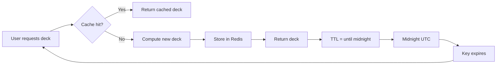
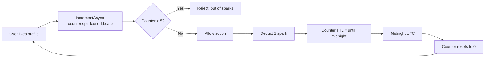

# Cache Key Conventions

**Last Updated:** 2026-10-07

---

## Overview

All cache keys follow a structured naming convention to ensure:
- **Uniqueness:** No collisions between features
- **Debuggability:** Easy to identify key purpose from name alone
- **TTL management:** Clear expiry semantics per key type
- **Security:** Sensitive keys flagged for encryption

---

## Key Patterns

**File:** `backend/WovenBackend/Services/CacheKeys.cs`

### Daily Deck

```csharp
public static string DailyDeck(int userId, DateOnly date) 
    => $"deck:{userId}:{date:yyyy-MM-dd}";
```

**Example:** `deck:123:2026-10-07`

**Purpose:** Cache computed daily deck (candidate pool + ECHO scoring)

**TTL:** Until midnight UTC (`CacheTtl.UntilMidnightUtc()`)

**Invalidation:** Time-based (expires at midnight, new deck computed next day)

**Sensitive:** No

---

### User Session

```csharp
public static string UserSession(int userId) 
    => $"session:{userId}";
```

**Example:** `session:456`

**Purpose:** Store temporary session state (e.g., OAuth flow, onboarding progress)

**TTL:** 1 hour (`CacheTtl.Session`)

**Invalidation:** Manual (`DeleteAsync` on logout)

**Sensitive:** **Yes** (encrypted)

**Encryption:** Applied in `CacheService.IsSensitiveKey()` check

---

### Pillar Embedding

```csharp
public static string PillarEmbedding(int userId) 
    => $"embedding:{userId}";
```

**Example:** `embedding:789`

**Purpose:** Cache OpenAI embedding vector (1536-dim) for user's 8 pillars

**TTL:** 1 day (`CacheTtl.EmbeddingLookup`)

**Invalidation:** Manual (on pillar update, season change)

**Sensitive:** **Yes** (encrypted)

**Why sensitive:** Embedding reveals user's profile semantics (PII-adjacent)

---

### Spark Counter

```csharp
public static string SparkCounter(int userId, DateOnly date) 
    => $"counter:spark:{userId}:{date:yyyy-MM-dd}";
```

**Example:** `counter:spark:100:2026-10-07`

**Purpose:** Track sparks spent today (daily limit = 5)

**TTL:** Until midnight UTC

**Invalidation:** Time-based (resets at midnight)

**Sensitive:** No

**Operations:**
- `IncrementAsync` on spark spend
- `GetCounterAsync` to check remaining

---

### Pending Counter

```csharp
public static string PendingCounter(int userId, DateOnly date) 
    => $"counter:pending:{userId}:{date:yyyy-MM-dd}";
```

**Example:** `counter:pending:200:2026-10-07`

**Purpose:** Track pending matches (balloons not yet popped)

**TTL:** Until midnight UTC

**Invalidation:** Time-based (resets at midnight)

**Sensitive:** No

---

### Games Counter

```csharp
public static string GamesCounter(int userId, DateOnly date) 
    => $"counter:games:{userId}:{date:yyyy-MM-dd}";
```

**Example:** `counter:games:300:2026-10-07`

**Purpose:** Track AI games played today (rate limit = 10/day)

**TTL:** Until midnight UTC

**Invalidation:** Time-based (resets at midnight)

**Sensitive:** No

---

### Commons Feed

```csharp
public static string CommonsFeed(int userId, DateOnly date) 
    => $"commons:{userId}:{date:yyyy-MM-dd}";
```

**Example:** `commons:400:2026-10-07`

**Purpose:** Cache personalized Commons feed (vector-sorted tiles)

**TTL:** 1 hour (`CacheTtl.CommonsFeed`)

**Invalidation:**
- Time-based (hourly refresh)
- Manual (on user action: post tile, orbit, dwell)

**Sensitive:** No

**Note:** Feed also includes `sessionId` in some endpoints (`commons:feed:{userId}:{sessionId}`) for finer-grained invalidation.

---

### Hot Tile

```csharp
public static string HotTile(int userId) 
    => $"hot-tile:{userId}";
```

**Example:** `hot-tile:500`

**Purpose:** Cache current trending tile for this user

**TTL:** 5 minutes (`CacheTtl.HotTile`)

**Invalidation:** Time-based (frequent refresh for trending content)

**Sensitive:** No

---

## Ad-Hoc Keys

Some features use inline cache keys (not in `CacheKeys.cs`):

### Analytics Session

**Pattern:** `analytics:session:{userId}`

**Example:** `analytics:session:600`

**Usage:** Track session start time for analytics events

**TTL:** 1 hour

**Location:** `AnalyticsService.cs`, `Program.cs`

---

### Rate Limit Keys

**Pattern:** `rate-limit:{feature}:{userId}`

**Examples:**
- `rate-limit:deck:123`
- `rate-limit:games:456`
- `rate-limit:chat-send:789`

**Usage:** Per-user, per-feature rate limiting via `CheckRateLimitAsync`

**TTL:** Varies by feature (e.g., 24h for deck, 1min for chat)

**Location:** Endpoints calling `_cache.CheckRateLimitAsync(...)`

---

### Batch Worker Locks

**Pattern:** `lock:{worker-name}`

**Examples:**
- `lock:connection-score-batch`
- `lock:weight-learning-batch`
- `lock:cf-score-batch`

**Usage:** Distributed lock to prevent duplicate batch runs across pods

**TTL:** 5 minutes (worker max runtime)

**Location:** Batch workers calling `_cache.AcquireLockAsync(...)`

---

### Batch Worker Timestamps

**Pattern:** `{worker-name}:last-run`

**Example:** `connection-score-batch:last-run`

**Usage:** Store last successful batch run timestamp (incremental processing)

**TTL:** None (never expires, manually updated)

**Value:** `DateTimeOffset` as ISO 8601 string

**Location:** `ConnectionScoreBatchWorker.cs`

---

## TTL Values

**File:** `backend/WovenBackend/Services/CacheKeys.cs` (lines 15–30)

```csharp
public static class CacheTtl
{
    public static TimeSpan UntilMidnightUtc()
    {
        var now     = DateTime.UtcNow;
        var midnight = now.Date.AddDays(1);
        var ttl     = midnight - now;
        // Never return zero or negative — minimum 1 second
        return ttl > TimeSpan.Zero ? ttl : TimeSpan.FromSeconds(1);
    }

    public static readonly TimeSpan Session        = TimeSpan.FromHours(1);
    public static readonly TimeSpan HotTile        = TimeSpan.FromMinutes(5);
    public static readonly TimeSpan CommonsFeed    = TimeSpan.FromHours(1);
    public static readonly TimeSpan EmbeddingLookup = TimeSpan.FromDays(1);
}
```

### UntilMidnightUtc()

**Purpose:** Calculate TTL for daily-resetting keys (counters, daily decks)

**Behavior:**
- If called at 11:30 PM UTC → returns 30 minutes
- If called at 12:00 AM UTC (edge case) → returns 1 second (minimum)

**Usage:**
```csharp
await _cache.SetAsync(
    CacheKeys.DailyDeck(userId, DateOnly.FromDateTime(DateTime.UtcNow)),
    deck,
    CacheTtl.UntilMidnightUtc(),
    ct
);
```

---

## Key Naming Rules

### General Conventions

1. **Prefix by feature area:**
   - `deck:*` — Matchmaking
   - `session:*` — Auth/session
   - `embedding:*` — ML/AI
   - `counter:*` — Rate limits / quotas
   - `commons:*` — Content feed
   - `rate-limit:*` — API quotas
   - `lock:*` — Worker coordination

2. **Include user ID when user-scoped:**
   - `deck:{userId}:{date}`
   - `session:{userId}`

3. **Include date for daily keys:**
   - Format: `yyyy-MM-dd` (sortable, ISO 8601)
   - Example: `2026-10-07`

4. **Use kebab-case for multi-word prefixes:**
   - `rate-limit:*` (not `rateLimit:*`)
   - `hot-tile:*` (not `hotTile:*`)

5. **No spaces, special chars, or wildcards in keys:**
   - Valid: `deck:123:2026-10-07`
   - Invalid: `deck 123`, `deck:*`, `deck:{userId}`

---

## Sensitive Key Detection

**File:** `backend/WovenBackend/Services/CacheService.cs` (lines 153–156)

```csharp
private static bool IsSensitiveKey(string key)
    => key.StartsWith("session:", StringComparison.Ordinal)
    || key.StartsWith("embedding:", StringComparison.Ordinal);
```

**Behavior:**
- Sensitive keys are **encrypted** before storage in Redis
- `GetAsync` **decrypts** on retrieval
- Encryption uses `IEncryptionService.EncryptBytes()` / `DecryptBytes()`
- Base64-encoded in Redis (encrypted binary → string)

**Why session is sensitive:**
- May contain OAuth tokens
- Onboarding progress (gender, location, etc.)
- Temporary PII

**Why embedding is sensitive:**
- 1536-dim vector reveals profile semantics
- Could be reverse-engineered to infer user traits
- Treated as PII-adjacent

---

## Cache Key Lifecycle

### Example: Daily Deck



### Example: Spark Counter



---

## Key Expiry vs. Invalidation

| Mechanism | Use Case | Example |
|---|---|---|
| **Time-based expiry (TTL)** | Predictable refresh cycle | Daily decks expire at midnight |
| **Manual invalidation** | Data changed by user action | Delete `embedding:{userId}` after pillar update |
| **No expiry** | Long-lived reference data | Worker timestamps (`last-run` keys) |

---

## Cache Key Patterns by Feature

### Matchmaking

| Key | TTL | Invalidation |
|---|---|---|
| `deck:{userId}:{date}` | Until midnight | Time-based |
| `counter:pending:{userId}:{date}` | Until midnight | Time-based |
| `lock:connection-score-batch` | 5 min | Worker release |
| `lock:cf-score-batch` | 5 min | Worker release |

---

### Auth / Session

| Key | TTL | Invalidation |
|---|---|---|
| `session:{userId}` | 1 hour | Manual (logout) |
| `analytics:session:{userId}` | 1 hour | Time-based |

---

### Content (Commons)

| Key | TTL | Invalidation |
|---|---|---|
| `commons:{userId}:{date}` | 1 hour | Manual (user action) |
| `commons:feed:{userId}:{sessionId}` | 1 hour | Manual (refresh) |
| `hot-tile:{userId}` | 5 min | Time-based |

---

### AI / Embeddings

| Key | TTL | Invalidation |
|---|---|---|
| `embedding:{userId}` | 1 day | Manual (pillar update) |

---

### Rate Limiting

| Key | TTL | Invalidation |
|---|---|---|
| `rate-limit:deck:{userId}` | 24 hours | Time-based |
| `rate-limit:games:{userId}` | 24 hours | Time-based |
| `rate-limit:chat-send:{userId}` | 1 min | Time-based |
| `counter:spark:{userId}:{date}` | Until midnight | Time-based |
| `counter:games:{userId}:{date}` | Until midnight | Time-based |

---

## Debugging Cache Keys

### List All Keys (Development Only)

```bash
redis-cli keys "*"
```

**Warning:** Never run `KEYS *` in production (blocks Redis). Use `SCAN` instead.

### Inspect Key Value

```bash
redis-cli get "deck:123:2026-10-07"
```

### Check TTL

```bash
redis-cli ttl "session:456"
# Returns: remaining seconds, or -1 (no expiry), or -2 (key doesn't exist)
```

### Delete Key

```bash
redis-cli del "embedding:789"
```

### Scan Keys by Pattern (Production-Safe)

```bash
redis-cli --scan --pattern "deck:*" | head -20
```

---

## Migration: Adding a New Cache Key

### Step 1: Define in CacheKeys.cs

```csharp
public static string MyFeature(int userId, string context) 
    => $"feature:{userId}:{context}";
```

### Step 2: Add TTL (if custom)

```csharp
public static readonly TimeSpan MyFeature = TimeSpan.FromHours(6);
```

### Step 3: Use in Service

```csharp
var key = CacheKeys.MyFeature(userId, "onboarding");
var cached = await _cache.GetAsync<MyData>(key, ct);

if (cached == null)
{
    cached = await ComputeExpensiveThingAsync();
    await _cache.SetAsync(key, cached, CacheTtl.MyFeature, ct);
}

return cached;
```

### Step 4: Add Invalidation

```csharp
// On data change:
await _cache.DeleteAsync(CacheKeys.MyFeature(userId, "onboarding"), ct);
```

### Step 5: Document Here

Add row to relevant table above (by feature area).

---

## Anti-Patterns

### ❌ Wildcard Keys

```csharp
// BAD: Can't delete all user sessions easily
public static string UserSession(int userId) => $"session:*";
```

**Why:** Redis `DEL` requires exact keys. Pattern matching needs `SCAN` loop.

**Fix:** Use exact keys, or maintain a set of active session IDs.

---

### ❌ Random Suffixes

```csharp
// BAD: Each request creates new key (cache never hits)
var key = $"deck:{userId}:{Guid.NewGuid()}";
```

**Why:** Cache key must be deterministic to hit on subsequent requests.

**Fix:** Use stable identifiers (userId, date, etc.).

---

### ❌ PII in Key Names

```csharp
// BAD: Email in key name (leaks PII in Redis logs)
var key = $"session:{user.Email}";
```

**Why:** Cache keys are logged, monitored, and visible in Redis CLI.

**Fix:** Use numeric user ID, not email/name.

---

### ❌ Huge Keys

```csharp
// BAD: Multi-MB object cached (eviction risk)
await _cache.SetAsync("feed:1", allTilesEver, ttl);
```

**Why:** Redis max memory is 250MB. Large keys cause eviction storms.

**Fix:** Cache **computed metadata** (tile IDs, scores), not full objects.

---

## FAQs

**Q: Why not use UUIDs for cache keys?**  
A: User IDs are stable, numeric, and debuggable. UUIDs are verbose and leak no semantic meaning.

**Q: Can I use wildcards in DeleteAsync?**  
A: No. `DeleteAsync` takes exact key. For patterns, use SCAN + loop (or invalidate via TTL expiry).

**Q: What if two features use same key prefix?**  
A: Collision. Use unique prefixes per feature area (e.g., `deck:*` vs `commons:*`).

**Q: Should I cache null values?**  
A: Generally no. Null means "compute on next request." Caching null wastes memory.

**Q: How do I cache data for anonymous users?**  
A: Use session ID or IP hash as key part: `anon:{sessionId}` or `ip:{hash}`.

---

## Related Docs

- **[Caching Overview](./README.md)** — Architecture, use cases
- **[Redis Configuration](./redis.md)** — Connection setup
- **[Cache Invalidation](./invalidation.md)** — Invalidation strategies
- **[CacheService Implementation](./implementation.md)** — Code walkthrough

---

## Changelog

| Date | Change |
|---|---|
| 2026-10-07 | Initial cache key documentation |
| 2026-06-04 | Added idempotency lock keys |
| 2026-06-03 | Added worker timestamp keys (incremental batch) |
| 2026-05-20 | Marked session/embedding as sensitive (encryption) |
