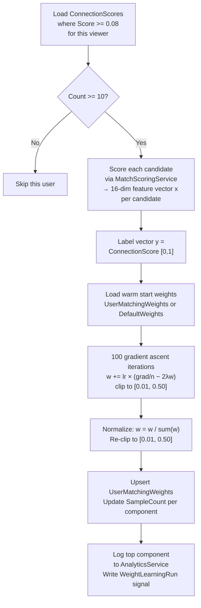
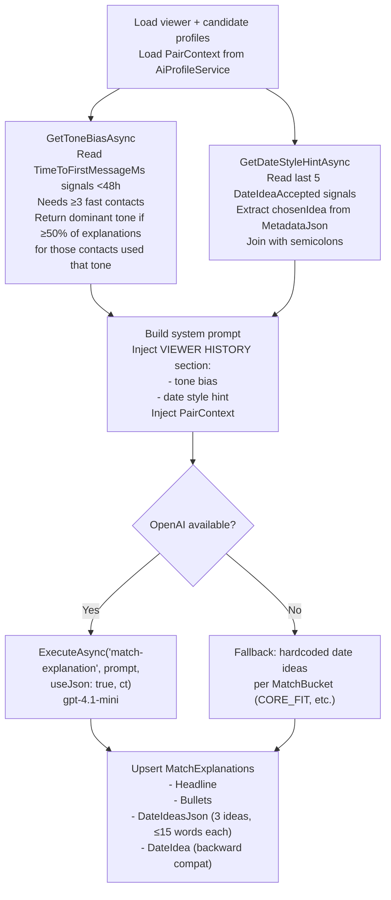
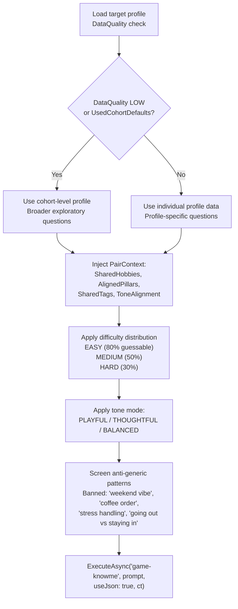
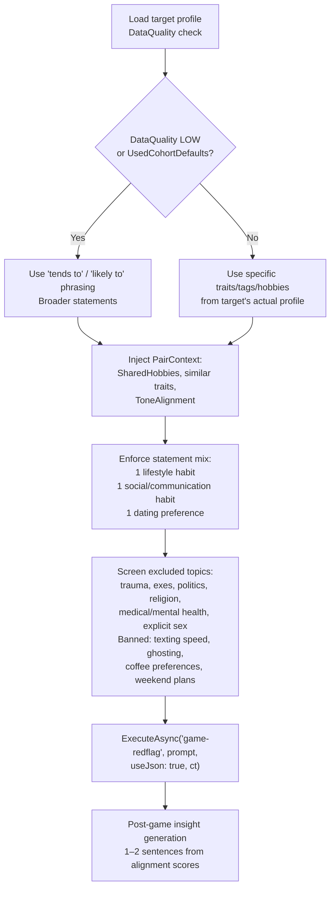

# AI/ML Documentation

> Cross-references: [AI Intelligence Deep Dive](../ai_intelligence/AI_INTELLIGENCE_DEEP_DIVE.md) | [Signals, Vectors & Scoring](../signals/SIGNALS_VECTORS_SCORING.md)

---

## Overview

This document covers the technical implementation of all AI and machine learning components in Woven's backend. It addresses services, workers, data models, OpenAI integration, embedding infrastructure, and the gaps between what is implemented and what is planned.

All AI components serve one goal: improve match quality over time by learning from revealed behavior, not stated preferences.

---

## Service Inventory

| Service | Location | Role |
|---|---|---|
| `MatchScoringService` | `Services/Matchmaking/` | 16-component weighted scorer |
| `WeightLearningService` | `Services/Matchmaking/` | Per-user logistic regression |
| `WeightLearningBatchWorker` | `Services/Matchmaking/` | Sunday 04:00 UTC batch job |
| `ConnectionScoreBatchWorker` | `Services/Matchmaking/` | Nightly 03:50 UTC batch job |
| `BehavioralFingerprintService` | (inferred from phase 5) | 16-dim behavioral fingerprint |
| `DeliveryBoostService` | `Services/Matchmaking/` | 12-step post-scoring boost pipeline |
| `DailyDeckOrchestrator` | `Services/Matchmaking/` | Deck generation coordinator |
| `CandidatePoolService` | `Services/Matchmaking/` | Candidate pool builder |
| `MatchExplanationService` | `Services/Matchmaking/` | Per-pair AI explanation + date ideas |
| `AiProfileService` | (profile intelligence) | DataQuality, PairContext, tone detection |
| `KnowMeAgent` | `Services/Games/` | KnowMe game question generator |
| `RedGreenFlagAgent` | `Services/Games/` | RedGreenFlag game statement generator |
| `VisualPreferenceService` | `Services/Embeddings/` | Visual preference centroid computation |
| `AttachmentProxyService` | `Services/Embeddings/` | 4-dim attachment proxy from pillars |
| `EmbeddingBatchWorker` | `Services/Embeddings/` | Vector embedding generation worker |
| `VoiceEmbeddingService` | `Services/Embeddings/` | ECAPA-TDNN voice embedding |
| `CollaborativeFilteringService` | `Services/Matchmaking/` | CF scoring — no worker running |
| `OpenAiTaggingService` | `Services/Matchmaking/` | Tagging via OpenAI |
| `IOpenAiResilientClient` | (client interface) | Resilient OpenAI client wrapper |

---

## Batch Worker Schedule

```mermaid
gantt
    title ECHO Batch Workers — Weekly Schedule
    dateFormat  HH:mm
    axisFormat  %H:%M

    section Nightly (every day)
    ConnectionScoreBatchWorker   :03:50, 30m

    section Weekly (Sunday only)
    WeightLearningBatchWorker    :04:00, 60m
```



| Worker | Schedule | What It Does |
|---|---|---|
| `ConnectionScoreBatchWorker` | Nightly 03:50 UTC | Computes ConnectionScore [0,1] per (viewer, candidate) pair from 7 signals |
| `WeightLearningBatchWorker` | Sunday 04:00 UTC | Runs logistic regression per user, updates `UserMatchingWeights` |

The 10-minute gap between ConnectionScore completion (03:50 + ~5 minutes) and WeightLearning start (04:00) ensures the nightly batch has finished producing fresh scores before weight learning reads from them.

---

## MatchScoringService

### Architecture

`MatchScoringService` scores a (viewer, candidate) pair by computing 16 component scores, each scaled to [0, 100], then computing a weighted sum.

```mermaid
flowchart TD
    INPUT["viewer + candidate IDs"]
    WEIGHTS["Load weights:\nUserMatchingWeights if ≥8 components\nhave SampleCount ≥5\nOtherwise: DefaultWeights"]
    C1["pillar (0.19)\nPillarEmbedding cosine, 1536-dim"]
    C2["intent (0.12)\nIntentEmbedding cosine + IntentAlignment rule"]
    C3["visual (0.10)\nCLIP cosine + aversion combined, 512-dim"]
    C4["expression (0.09)\nExpressionEmbedding cosine, 1536-dim"]
    C5["style (0.09)\nStyleEmbedding cosine, 128-dim"]
    C6["lifestyle (0.08)\nRule-based: children/smoking/diet/religion"]
    C7["voice (0.08)\nVoiceEmbedding cosine, 192-dim (ECAPA-TDNN)"]
    C8["orbit_gravity (0.08)\nOrbitGravity × e^-0.1t, log scale, cap +15"]
    C9["humor (0.07)\nHumorEmbedding cosine, 64-dim"]
    C10["pulse (0.06)\nWeekly vibe alignment"]
    C11["behavioral_lifestyle (0.05)\nBehavioralFingerprint lifestyle dims"]
    C12["shared_tile_affinity (0.05)\nStub — requires CfScore"]
    C13["emotional_rhythm (0.04)\nEmotionalRhythmEmbedding cosine, 48-dim"]
    C14["preference_affinity (0.04)\nStated preference affinity"]
    C15["attachment (0.04)\nAttachmentProxy cosine, 4-dim"]
    C16["cf (0.03)\nCfScores table — always 0 (no worker)"]
    SUM["Weighted sum → raw score\nPassed to DeliveryBoostService"]

    INPUT --> WEIGHTS
    WEIGHTS --> C1 & C2 & C3 & C4 & C5 & C6 & C7 & C8 & C9 & C10 & C11 & C12 & C13 & C14 & C15 & C16
    C1 & C2 & C3 & C4 & C5 & C6 & C7 & C8 & C9 & C10 & C11 & C12 & C13 & C14 & C15 & C16 --> SUM
```



### Cosine Similarity Normalization

All embedding-based components use:

```
score_component = (cosine_similarity(viewer_vec, candidate_vec) + 1) / 2 × 100
```

This maps [-1, 1] → [0, 100].

### Weight Override Condition

```
if (UserMatchingWeights for this viewer).Count(w => w.SampleCount >= 5) >= 8:
    use learned weights
else:
    use DefaultWeights (the base weights in the table above)
```

---

## WeightLearningService

### Data Flow



### Parameters Reference

| Parameter | Value | Purpose |
|---|---|---|
| `MinSamples` | 10 | Minimum qualifying ConnectionScores to run |
| `LearningRate` | 0.01 | Gradient step size |
| `Iterations` | 100 | Training iterations |
| `L2Lambda` | 0.01 | L2 regularization coefficient |
| `MinWeight` | 0.01 | Floor per component (enforced twice) |
| `MaxWeight` | 0.50 | Ceiling per component (enforced twice) |
| `MinConnectionScore` | 0.08 | Excludes balloon-only pairs from training |

---

## DeliveryBoostService

The 12-step pipeline runs after `MatchScoringService` produces a raw score and before deck delivery ordering is finalized.

### Step-by-Step Reference

| Step | Constant | Value | Trigger Condition |
|---|---|---|---|
| 1 | `ReciprocalBoost` | +18 | Candidate's deck has also shown viewer |
| 2 | `PendingBoost` | +10 | Match exists in pending state |
| 3 | `PositiveChoiceBoost` | +12 | Candidate received Magical or Resonant choice |
| 4 | `FatiguePenalty_2to3` | -5 | Candidate has been shown 2–3 times without engagement |
| 5 | `FatiguePenalty_4plus` | -12 | Candidate has been shown 4+ times without engagement |
| 6 | `PopPenalty` | -10 | Balloon popped but viewer did not meaningfully engage |
| 7 | `UnmatchPenalty` | -18 | Previously unmatched |
| 8 | `OrbitBoostCap` | log, +15 max | OrbitGravity × e^(-0.1×days), log-scaled |
| 9 | `DwellBoostCap` | log, +10 max | Candidate dwell time, log-scaled |
| 10 | `ProfileDepthBoostCap` | +12 max | Viewer scrolled deep on candidate's profile |
| 11 | `ViewerDwellBoostCap` | +8 max | Viewer's own engagement breadth |
| 12 | — | varies | Additional pipeline step |

### Orbit Gravity Decay Formula

Orbit gravity (candidates whom the viewer has "orbited" on Commons tiles) decays over time:

```
orbit_contribution = OrbitGravity × e^(-0.1 × days_since_orbit)
boost = min(log(orbit_contribution + 1) × scale_factor, 15)
```

This rewards recent engagement but prevents stale orbits from permanently dominating deck ordering.

### Log-Scale Boosts

Steps 8 and 9 use log scaling because dwell time and orbit gravity are right-skewed distributions — a few very long dwells or very high orbit scores would dominate if linearly scaled. The log scale compresses the tail while still rewarding high engagement.

---

## AiProfileService

### DataCompleteness Score

```
completeness = 0.40 × (pillar_variance_score)
             + 0.25 × (tag_score)
             + 0.15 × (hobby_score)
             + 0.10 × (pulse_score)
             + 0.10 × (intent_score)
```

### DataQuality Tier Assignment

| Tier | Condition | Consequence |
|---|---|---|
| HIGH | completeness ≥ 0.6 | Use individual profile data |
| MEDIUM | completeness ≥ 0.3 | Use individual data with some caution |
| LOW | completeness < 0.3 | Use cohort fallback |

### Cohort Fallback

When `DataQuality = LOW` or `UsedCohortDefaults = true`:

- Sample 50 users: age ±5, same gender, active within last 30 days
- Cohort aggregate used for game prompts and explanation prompts in place of individual data
- Games use broader exploratory questions; RedGreenFlag uses "tends to" / "likely to" phrasing

### ConversationTone Detection

```
if (banter_score HIGH) and (social_capacity HIGH):  → PLAYFUL
if (depth_score HIGH) and (banter_score LOW):       → THOUGHTFUL
if (social_score LOW) and (depth_score HIGH):       → CALM
else:                                                → BALANCED
```

Tone is injected into `PairContext` and used by `MatchExplanationService` to bias date idea style and explanation language.

### IntentAlignment Scoring

```
1.0  — exact match (both want same thing)
0.85 — same intent group (e.g., both long-term oriented)
0.6  — one party is "exploring"
0.3  — serious / casual mismatch
```

### Prompt Safety

Two protections applied to all user-provided text before it enters any prompt:

**Injection pattern screening (8 regex patterns):**
- `ignore previous`
- `system:`
- `endoftext` tokens
- `assistant:`
- `human:`
- `[INST]`
- 2 additional patterns

**PII sanitization:**
- Email addresses stripped via regex
- Phone numbers stripped via regex
- All user-provided text truncated to 200 characters

---

## MatchExplanationService

### Generation Flow



### Date Idea Constraints

- Exactly 3 ideas per pair
- Each idea: maximum 15 words
- Distinct activity types (no two ideas of the same category)
- At least 1 idea must incorporate shared hobbies if `PairContext.SharedHobbies` is non-empty

---

## KnowMeAgent

### Prompt Construction



### Response Schema

```json
{
  "questions": [
    {
      "id": "string",
      "text": "string",
      "difficulty": "EASY | MEDIUM | HARD",
      "options": [
        { "id": "string", "text": "string", "isCorrect": true }
      ]
    }
  ]
}
```

### Fallback Questions (No OpenAI)

When `IOpenAiResilientClient` is unavailable (circuit open):

1. "How do you recharge after a long week — alone or with others?"
2. "When you disagree with someone close, what do you usually do?"
3. "What would your ideal first date look like?"

---

## RedGreenFlagAgent

### Prompt Construction



### Response Schema

```json
{
  "statements": [
    { "text": "string", "difficulty": "EASY | MEDIUM | HARD" }
  ]
}
```

### Game Mechanics

- 3 statements per round, about the TARGET (not the guesser)
- Labels: GREEN / YELLOW / RED / DEPENDS
- 90-second time limit per round
- Score = count of rounds where guesser's label matched target's self-label
- Post-game: 1–2 sentence insight based on overall alignment pattern

### Fallback Statements (No OpenAI)

1. "They'll cancel plans last minute if they're drained — and tell you honestly." (EASY)
2. "They want their partner to have a full life outside the relationship." (MEDIUM)
3. "They'd rather have an awkward honest conversation than let tension sit." (HARD)

---

## OpenAI Integration

### IOpenAiResilientClient

All OpenAI calls go through `IOpenAiResilientClient`, which wraps the raw API client with:

| Feature | Implementation |
|---|---|
| Circuit breaker | Opens on sustained failures, prevents cascading costs |
| Retry logic | Exponential backoff on transient errors |
| Cost tracking | Per-operation cost tagged by `operationName` |

### Operation Names

Every call is tagged with an operation name for cost attribution:

| Operation Name | Service | Purpose |
|---|---|---|
| `"game-knowme"` | KnowMeAgent | KnowMe question generation |
| `"game-redflag"` | RedGreenFlagAgent | RedGreenFlag statement generation |
| `"match-explanation"` | MatchExplanationService | Pair explanation + date ideas |

### Model and Budget

- **Model:** `gpt-4.1-mini` for all operations
- **Daily budget:** $50

### Call Pattern

```csharp
await _openAi.ExecuteAsync(operationName, prompt, useJson: true, ct);
```

`useJson: true` instructs the client to use JSON response format (structured output mode).

---

## Embedding Infrastructure

### Generation Workers

`EmbeddingBatchWorker` handles the generation of text embeddings (via OpenAI's `text-embedding-3-small`). `VoiceEmbeddingService` handles ECAPA-TDNN voice embeddings via SpeechBrain.

### Vector Storage

All vector columns are stored in PostgreSQL using the `pgvector` extension. The extension is registered in `WovenDbContext` via:

```csharp
modelBuilder.HasPostgresExtension("vector");
```

HNSW indexes are created via raw SQL in migrations because EF Core's fluent API cannot express pgvector-specific HNSW index syntax. Migration files follow the `yyyyMMdd_DescriptiveName.cs` naming convention. pgvector columns that require HNSW indexes are added via `psql` directly (pgvector not available in the local dev environment).

### Full Vector Column Reference

| Table | Column | Dims | Model |
|---|---|---|---|
| `UserVector` | `PillarEmbedding` | 1536 | text-embedding-3-small |
| `UserVector` | `ExpressionEmbedding` | 1536 | text-embedding-3-small |
| `UserVector` | `IntentEmbedding` | 1536 | text-embedding-3-small |
| `UserVector` | `StyleEmbedding` | 128 | text-embedding-3-small (truncated) |
| `UserVector` | `HumorEmbedding` | 64 | text-embedding-3-small (truncated) |
| `UserVector` | `LifestyleEmbedding` | 128 | text-embedding-3-small (truncated) |
| `UserVector` | `EmotionalRhythmEmbedding` | 48 | custom |
| `UserVector` | `AttachmentProxyEmbedding` | 4 | custom |
| `UserVector` | `VoiceEmbedding` | 192 | ECAPA-TDNN (SpeechBrain) |
| `Tile` | `Embedding` | 1536 | text-embedding-3-small |
| `Tile` | `VoiceEmbedding` | 192 | ECAPA-TDNN |
| `PhotoEmbedding` | `Embedding` | 512 | CLIP-style |
| `UserVisualPreference` | `PreferenceEmbedding` | 512 | CLIP-style |
| `UserVisualPreference` | `AversionEmbedding` | 512 | CLIP-style |
| `UserVoicePreference` | `PreferenceEmbedding` | 192 | ECAPA-TDNN |
| `ReferencePhotoEmbedding` | `Embedding` | 512 | CLIP-style |

---

## What Is Not Yet Built

| Gap | Service / Table | Status |
|---|---|---|
| CfScore batch job | `CollaborativeFilteringService` + `CfScores` table | Service exists, no worker runs — `cf` component always scores 0 |
| SharedTileAffinity computation | Part of `MatchScoringService` | Stub — requires populated `CfScores` |
| PreferenceEmbedding from ChatNotes | Worker stub | Not wired to any schedule |
| LinUCB bandit integration | `LinUcbUserModel` table | Table exists, not integrated into scoring or deck generation |
| Ambition pillar coverage | Onboarding questions | No question covers this pillar — `PillarEmbedding` is incomplete |

### Impact of Missing Components

**CfScore = 0:** The `cf` component (weight 0.03) and `shared_tile_affinity` (weight 0.05) are effectively dead weight in all current scoring — 8% of the weight budget contributes nothing.

**LinUCB not integrated:** Deck generation has no exploration mechanism. Candidates who score well statically are always shown; candidates with uncertain fit are not surfaced for data collection.

**Ambition pillar gap:** The `pillar` component (highest weight at 0.19) embeds concatenated pillar answers. Missing ambition data means the pillar embedding is structurally incomplete for all users.

---

## Key Data Tables

| Table | Purpose |
|---|---|
| `MatchSignalLogs` | Append-only signal ledger |
| `ConnectionScores` | Per-(viewer, candidate) composite score |
| `UserMatchingWeights` | Per-(user, component) learned weight + SampleCount |
| `UserVector` | All embedding columns per user |
| `PhotoEmbedding` | Per-photo CLIP-style embeddings |
| `UserVisualPreference` | Preference + aversion centroids |
| `UserVoicePreference` | Voice preference centroid |
| `ReferencePhotoEmbedding` | Catfish detection references |
| `CfScores` | Collaborative filtering scores (populated by missing worker) |
| `LinUcbUserModel` | LinUCB bandit model state (not yet integrated) |
| `MatchExplanations` | Generated headlines, bullets, date ideas |
| `UserVisualDecisions` | YES / NO / PENDING per (viewer, photo) |

---

> See also: [AI Intelligence Deep Dive](../ai_intelligence/AI_INTELLIGENCE_DEEP_DIVE.md) | [Signals, Vectors & Scoring](../signals/SIGNALS_VECTORS_SCORING.md)
