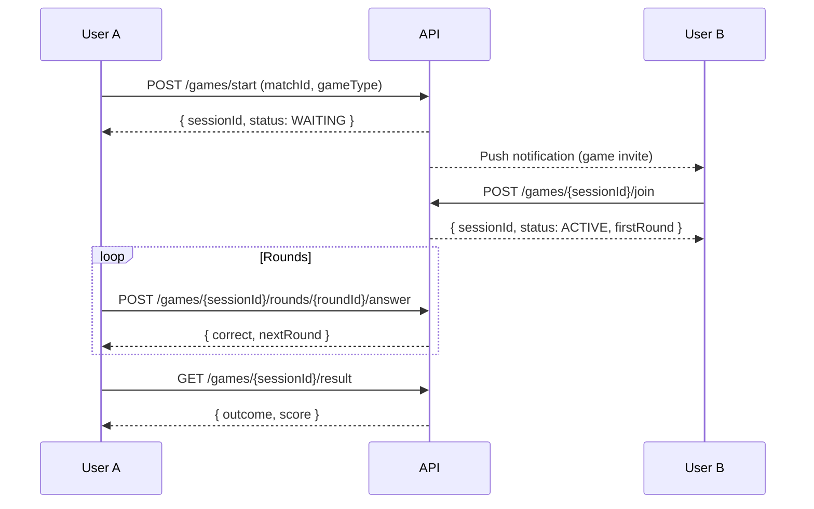
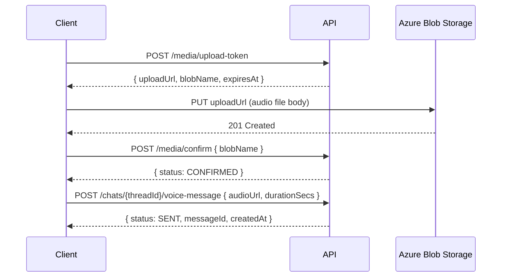
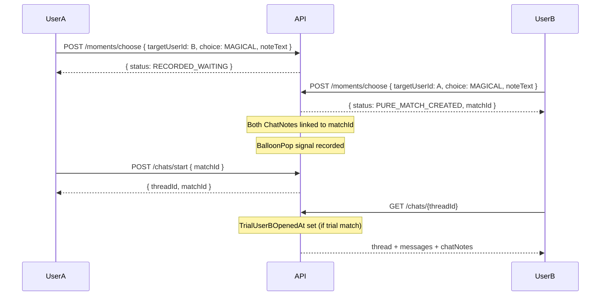
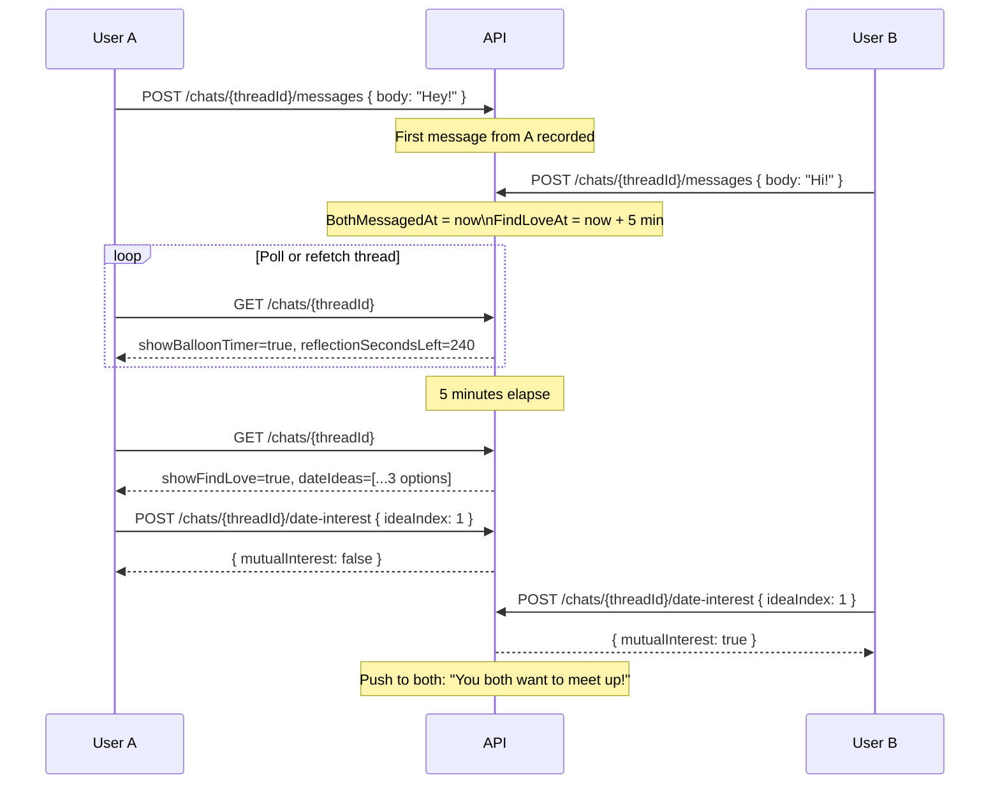

# API DOCUMENTATION

Woven REST API reference. All endpoints served by the .NET 10 Minimal API backend.

Related docs: [ARCHITECTURE.md](ARCHITECTURE.md) | [BACKEND_DESIGN.md](BACKEND_DESIGN.md) | [DATABASE_DESIGN.md](DATABASE_DESIGN.md)

---

## Connection

| Property | Value |
|---|---|
| Base URL (dev) | `http://localhost:5135` |
| Protocol | HTTP/HTTPS |
| Content-Type | `application/json` |
| Auth scheme | Bearer JWT |
| JWT storage | `localStorage` (dev convenience — flagged for pre-prod revisit) |

All endpoints require `Authorization: Bearer <jwt>` unless marked **[public]**.

JWT claims: `uid` (userId UUID), `sub`, `email`, `name`.

---

## Standard Error Format

Every error response uses a consistent envelope:

```json
{ "error": "ERROR_CODE_STRING" }
```

| HTTP Status | Meaning |
|---|---|
| 400 | Bad request / invalid input / illegal action |
| 403 | Forbidden (non-participant, mutual interest required, etc.) |
| 404 | Resource not found |
| 409 | Conflict (already responded, already submitted, etc.) |

---

## Error Code Reference

| Code | HTTP | Description |
|---|---|---|
| `THREAD_NOT_FOUND` | 404 | Chat thread ID does not exist |
| `MATCH_NOT_FOUND` | 404 | Match ID does not exist |
| `MESSAGE_NOT_FOUND` | 404 | Message ID does not exist |
| `BALLOON_NOT_ACTIVE` | 400 | Match balloon_state is CLOSED |
| `NOT_IN_TRIAL` | 400 | Thread is not in a trial match |
| `TRIAL_NOT_ENDED` | 400 | Trial window has not closed yet |
| `INVALID_DECISION` | 400 | decision field is not a valid value |
| `EMPTY_MESSAGE` | 400 | body field is empty |
| `MESSAGE_TOO_LONG` | 400 | body exceeds 1000 characters |
| `ALREADY_RESPONDED_TODAY` | 409 | Already submitted a MomentResponse for this target today |
| `NOTE_ALREADY_SUBMITTED` | 409 | ChatNote already exists for this (user, target) pair |
| `CANNOT_LOVE_OWN_NOTE` | 400 | Attempting to love-react to own ChatNote |
| `CANNOT_LOVE_OWN_MESSAGE` | 400 | Attempting to love-react to own message |
| `CANNOT_LISTEN_OWN_NOTE` | 400 | Attempting to mark own voice note as listened |
| `MUTUAL_INTEREST_REQUIRED` | 403 | Both users must have set date interest |
| `NOTE_NOT_LINKED_TO_MATCH` | 400 | ChatNote has not been linked to a balloon yet |
| `MATCH_NOT_ACTIVE` | 400 | Match is not in ACTIVE balloon state |
| `ALREADY_LOVED` | 200/409 | Love reaction already recorded (idempotent — returns existing state) |

---

## Auth Endpoints

### POST /auth/google

**[public]** Authenticate with a Google ID token. Creates user account on first login.

**Request body:**

```json
{ "idToken": "google-id-token-string" }
```

**Success response (200):**

```json
{
  "token": "eyJhbGciOi...",
  "userId": "uuid"
}
```

**Behavior:**
1. Validates the Google ID token against Google's public keys.
2. Looks up `AuthIdentity` by (provider="google", provider_subject=Google sub).
3. If no identity found: creates `User` + `AuthIdentity` + `SparkWallet` (balance=5).
4. Issues JWT with claims: `uid`, `sub`, `email`, `name`.

---

## Health Endpoints

All health endpoints are **[public]**.

| Method | Path | Description |
|---|---|---|
| GET | `/health` | Aggregate health check |
| GET | `/health/live` | Liveness probe |
| GET | `/health/ready` | Readiness probe |

---

## Chat Endpoints (`/chats`)

### GET /chats

Returns all active chat threads for the authenticated user, ordered by last activity.

**Response (200):**

```json
{
  "meUserId": "uuid",
  "count": 2,
  "chats": [
    {
      "threadId": "uuid",
      "matchId": "uuid",
      "matchType": "PURE",
      "edgeOwnerId": null,
      "expiresAt": "2026-05-27T12:00:00Z",
      "bothMessagedAt": "2026-05-26T10:00:00Z",
      "findLoveAt": "2026-05-26T10:05:00Z",
      "showFindLove": true,
      "showBalloonTimer": false,
      "reflectionSecondsLeft": null,
      "title": "Display name",
      "other": {
        "userId": "uuid",
        "fullName": "Full Name",
        "isVerified": true,
        "displayPronouns": "she/her",
        "profilePhoto": "https://..."
      },
      "lastMessage": {
        "body": "Hey!",
        "createdAt": "2026-05-26T10:01:00Z",
        "senderUserId": "uuid",
        "messageType": "TEXT",
        "metaJson": null
      },
      "isTrial": false,
      "trialEndsAt": null,
      "trialSecondsLeft": null
    }
  ]
}
```

---

### POST /chats/start

Creates a chat thread for an existing match. Returns the existing thread if one already exists (idempotent).

**Request body:**

```json
{ "matchId": "uuid" }
```

**Response (200):**

```json
{
  "threadId": "uuid",
  "matchId": "uuid"
}
```

**Error cases:**

| Code | Condition |
|---|---|
| `MATCH_NOT_FOUND` | matchId does not exist or caller is not a participant |
| `BALLOON_NOT_ACTIVE` | Match is closed |

---

### GET /chats/{threadId}

Returns the full thread state including the last 50 messages, match metadata, date ideas, and linked ChatNotes.

**Path params:**

| Param | Type | Description |
|---|---|---|
| threadId | UUID | Chat thread ID |

**Response (200):**

```json
{
  "meUserId": "uuid",
  "threadId": "uuid",
  "matchId": "uuid",
  "matchType": "PURE",
  "balloonState": "ACTIVE",
  "expiresAt": "2026-05-27T12:00:00Z",
  "bothMessagedAt": "2026-05-26T10:00:00Z",
  "findLoveAt": "2026-05-26T10:05:00Z",
  "showBalloonTimer": false,
  "reflectionSecondsLeft": null,
  "showFindLove": true,
  "dateIdea": "Coffee walk (legacy field)",
  "dateIdeas": ["Option A", "Option B", "Option C"],
  "chatNotes": [
    {
      "fromUserId": "uuid",
      "noteText": "Your note text here",
      "choice": "MAGICAL",
      "createdAt": "2026-05-26T09:58:00Z"
    }
  ],
  "other": {
    "userId": "uuid",
    "fullName": "Full Name",
    "profilePhoto": "https://..."
  },
  "messages": [
    {
      "messageId": "uuid",
      "senderUserId": "uuid",
      "body": "Hey!",
      "messageType": "TEXT",
      "meta": null,
      "createdAt": "2026-05-26T10:01:00Z"
    }
  ],
  "isTrial": false,
  "trialEndsAt": null,
  "trialSecondsLeft": null,
  "canMakeDecision": false,
  "isUserA": true,
  "userADecision": null,
  "userBDecision": null
}
```

Messages are the last 50, returned in ascending created_at order.

`dateIdeas` is only revealed when `showFindLove == true`.

**Side effects on load:**
- If match is a trial AND caller has not opened the thread before: sets `TrialUserAOpenedAt` or `TrialUserBOpenedAt`.
- When both timestamps are set: `TrialStartedAt = now`, `TrialEndsAt = now + 3 minutes`.
- If trial window has expired and no messages were exchanged: auto-closes match (CLOSED + ClosedReason.NO_SPARK), issues ghost refund (0.5 sparks to each user).

---

### POST /chats/{threadId}/messages

Send a text message to a thread.

**Path params:**

| Param | Type | Description |
|---|---|---|
| threadId | UUID | Chat thread ID |

**Request body:**

```json
{ "body": "Message text, max 1000 chars" }
```

**Response (200):**

```json
{
  "status": "SENT",
  "messageId": "uuid",
  "createdAt": "2026-05-26T10:01:00Z"
}
```

**Error cases:**

| Code | Condition |
|---|---|
| `EMPTY_MESSAGE` | body is empty |
| `MESSAGE_TOO_LONG` | body exceeds 1000 characters |
| `THREAD_NOT_FOUND` | threadId does not exist |
| `MATCH_NOT_FOUND` | No match linked to thread |
| `BALLOON_NOT_ACTIVE` | Match is closed |

**Side effects:**
- Increments `ChatThreads.MessageCount`.
- Updates `ChatThreads.UpdatedAt` and `ChatThreads.LastMessageAt`.
- If this is the first message from the other user (counterpart already messaged): sets `BothMessagedAt = now`, `FindLoveAt = now + 5 minutes`.
- Records ECHO signals: `MessageSent`, `MessageResponseLatencyMs` (if responding), `TimeToFirstMessageMs` (if this is the first message across the match).
- Fires push notification to the other participant.

---

### POST /chats/{threadId}/close-gracefully

Closes the match with an UNMATCH reason.

**Path params:**

| Param | Type | Description |
|---|---|---|
| threadId | UUID | Chat thread ID |

**Response (200):**

```json
{
  "status": "CLOSED",
  "closedAt": "2026-05-26T11:00:00Z"
}
```

**Side effects:**
- Sets `BalloonState = CLOSED`, `ClosedReason = UNMATCH`, `ClosedAt = now`.
- If no messages were exchanged: issues ghost refund of 0.5 sparks to each user.

---

### POST /chats/{threadId}/trial-decision

Submit a trial period decision.

**Path params:**

| Param | Type | Description |
|---|---|---|
| threadId | UUID | Chat thread ID |

**Request body:**

```json
{
  "decision": "CONTINUE",
  "endReason": null
}
```

| Field | Type | Values | Required |
|---|---|---|---|
| decision | string | `CONTINUE`, `END`, `BLOCK` | yes |
| endReason | string | `no_spark`, `wrong_timing`, `not_my_type` | only when decision=END |

**Decision outcomes:**

| Decision | Counterpart | Outcome |
|---|---|---|
| `CONTINUE` | Not yet decided | Records decision; returns DECISION_RECORDED + waitingForOther=true |
| `CONTINUE` | Also CONTINUE | `IsTrial=false`, `FindLoveAt=now` (immediate unlock); returns MATCH_CONTINUES |
| `END` | Any | Match closed: CLOSED + UNMATCH; ghost refund if no messages; returns MATCH_ENDED |
| `BLOCK` | Any | Match closed: CLOSED + BLOCK; Block record created; returns MATCH_BLOCKED |

**Response (200):**

```json
{
  "status": "DECISION_RECORDED",
  "waitingForOther": true,
  "findLoveAt": null,
  "closedAt": null
}
```

Possible status values: `DECISION_RECORDED`, `MATCH_BLOCKED`, `MATCH_CONTINUES`, `MATCH_ENDED`.

**Signals recorded:**
- `TrialAccepted` (CONTINUE), `TrialRejected` (END/BLOCK)
- `TrialMessageCount`
- `TrialEndedNoSpark`, `TrialEndedWrongTiming`, `TrialEndedNotMyType` (based on endReason)

---

### POST /chats/{threadId}/voice-message

Send a voice note. The audio file must already be uploaded to Azure Blob Storage via the `/media/upload-token` flow before calling this endpoint.

**Path params:**

| Param | Type | Description |
|---|---|---|
| threadId | UUID | Chat thread ID |

**Request body:**

```json
{
  "audioUrl": "https://storage.blob.core.windows.net/...",
  "durationSecs": 12
}
```

| Field | Type | Constraint |
|---|---|---|
| audioUrl | string | Azure Blob URL |
| durationSecs | int | 1–180 |

**Response (200):**

```json
{
  "status": "SENT",
  "messageId": "uuid",
  "createdAt": "2026-05-26T10:02:00Z"
}
```

**Behavior:**
- Creates `ChatMessage` with `MessageType="VOICE"`, `MetaJson={"audioUrl":"...","durationSecs":12}`.
- If this is the first message in the match: records `TimeToFirstMessageMs` signal.
- Fires push notification to partner with body "🎤 Voice note".

---

### POST /chats/{threadId}/messages/{messageId}/voice-listened

Mark a voice note as listened. Records ECHO signal.

**Path params:**

| Param | Type | Description |
|---|---|---|
| threadId | UUID | Chat thread ID |
| messageId | UUID | Voice message ID |

**Response (204):** No content.

**Error cases:**

| Code | Condition |
|---|---|
| `CANNOT_LISTEN_OWN_NOTE` | Caller is the sender of the voice note |
| `MESSAGE_NOT_FOUND` | messageId does not exist in thread |

**Side effects:**
- Records `VoiceNoteListenComplete` signal.
- If both participants have sent a voice note in this thread: also records `MutualVoiceExchange` signal.

---

### POST /chats/chatnotes/{noteId}/love

Love-react to a ChatNote. One reaction per user per note. Idempotent.

**Path params:**

| Param | Type | Description |
|---|---|---|
| noteId | UUID | ChatNote ID |

**Response (200):**

```json
{ "status": "LOVED" }
```

Returns `{ "status": "ALREADY_LOVED" }` if already reacted.

**Error cases:**

| Code | Condition |
|---|---|
| `CANNOT_LOVE_OWN_NOTE` | Caller authored the note |
| `NOTE_NOT_LINKED_TO_MATCH` | ChatNote has no match_id (balloon not popped yet) |
| `MATCH_NOT_ACTIVE` | Linked match is closed |

**Side effects:** Records `ChatNoteLove` signal.

---

### POST /chats/{threadId}/messages/{messageId}/love

Love-react to a chat message. One reaction per user per message. Idempotent.

**Path params:**

| Param | Type | Description |
|---|---|---|
| threadId | UUID | Chat thread ID |
| messageId | UUID | Message ID |

**Response (200):**

```json
{ "status": "LOVED" }
```

Returns `{ "status": "ALREADY_LOVED" }` if already reacted.

**Error cases:**

| Code | Condition |
|---|---|
| `CANNOT_LOVE_OWN_MESSAGE` | Caller is the message sender |

**Side effects:** Records `MessageLove` signal.

---

### GET /chats/{threadId}/nudge

Returns a conversation nudge string generated by NudgeService.

**Response (200):**

```json
{ "nudge": "Ask them about their favorite weekend ritual." }
```

---

### POST /chats/{threadId}/nudge/dismiss

Dismisses the nudge for 48 hours. Stored in Redis.

**Response (204):** No content.

---

### POST /chats/{threadId}/date-interest

Signal interest in meeting in person. Optionally include which date idea was selected.

**Request body (optional):**

```json
{
  "ideaIndex": 1,
  "ideaText": "Coffee walk"
}
```

**Response (200):**

```json
{ "mutualInterest": true }
```

`mutualInterest` is true only when both participants have now set date interest.

**Side effects:**
- Sets `DateIdeaInterestedA` or `DateIdeaInterestedB` on the match.
- When both are set: fires push notification to both users ("You both want to meet up!"). Notification is deduped via Redis key `dateinterest:notified:{matchId}` with 7-day TTL — fires only once.
- Records `DateIdeaAccepted` signal with `chosenIdea` and `ideaIndex` stored in `metadata_json`.

---

### GET /chats/{threadId}/venue-suggestions

Returns venue suggestions for the match location.

**Response (200):**

```json
{ "venues": [ { "name": "...", "type": "...", "address": "..." } ] }
```

**Error cases:**

| Code | HTTP | Condition |
|---|---|---|
| `MUTUAL_INTEREST_REQUIRED` | 403 | Both `DateIdeaInterestedA` and `DateIdeaInterestedB` must be true |

---

### POST /chats/{threadId}/availability

Signal availability to the chat partner.

**Request body:**

```json
{ "signalText": "Free after 6pm tonight" }
```

| Field | Type | Constraint |
|---|---|---|
| signalText | string | max 200 characters |

**Response (204):** No content.

**Side effects:**
- Creates `ChatAvailabilitySignal` record.
- Fires push notification to partner.

---

## Moments Endpoints (`/moments`)

### GET /moments

Returns today's discovery deck for the authenticated user.

**Response (200):**

```json
{
  "dateUtc": "2026-05-26",
  "budget": {
    "totalCap": 5,
    "totalUsed": 1,
    "totalRemaining": 4
  },
  "sparkBalance": 8.5,
  "count": 6,
  "cards": [
    {
      "userId": "uuid",
      "fullName": "First Name",
      "isVerified": true,
      "displayPronouns": "they/them",
      "gender": "nonbinary",
      "location": "Brooklyn, NY",
      "profilePhoto": "https://...",
      "score": 0.87,
      "bucket": "strong",
      "alreadyChoseYou": true,
      "reason": {
        "headline": "You both want a slow burn.",
        "bullets": ["Shared love of quiet mornings", "Both cited music as identity-level"],
        "tone": "warm"
      },
      "rating": null
    }
  ]
}
```

**Behavior:**
- Filters out users already responded to today, blocked users, and existing active matches.
- Cards sorted by ECHO score descending.
- `profilePhoto` is the per-viewer best photo selected using CLIP visual preference embeddings.
- `rating` is only populated if the candidate has received 5 or more community votes — never shown below this threshold.
- `alreadyChoseYou` is true if the candidate submitted a positive MomentResponse toward the viewer that day.

---

### GET /moments/liked-you

Returns users who have positively responded to the viewer in the last 7 days.

**Response (200):**

```json
{
  "count": 3,
  "cards": [
    {
      "userId": "uuid",
      "fullName": "First Name",
      "isVerified": false,
      "location": "Austin, TX",
      "profilePhoto": "https://...",
      "likedAt": "2026-05-25T18:30:00Z",
      "expiresInHours": 48
    }
  ]
}
```

**Filtering:**
- Only includes users who responded positively (MAGICAL or LOGICAL).
- Excludes: already matched, blocked users, users who appear in today's deck.
- Deduplicated per user (most recent response only).
- Sorted by most recent first.

---

### POST /moments/respond

Submit a quick response (no opening note required).

**Request body:**

```json
{
  "targetUserId": "uuid",
  "choice": "MAGICAL",
  "source": "TODAY",
  "timeOnCardMs": 4200
}
```

| Field | Type | Values | Required |
|---|---|---|---|
| targetUserId | UUID | — | yes |
| choice | string | `MAGICAL`, `LOGICAL`, `PASS` | yes |
| source | string | `TODAY`, `LIKED_YOU` | no (defaults to TODAY) |
| timeOnCardMs | int | milliseconds spent on card | no |

**Response (200):**

```json
{
  "status": "PURE_MATCH_CREATED",
  "matchId": "uuid",
  "matchType": "PURE",
  "edgeOwnerId": null,
  "sparkBalance": 7.5
}
```

Possible status values:

| Status | Meaning |
|---|---|
| `RECORDED_PASS` | PASS choice recorded; no further action |
| `RECORDED_WAITING` | Positive choice recorded; other user has not responded |
| `PURE_MATCH_CREATED` | Both chose same type; PURE match created |
| `EDGE_MATCH_CREATED` | Both chose positively but different types; EDGE match created |
| `MATCH_NOT_CREATED` | Positive choice recorded; match creation blocked (e.g., existing block) |

**Budget / spark rules:**
- `PASS` does not spend budget or sparks.
- Positive choice from `TODAY` deck: spends 1 from the daily interaction budget (cap 5/day).
- Positive choice from `LIKED_YOU`: spends 1 spark from `SparkWallet`.

**Side effects:**
- Records `BalloonPop` signal when match is created.
- Records `UserVisualDecision` (fire-and-forget, for visual preference learning).

---

### POST /moments/choose

Submit a choice with a required opening note (ChatNote). Match is only created when both users have submitted both a choice and a note.

**Request body:**

```json
{
  "targetUserId": "uuid",
  "choice": "LOGICAL",
  "noteText": "Your handwriting font made me stop scrolling.",
  "source": "TODAY",
  "timeOnCardMs": 6100
}
```

| Field | Type | Constraint | Required |
|---|---|---|---|
| targetUserId | UUID | — | yes |
| choice | string | `MAGICAL` or `LOGICAL` | yes |
| noteText | string | 20–150 characters | yes |
| source | string | `TODAY`, `LIKED_YOU` | no |
| timeOnCardMs | int | milliseconds | no |

**Response (200):**

```json
{
  "status": "PURE_MATCH_CREATED",
  "matchId": "uuid",
  "matchType": "PURE",
  "edgeOwnerId": null,
  "sparkBalance": null
}
```

Possible status values:

| Status | Meaning |
|---|---|
| `RECORDED_WAITING` | Choice + note saved; other user has not responded at all |
| `WAITING_FOR_OTHER_NOTE` | Other user responded but has not submitted a note yet |
| `PURE_MATCH_CREATED` | Both chose same type + both have notes; PURE match created |
| `EDGE_MATCH_CREATED` | Both chose positively + both have notes; EDGE match created |
| `MATCH_NOT_CREATED` | Both ready but match creation blocked |

**Side effects:**
- Saves `MomentResponse` + `ChatNote`.
- When match is created: links both `ChatNote` records to the new match via `match_id`.

---

## User Data Endpoints (`/me`)

### GET /me/data-summary

Returns a lightweight overview of the caller's stored data.

**Response (200):**

```json
{
  "tileCount": 4,
  "momentResponseCount": 31,
  "chatMessageCount": 87,
  "photoEmbeddingCount": 3,
  "thirdPartyProcessors": ["OpenAI", "Azure Blob Storage", "Google OAuth"]
}
```

---

### GET /me/data-export

Full GDPR-style export of the caller's data.

**Response (200):**

```json
{
  "profile": { "...": "..." },
  "tiles": [],
  "chatMessages": [],
  "visualPreferences": {}
}
```

**Rate limit:** 1 request per 30 days per user. Rate limit tracked in Redis via key `data-export:{userId}`.

**Side effects:** Logs a `bulk_data_export` event to `SecurityAuditLogs`.

**Error:** Returns 429 if within the 30-day cooldown.

---

### POST /me/visual-preference/reset

Resets the caller's visual preference embeddings (`UserVisualPreferences.preference_embedding` and `aversion_embedding`) to null. Yes/No sample counts are also zeroed.

**Response (204):** No content.

---

## Media Endpoints (`/media`)

### POST /media/upload-token

Returns a short-lived Azure Blob SAS token and upload URL. The client uses this URL to PUT the file directly to Azure Blob Storage, bypassing the API server.

Used for: profile photos, tile media (text/photo/video/voice), voice note audio.

**Response (200):**

```json
{
  "uploadUrl": "https://storage.blob.core.windows.net/container/blob?sas=...",
  "blobName": "users/uuid/voice/uuid.webm",
  "expiresAt": "2026-05-26T10:15:00Z"
}
```

---

### POST /media/confirm

Confirms that a blob was successfully uploaded. Triggers downstream processing (e.g., embedding generation for voice notes, CLIP embedding for photos).

**Request body:**

```json
{ "blobName": "users/uuid/voice/uuid.webm" }
```

**Response (200):**

```json
{ "status": "CONFIRMED" }
```

---

## Match Endpoints (`/matches`)

### GET /matches/{matchId}/profile

Returns the match partner's profile, visible to either participant once the balloon is ACTIVE.

**Path params:**

| Param | Type | Description |
|---|---|---|
| matchId | UUID | Match ID |

---

## Push Subscription Endpoints (`/push`)

### POST /push/subscribe

Registers a Web Push subscription for the authenticated user.

**Request body:**

```json
{
  "subscription": { "endpoint": "...", "keys": { "p256dh": "...", "auth": "..." } }
}
```

**Response (200):** Stores a `PushSubscription` record.

---

### DELETE /push/subscribe

Removes the caller's push subscription.

**Response (204):** No content.

---

## Commons / Tiles Endpoints (`/commons`)

### GET /commons/feed

Returns the Commons tile feed for the authenticated user. Tiles are filtered, scored, and ordered by the feed algorithm (recency + affinity signals).

**Response (200):**

```json
{
  "tiles": [
    {
      "tileId": "uuid",
      "userId": "uuid",
      "contentType": "photo",
      "mediaUrl": "https://...",
      "expiresAt": "2026-05-27T12:00:00Z",
      "author": {
        "fullName": "First Name",
        "isVerified": true,
        "profilePhoto": "https://..."
      }
    }
  ]
}
```

---

### POST /commons/tiles

Create a new tile.

**Request body:**

```json
{
  "contentType": "photo",
  "mediaUrl": "https://...",
  "body": "Optional text"
}
```

| Field | Type | Values |
|---|---|---|
| contentType | string | `text`, `photo`, `video`, `voice` |
| mediaUrl | string | Azure Blob URL (for non-text tiles) |

**Response (200):** Returns the created tile ID and metadata.

**Side effects:**
- Queues tile for moderation (`ModerationQueues`).
- Queues tile for embedding generation (text: text-embedding-3-small; voice: ECAPA-TDNN).

---

## Games Endpoints (`/games`)

Game endpoints manage the KnowMe and RedGreenFlag in-chat mini-games. Full game flow:



Session states: `WAITING` → `ACTIVE` → `COMPLETED` / `EXPIRED`.

---

## End-to-End: Voice Note Flow



---

## End-to-End: Match Creation Flow



---

## End-to-End: Find Love Unlock Timing



---

## Spark Economy Rules

| Action | Spark change |
|---|---|
| Account created | +5 (starting balance) |
| Positive response from `LIKED_YOU` tab | -1 |
| Match closes with 0 messages exchanged | +0.5 (ghost refund to both participants) |
| Daily budget (TODAY deck) | 5 free responses/day, no spark cost |
| Wallet maximum | 10 |

The `sparkBalance` field is returned in Moments respond responses when the action consumed or refunded sparks.

---

## Signal Recording Reference

Every behavioral event that feeds ECHO is recorded via `IMatchSignalService.RecordAsync`. The following table maps API actions to the signals they fire.

| API Action | Signals Recorded |
|---|---|
| POST /chats/{threadId}/messages (first message) | `TimeToFirstMessageMs` |
| POST /chats/{threadId}/messages (reply) | `MessageSent`, `MessageResponseLatencyMs` |
| POST /chats/{threadId}/voice-message | `TimeToFirstMessageMs` (if first) |
| POST /chats/{threadId}/messages/{id}/voice-listened | `VoiceNoteListenComplete` |
| Voice-listened when both have sent voice | `MutualVoiceExchange` |
| POST /moments/respond (match created) | `BalloonPop` |
| POST /moments/respond | `UserVisualDecision` (fire-and-forget) |
| POST /chats/{threadId}/trial-decision CONTINUE | `TrialAccepted`, `TrialMessageCount` |
| POST /chats/{threadId}/trial-decision END | `TrialRejected`, `TrialMessageCount`, `TrialEndedNoSpark`/`WrongTiming`/`NotMyType` |
| POST /chats/{threadId}/trial-decision BLOCK | `TrialRejected`, `TrialMessageCount` |
| POST /chats/{threadId}/date-interest | `DateIdeaAccepted` (with metadata_json: chosenIdea, ideaIndex) |
| POST /chats/chatnotes/{noteId}/love | `ChatNoteLove` |
| POST /chats/{threadId}/messages/{id}/love | `MessageLove` |

Signal logs write to `match_signal_logs` with `viewer_id`, `candidate_id`, `event_type`, `event_value`, and optional `metadata_json`. The append-only ledger is never updated — corrections are new rows.

---

## Authorization Model

All routes registered via the `MapXxxEndpoints` pattern call `.RequireAuthorization()`. The only public routes are `/auth/*`, `/health`, `/health/live`, and `/health/ready`.

User ID is extracted from the JWT claims in every endpoint via the `GetUserId(http.User)` helper. Participant checks (e.g., confirming the caller is a participant in a match or thread) are performed in service layer methods, returning 403 if the caller is not a participant.

---

## Pagination

The current API does not implement cursor or offset pagination. Endpoints with potentially large result sets are bounded:
- `GET /chats/{threadId}` — last 50 messages only.
- `GET /moments` — bounded by daily deck size.
- `GET /moments/liked-you` — last 7 days only.

---

## Idempotency

The following endpoints are idempotent by design:

| Endpoint | Idempotency guarantee |
|---|---|
| `POST /chats/start` | Returns existing thread if one exists for the match |
| `POST /chats/chatnotes/{noteId}/love` | Returns ALREADY_LOVED if reaction exists |
| `POST /chats/{threadId}/messages/{id}/love` | Returns ALREADY_LOVED if reaction exists |
| `GET /chats/{threadId}` | Trial timestamps are set once and never overwritten |
