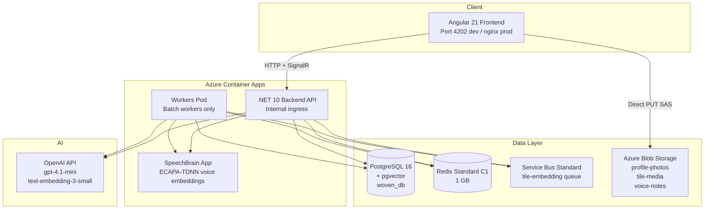
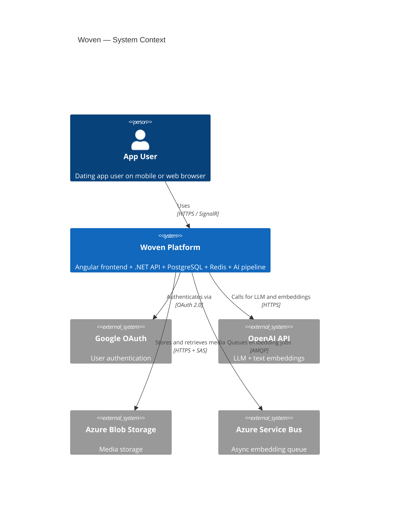
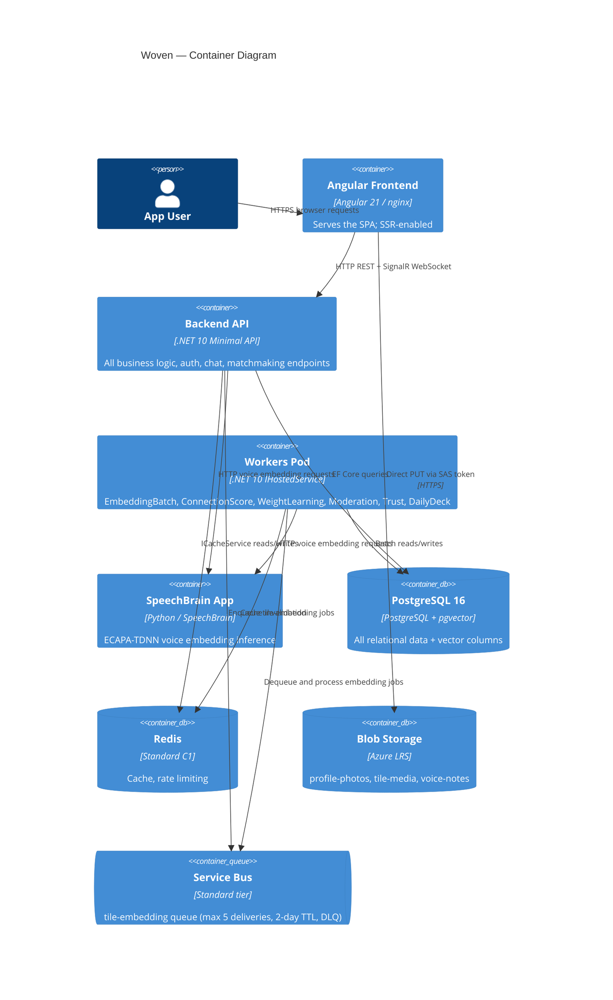
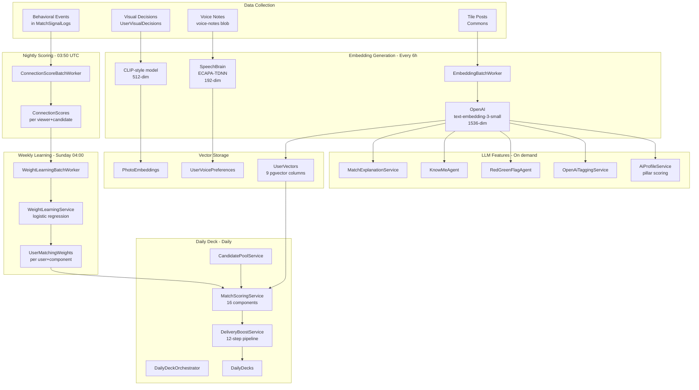
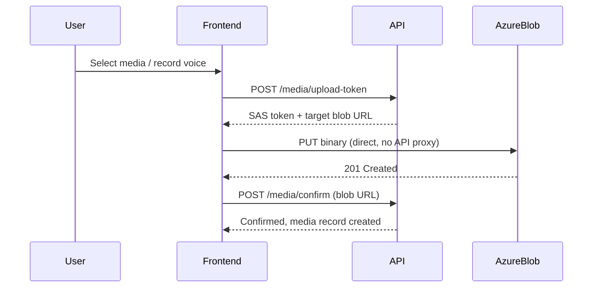
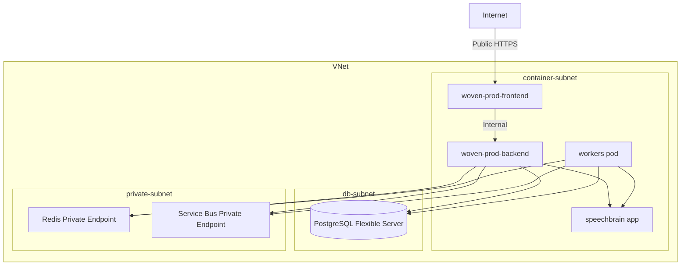
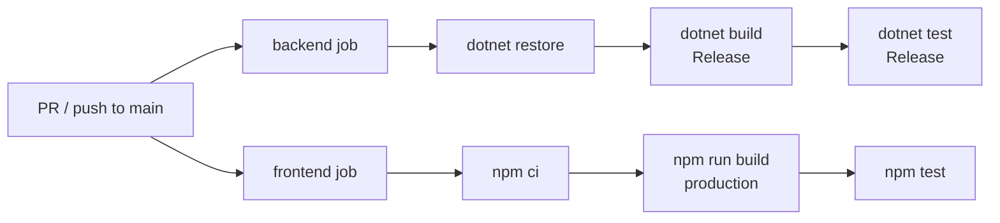
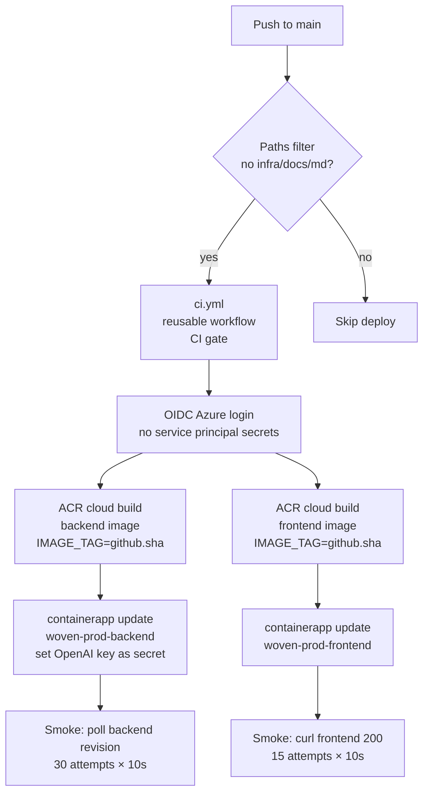
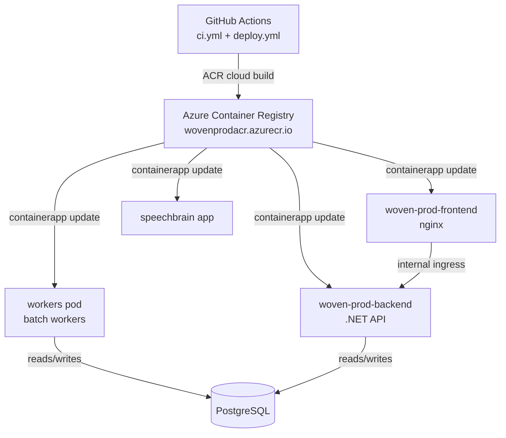

# Woven — Architecture

> System-wide architectural reference. Covers the full technology stack, component topology, inter-service communication, deployment architecture, local development environment, and CI/CD pipeline. Cross-references: [BACKEND_DESIGN.md](BACKEND_DESIGN.md) | [SYSTEM_DESIGN.md](SYSTEM_DESIGN.md)

---

## Table of Contents

1. [Overview](#overview)
2. [Technology Stack Summary](#technology-stack-summary)
3. [Component Topology](#component-topology)
4. [Frontend Architecture](#frontend-architecture)
5. [Backend Architecture](#backend-architecture)
6. [Data Storage Architecture](#data-storage-architecture)
7. [AI and ML Architecture](#ai-and-ml-architecture)
8. [Realtime Architecture](#realtime-architecture)
9. [Media Architecture](#media-architecture)
10. [Azure Infrastructure](#azure-infrastructure)
11. [Network and Security Architecture](#network-and-security-architecture)
12. [Local Development Environment](#local-development-environment)
13. [CI/CD Pipeline](#cicd-pipeline)
14. [Deployment Architecture](#deployment-architecture)
15. [Scaling Model](#scaling-model)

---

## Overview

Woven is a dating app with three primary user-facing surfaces: Moments (daily deck-based discovery), Commons (content tile feed), and Chats (match-gated conversations). The backend is a .NET 10 minimal API. The frontend is Angular 21 with SSR. PostgreSQL 16 with pgvector is the primary database. Redis provides caching. SignalR provides realtime messaging. The ECHO pipeline — a behavioral ML system — learns from user actions to improve match quality over time without any user-visible AI features.



---

## Technology Stack Summary

| Layer | Technology | Version / Config |
|---|---|---|
| Frontend framework | Angular | 21, SSR enabled |
| Frontend runtime | nginx | Prod container |
| Frontend dev port | — | 4202 |
| Backend framework | .NET Minimal API | .NET 10 |
| Backend API port | — | 5135 (dev) / 8080 (container) |
| Primary database | PostgreSQL + pgvector | 16 |
| Database port | — | 5433 (dev) |
| Database name | — | `woven_db` |
| Cache | Redis | Standard C1 (Azure) / 7 Alpine (Docker) |
| Realtime | SignalR | Hub at `/hubs/woven` |
| LLM | OpenAI | `gpt-4.1-mini`, $50/day cap |
| Text embeddings | OpenAI | `text-embedding-3-small`, 1536-dim |
| Voice embeddings | ECAPA-TDNN (SpeechBrain) | 192-dim |
| Photo embeddings | CLIP-style model | 512-dim |
| Object storage | Azure Blob Storage LRS | 3 private containers |
| Message queue | Azure Service Bus Standard | tile-embedding queue |
| Container registry | Azure Container Registry | `wovenprodacr.azurecr.io` |
| Hosting | Azure Container Apps | VNet-integrated |
| IaC | Terraform | `infra/main.tf` |
| CI/CD | GitHub Actions | OIDC auth to Azure |

---

## Component Topology



### Container Level



---

## Frontend Architecture

The frontend is Angular 21 with server-side rendering (SSR) enabled. In production it runs inside an nginx container. In development it runs on port 4202.

### Route Structure

All routes are flat — no nested route groups in the URL:

| Path | Page |
|---|---|
| `/login` | Login / Google OAuth entry |
| `/onboarding/*` | Multi-step onboarding |
| `/moments` | Deck (daily discovery) + Drawn tab |
| `/commons` | Content tile feed |
| `/chats` | Chat thread list |
| `/chats/:threadId` | Individual chat thread |
| `/matches/:matchId/profile` | Match profile view |
| `/you` | Own profile |
| `/you/settings` | Settings |
| `/you/tiles` | My Tiles (highlights) |

### Change Detection

All pages use `ChangeDetectionStrategy.OnPush`. After any async state change, components call `cdr.markForCheck()` or `cdr.detectChanges()` to trigger re-rendering. This is a strict rule — async updates that bypass change detection cause silent UI staleness.

### HTTP Pattern

HTTP calls go through Angular service classes (one per domain). Components never call `HttpClient` directly. One-shot HTTP calls inside `async` methods use `firstValueFrom()`.

### Optimistic UI

Chat sends follow an optimistic pattern: a temporary message is appended immediately, confirmed by the API response, then the list is silently reloaded to reconcile.

### Route Parameter Extraction

Route params are extracted by walking the full route tree — see `getThreadIdFromRouteTree()` in `chat-thread`. Angular's `ActivatedRoute` snapshot alone is insufficient for nested router-outlet scenarios.

### Design System

All CSS values use token variables from `styles.scss`. No raw hex codes or pixel values are used outside the token definitions. No `translateY` hover lifts on any element — hover states use glow, shadow, or color only. `:active` scale transforms are permitted.

---

## Backend Architecture

See [BACKEND_DESIGN.md](BACKEND_DESIGN.md) for the full breakdown. Key architectural points:

### Minimal API with Route Groups

The backend uses .NET 10 Minimal API. Routes are organized into extension methods (`MapXxxEndpoints()`) registered in `Program.cs`. There are no controllers. This produces a lean startup with explicit, readable route registration.

### Dependency Injection

`Program.cs` registers 40+ services in the DI container. Services are grouped by domain: matchmaking, embeddings, games, trust, analytics, cache, notifications. Background workers are registered as `IHostedService`.

### Authorization Boundary

Every endpoint calls `.RequireAuthorization()`. The only exceptions are explicitly documented public routes (health checks, `POST /auth/google`). JWT tokens are stored in `localStorage` in the current dev build.

### Resilient OpenAI Client

`IOpenAiResilientClient` wraps all OpenAI calls with:
- Circuit breaker (prevents cascade failure when OpenAI is degraded)
- Automatic retry with backoff
- Cost tracking against the $50/day budget cap

When the budget cap is reached, the circuit breaker opens and AI features degrade gracefully.

### Worker Isolation

The `WOVEN_DISABLE_BATCH_WORKERS` environment variable gates all background workers. API pods set this to `true`. The dedicated workers pod runs with it unset (or `false`). This prevents duplicate job execution when the API auto-scales.

```mermaid
flowchart LR
    subgraph API Pod (×N)
        direction TB
        A1[Endpoints] --> A2[Services]
        A3[WOVEN_DISABLE_BATCH_WORKERS=true\nNo workers run]
    end

    subgraph Workers Pod (×1, min=max=1)
        direction TB
        W1[EmbeddingBatchWorker]
        W2[ConnectionScoreBatchWorker]
        W3[WeightLearningBatchWorker]
        W4[ModerationWorker]
        W5[TrustBatchWorker]
        W6[DailyDeckOrchestrator]
    end

    PG[(PostgreSQL)]
    RD[(Redis)]

    API Pod --> PG
    API Pod --> RD
    Workers Pod --> PG
    Workers Pod --> RD
```

---

## Data Storage Architecture

### PostgreSQL 16 + pgvector

The primary data store. All relational entities live here. Vector columns use pgvector with HNSW indexes for ANN search. EF Core manages schema via code-first migrations.

**Vector dimensions in use:**

| Purpose | Dimensions | Source |
|---|---|---|
| Text pillars / intent / expression | 1536 | OpenAI text-embedding-3-small |
| Photo embeddings | 512 | CLIP-style model |
| Voice signatures | 192 | ECAPA-TDNN |
| Style / lifestyle / humor | 64–128 | Custom models |
| Emotional rhythm | 48 | Custom model |
| Attachment style | 4 | AttachmentProxyService |

### Redis

Used for:
- Response caching (decks, feeds, match data)
- Rate limiting windows
- Session-adjacent data

All Redis access goes through `ICacheService` / `CacheService`. No cache-aside logic in endpoint handlers.

### Azure Blob Storage

Three private containers:
- `profile-photos` — user profile photos
- `tile-media` — Commons tile images and videos
- `voice-notes` — voice message audio blobs

Clients upload directly using time-limited SAS tokens. The API never proxies binary data.

### Azure Service Bus

Standard tier queue for the tile-embedding pipeline:
- Queue name: `tile-embedding`
- Max delivery count: 5
- Message TTL: 2 days
- Dead-letter queue enabled

`EmbeddingBatchWorker` dequeues and processes messages every 6 hours.

---

## AI and ML Architecture



### OpenAI Usage

All OpenAI calls go through `IOpenAiResilientClient`. The model for all LLM calls is `gpt-4.1-mini`. Text embeddings use `text-embedding-3-small`. The $50/day budget cap prevents runaway costs. The circuit breaker opens on repeated failures or budget exhaustion.

### AiProfileService

Pillar scoring runs per-user and per-pair. The `PairContext` object carries both users' pillar data into the LLM prompt. When data is sparse, scores fall back to cohort distributions rather than returning null or defaulting to zero.

### SpeechBrain Integration

The `speechbrain` Azure Container App runs the ECAPA-TDNN model. It is called over HTTP from both the API (on-demand) and the workers pod (batch). Voice embeddings are 192-dimensional and stored in `UserVoicePreferences` and `UserVectors.VoiceEmbedding`.

---

## Realtime Architecture

SignalR provides realtime messaging between clients and the backend. The hub is mounted at `/hubs/woven`. In production, SignalR backplane (Redis or Azure SignalR Service) is needed when the API scales beyond one replica; the current architecture has a single API pod for realtime purposes or routes sticky sessions.

---

## Media Architecture



The API is never in the binary data path. This keeps API bandwidth low and shifts upload costs to direct blob egress.

---

## Azure Infrastructure

### Resource Inventory

| Resource | Type | Configuration |
|---|---|---|
| Container Apps Environment | Azure Container Apps | VNet-integrated |
| `woven-prod-backend` | Container App | .NET API; internal ingress only |
| `woven-prod-frontend` | Container App | Angular + nginx; public ingress |
| `workers` pod | Container App | min=max=1 (no scale-out) |
| `speechbrain` app | Container App | ECAPA-TDNN inference |
| PostgreSQL Flexible Server | Azure Database for PostgreSQL | Private DNS zone; VNet subnet |
| Redis Cache | Azure Cache for Redis Standard C1 | 1 GB; 99.9% SLA |
| Service Bus Namespace | Azure Service Bus Standard | tile-embedding queue |
| Blob Storage Account | Azure Storage LRS | 3 private containers |
| Container Registry | Azure Container Registry | `wovenprodacr.azurecr.io` |

### VNet Topology



- **container-subnet**: All Container Apps
- **db-subnet**: PostgreSQL Flexible Server (private DNS zone, no public endpoint)
- **private-subnet**: Private endpoints for Redis and Service Bus

The backend API has internal ingress only — it is not directly reachable from the internet. All external traffic enters through the frontend Container App.

---

## Local Development Environment

`docker-compose.yml` defines the full local stack:

| Service | Image | Port Mapping | Notes |
|---|---|---|---|
| `postgres` | `pgvector/pgvector:pg16` | 5433→5432 | Healthcheck: `pg_isready` |
| `azurite` | Azurite | 10000 | Azure Blob Storage emulator |
| `redis` | `redis:7-alpine` | 6379 | |
| `backend` | .NET build | 5135→8080 | Depends on postgres + redis healthy |
| `frontend` | Angular + nginx | 80 | |

Backend depends on `postgres` and `redis` being healthy before starting. Azurite emulates Azure Blob Storage for local media uploads.

**Dev ports at a glance:**

| Service | Port |
|---|---|
| Frontend (Angular dev server) | 4202 |
| Backend API | 5135 |
| PostgreSQL | 5433 |
| Redis | 6379 |
| Azurite Blob | 10000 |

---

## CI/CD Pipeline

### `ci.yml` — Build and Test

Triggers on every PR and push to `main`/`master`.



Both jobs run in parallel. Both must pass before the PR can merge.

### `deploy.yml` — Build and Deploy

Triggers on push to `main`/`master`. Skips runs that only touch `infra/`, `docs/`, or `.md` files.



Authentication uses OIDC (federated identity) — no long-lived service principal secrets in GitHub. Image tags are `github.sha` for exact traceability.

### `terraform.yml` — Infrastructure Changes

Handles Terraform plan and apply for infrastructure-only changes.

---

## Deployment Architecture



The workers pod has `min=max=1` — it does not auto-scale. This prevents multiple workers from running the same batch job concurrently.

---

## Scaling Model

| Component | Scale Strategy | Notes |
|---|---|---|
| Frontend | Azure Container Apps auto-scale | Stateless nginx; scales freely |
| Backend API | Azure Container Apps auto-scale | Stateless; `WOVEN_DISABLE_BATCH_WORKERS=true` |
| Workers Pod | Fixed at 1 replica | `min=max=1`; no concurrent batch runs |
| SpeechBrain App | Azure Container Apps | GPU or CPU inference; scales by request load |
| PostgreSQL | Vertical scale (Flexible Server) | VNet-private; connection pooling recommended at scale |
| Redis | Standard C1 (1 GB) | Single shard; upgrade tier for more memory |
| Service Bus | Standard tier | Auto-scales with throughput |

SignalR realtime: the current architecture does not configure a SignalR backplane. Horizontal API scaling with SignalR requires either sticky sessions (Azure Container Apps session affinity) or a Redis / Azure SignalR Service backplane.

---

*See also: [BACKEND_DESIGN.md](BACKEND_DESIGN.md) for detailed backend internals, [SYSTEM_DESIGN.md](SYSTEM_DESIGN.md) for end-to-end data flows.*
