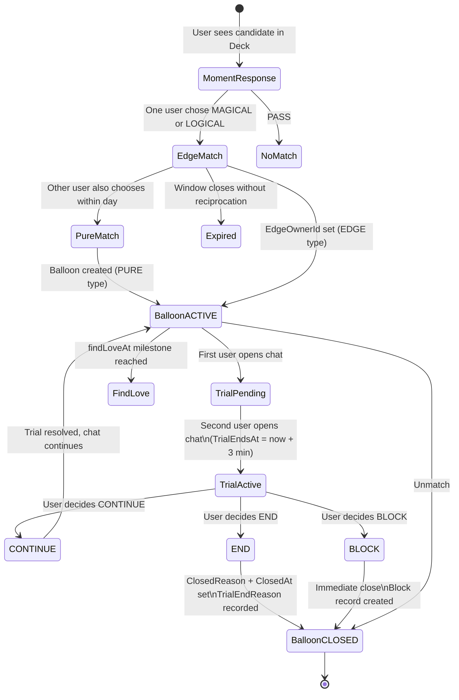
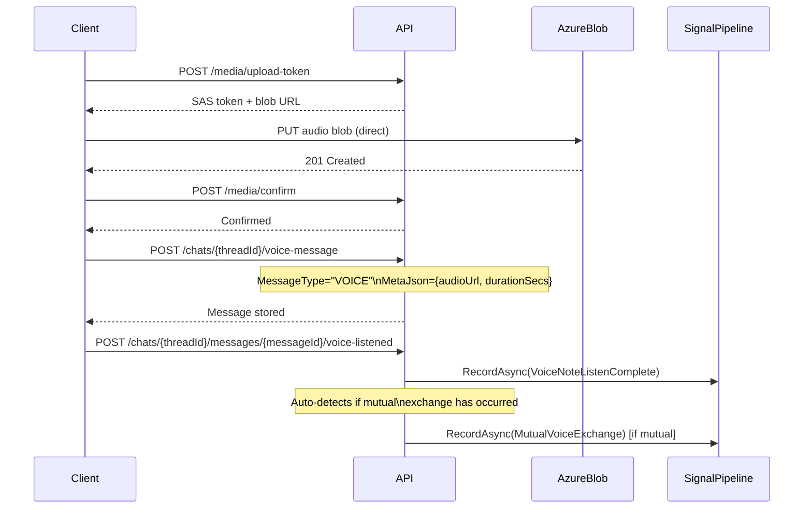
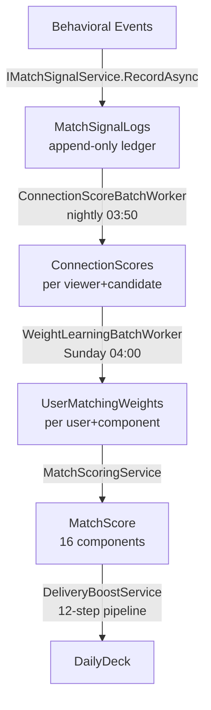

# Woven — Backend Design

> Comprehensive reference for the .NET 10 backend. Covers project structure, service architecture, API patterns, background workers, database entities, encryption, and signal pipeline. Cross-references: [ARCHITECTURE.md](ARCHITECTURE.md) | [SYSTEM_DESIGN.md](SYSTEM_DESIGN.md)

---

## Table of Contents

1. [Tech Stack](#tech-stack)
2. [Project Structure](#project-structure)
3. [API Layer](#api-layer)
4. [Service Layer](#service-layer)
5. [Background Workers](#background-workers)
6. [Database Design](#database-design)
7. [Encryption](#encryption)
8. [Match State Machine](#match-state-machine)
9. [Trial Period](#trial-period)
10. [Voice Notes Flow](#voice-notes-flow)
11. [Spark Economy](#spark-economy)
12. [ECHO Signal Pipeline](#echo-signal-pipeline)
13. [pgvector Columns](#pgvector-columns)
14. [Feature Vocabulary](#feature-vocabulary)
15. [Known Gaps](#known-gaps)

---

## Tech Stack

| Component | Technology |
|---|---|
| Runtime | .NET 10 |
| API Style | Minimal API |
| ORM | Entity Framework Core (code-first) |
| Database | PostgreSQL 16 + pgvector extension |
| Cache | Redis Standard C1 (Azure) / Redis 7 Alpine (Docker) |
| Realtime | SignalR hub at `/hubs/woven` |
| AI / LLM | OpenAI `gpt-4.1-mini` via `IOpenAiResilientClient` |
| Voice Embeddings | ECAPA-TDNN (SpeechBrain), 192-dim |
| Photo Embeddings | CLIP-style visual model, 512-dim |
| Text Embeddings | OpenAI `text-embedding-3-small`, 1536-dim |
| Object Storage | Azure Blob Storage (private containers) |
| Message Queue | Azure Service Bus Standard |

**OpenAI budget cap:** $50/day enforced by `IOpenAiResilientClient`, which also implements circuit breaker and automatic retry with cost tracking.

---

## Project Structure

```
backend/WovenBackend/
├── Endpoints/
│   ├── ChatEndpoints.cs
│   ├── MatchesEndpoints.cs
│   ├── MomentsEndpoints.cs
│   ├── UserDataEndpoints.cs
│   └── (additional route groups — all follow MapXxxEndpoints pattern)
├── Services/
│   ├── Matchmaking/
│   │   ├── MatchScoringService.cs       # 16-component scorer
│   │   ├── WeightLearningService.cs     # logistic regression weight learner
│   │   ├── DeliveryBoostService.cs      # 12-step delivery boost pipeline
│   │   ├── MatchExplanationService.cs   # explanation + 3 date ideas + tone feedback loop
│   │   ├── CandidatePoolService.cs
│   │   ├── DailyDeckOrchestrator.cs
│   │   ├── OpenAiTaggingService.cs
│   │   └── MatchScore.cs
│   ├── Embeddings/
│   │   ├── BehavioralFingerprintService.cs  # 16-dim behavioral fingerprint
│   │   ├── EmbeddingBatchWorker.cs
│   │   ├── VisualPreferenceService.cs
│   │   ├── VoiceEmbeddingService.cs
│   │   └── AttachmentProxyService.cs
│   ├── Moments/
│   │   ├── InteractionBudgetService.cs
│   │   └── (deck generation, spark economy)
│   ├── Tiles/
│   │   └── (Commons feed + tile embedding)
│   ├── Trust/
│   │   └── (catfish detection, trust scoring)
│   ├── Games/
│   │   ├── KnowMeAgent.cs               # 3-question game, difficulty + tone system
│   │   ├── RedGreenFlagAgent.cs         # 3-statement game, GREEN/YELLOW/RED/DEPENDS
│   │   └── GameOutcomeService.cs
│   ├── Feedback/
│   │   └── DateFeedbackService.cs
│   ├── Security/
│   │   └── EncryptionService.cs         # AES-256-GCM
│   ├── Commons/
│   │   └── CommonsFeedService.cs
│   ├── Analytics/
│   │   └── AnalyticsService.cs
│   ├── AiProfileService.cs              # Pillar scoring, DataCompleteness, PairContext, cohort fallback
│   ├── ICacheService.cs / CacheService.cs
│   └── INotificationService.cs / NotificationService.cs
├── data/
│   ├── Entities/                        # EF Core entities (snake_case columns)
│   └── WovenDbContext.cs
├── Migrations/                          # yyyyMMdd_DescriptiveName.cs format
├── Program.cs                           # DI registration (40+ services), middleware, worker schedule
└── appsettings.json                     # OpenAI model, ECHO weights, connection strings
```

---

## API Layer

### Authorization

All endpoints require `.RequireAuthorization()`. Public routes are the explicit exception, not the rule. User identity is resolved at the top of every endpoint file via the `GetUserId(http.User)` helper — never inline.

### Timestamps

All timestamp calculations use `MomentsRules.NowUtc()`, not `DateTime.UtcNow` directly. This ensures a single, testable time source across the system.

### Route Registration Pattern

Each endpoint file exposes a single `MapXxxEndpoints(this WebApplication app)` extension method. `Program.cs` calls these in sequence during startup. This keeps the startup file readable and forces logical grouping of related routes.

### Signal Recording

Every behavioral event must record a signal via `IMatchSignalService.RecordAsync(...)`. This is a hard rule — skipping it means the ECHO pipeline loses data it cannot recover. Signal records are appended to `MatchSignalLog` with `OccurredAt` as the timestamp. New event types are registered as constants in `MatchSignalEventTypes`.

### Key API Routes

#### Authentication
| Method | Route | Notes |
|---|---|---|
| POST | `/auth/google` | Google OAuth login |

#### Chat
| Method | Route | Notes |
|---|---|---|
| GET | `/chats` | List chat threads |
| GET | `/chats/{threadId}` | Thread detail — messages, match state, date ideas |
| POST | `/chats/{threadId}/messages` | Send text message |
| POST | `/chats/{threadId}/voice-message` | Send voice note |
| POST | `/chats/{threadId}/messages/{messageId}/voice-listened` | Track voice listen, auto-detects mutual exchange |
| POST | `/chats/{threadId}/date-interest` | Express date interest (logs `DateIdeaAccepted` signal) |

#### Moments
| Method | Route | Notes |
|---|---|---|
| GET | `/moments/deck` | Today's Deck |
| GET | `/moments/liked-you` | Drawn tab |
| POST | `/moments/{candidateId}/choose` | Magical / Resonant / Pass |

#### Commons
| Method | Route | Notes |
|---|---|---|
| GET | `/commons/feed` | Commons tile feed |
| POST | `/commons/tiles` | Create tile |

#### Media
| Method | Route | Notes |
|---|---|---|
| POST | `/media/upload-token` | SAS token for direct Azure Blob PUT |
| POST | `/media/confirm` | Confirm upload complete |

#### Matches
| Method | Route | Notes |
|---|---|---|
| GET | `/matches/{matchId}/profile` | Match profile view |

#### Health
| Method | Route | Notes |
|---|---|---|
| GET | `/health` | Full health check |
| GET | `/health/live` | Liveness probe |
| GET | `/health/ready` | Readiness probe |

---

## Service Layer

### Matchmaking Services

**`MatchScoringService`** — the core ECHO scorer. Computes a composite compatibility score from 16 distinct components. Each component has a base weight stored in `appsettings.json` under the ECHO weights key; weights are updated weekly by `WeightLearningBatchWorker`. Output is a `MatchScore` record.

**`WeightLearningService`** — logistic regression over historical `ConnectionScores` and `MatchSignalLogs`. Runs every Sunday at 04:00 UTC. Updates per-user weights in `UserMatchingWeights` (keyed by UserId + Component).

**`DeliveryBoostService`** — a 12-step pipeline applied after scoring to boost or suppress delivery of a candidate to a given viewer. Accounts for freshness, prior exposure, delivery diversity, and other signals. Outputs the final delivery priority.

**`MatchExplanationService`** — generates the match explanation shown to users when a Balloon pops. Also generates 3 date ideas and runs a tone feedback loop to calibrate the explanation's voice. Uses `gpt-4.1-mini` via `IOpenAiResilientClient`.

**`CandidatePoolService`** — assembles the raw candidate pool from the database before scoring. Applies hard filters (blocks, prior pass, geography if applicable) before handing candidates to `MatchScoringService`.

**`DailyDeckOrchestrator`** — coordinates the end-to-end daily deck generation: candidate pool → scoring → delivery boost → deck write. Runs on a daily schedule.

**`OpenAiTaggingService`** — uses `gpt-4.1-mini` to generate semantic tags for user content and profiles.

### Embedding Services

**`BehavioralFingerprintService`** — produces a 16-dimensional fingerprint from behavioral signals. Stored in `UserBehavioralFingerprints`.

**`EmbeddingBatchWorker`** — processes the embedding queue every 6 hours. Handles text, photo, and voice embeddings in batch.

**`VisualPreferenceService`** — manages the 512-dim visual preference and aversion embeddings per user.

**`VoiceEmbeddingService`** — calls the SpeechBrain ECAPA-TDNN service to produce 192-dim voice signatures.

**`AttachmentProxyService`** — derives an attachment proxy score used in pillar scoring.

### AI Profile Service

**`AiProfileService`** — the central pillar scoring engine. Computes scores for each personality/values pillar from foundational question answers. Handles `DataCompleteness` calculation to determine when a user's profile has enough signal for reliable scoring. Builds `PairContext` objects for pair-wise scoring. Includes cohort fallback: when a user's pillar data is sparse, scores fall back to cohort-level distributions.

### Games

**`KnowMeAgent`** — drives the Know Me mini-game. Generates 3 questions per session at EASY/MEDIUM/HARD difficulty levels and PLAYFUL/THOUGHTFUL/BALANCED tones, tuned to the pair's match context.

**`RedGreenFlagAgent`** — drives the Red/Green Flag mini-game. Generates 3 statements per session; users respond with GREEN/YELLOW/RED/DEPENDS. Responses feed back into preference signals.

**`GameOutcomeService`** — records game session results and propagates outcome signals to the ECHO pipeline.

### Security

**`EncryptionService`** — implements AES-256-GCM symmetric encryption. Applied transparently in `WovenDbContext` via `EncryptedStringConverter` on PII fields (see [Encryption](#encryption)).

### Cache

**`CacheService`** (implements `ICacheService`) — Redis wrapper. Used across the system for deck caching, rate limiting windows, and session-adjacent data. No cache-aside logic lives in endpoint handlers — always behind the service interface.

### Notifications

**`NotificationService`** (implements `INotificationService`) — handles in-app notification dispatch. Push notifications (Web Push / VAPID) are not yet implemented.

---

## Background Workers

All background workers are gated by the `WOVEN_DISABLE_BATCH_WORKERS` environment variable. API pods set this to `true`. Only the dedicated workers pod runs them. This prevents double-execution when the API scales horizontally.

```mermaid
gantt
    title Worker Schedule (UTC)
    dateFormat HH:mm
    axisFormat %H:%M

    section Frequent
    ModerationWorker (every 5 min)     :active, 00:00, 24:00
    EmbeddingBatchWorker (every 6 hr)  :active, 00:00, 24:00

    section Nightly
    DailyDeckOrchestrator              :milestone, 00:00, 0m
    ConnectionScoreBatchWorker         :milestone, 03:50, 0m

    section Weekly
    WeightLearningBatchWorker (Sun)    :milestone, 04:00, 0m
    TrustBatchWorker (Tue)             :milestone, 02:00, 0m
```



| Worker | Schedule | Purpose |
|---|---|---|
| `EmbeddingBatchWorker` | Every 6 hours | Processes text/photo/voice embedding queue |
| `ConnectionScoreBatchWorker` | Nightly 03:50 UTC | Aggregates signals into composite outcome scores per (viewer, candidate) pair |
| `WeightLearningBatchWorker` | Sunday 04:00 UTC | Runs logistic regression and updates ECHO weights |
| `ModerationWorker` | Every 5 minutes | Processes moderation queue for tiles and reported content |
| `TrustBatchWorker` | Tuesday 02:00 UTC | Runs catfish detection and trust scoring |
| `DailyDeckOrchestrator` | Daily | Generates next-day decks for all active users |

---

## Database Design

The database is PostgreSQL 16 with the pgvector extension. Entity Framework Core manages schema via code-first migrations. All entity column names use snake_case (configured in `WovenDbContext.OnModelCreating`). Migrations follow the filename pattern `yyyyMMdd_DescriptiveName.cs`.

HNSW indexes for vector columns are added via raw SQL in migrations (pgvector must be installed on the database server; local dev installs it via the Docker pgvector image).

### Entity Groups

#### User and Profile

| DbSet | Notes |
|---|---|
| `Users` | Core identity record |
| `AuthIdentities` | Google OAuth bindings; unique on (provider, subject) |
| `UserProfiles` | 1:1 with User |
| `UserPreferences` | 1:1 with User |
| `UserPhotos` | Multiple photos per user |
| `UserIntents` | 1:1 — relationship intent + reflection sentence (encrypted) |
| `UserFoundationalV1` | 1:1 — foundational question answers |
| `UserFoundationalQuestionSets` | Versioned question set assignments |
| `UserOptionalFields` | Flexible key/value optional fields (value encrypted) |
| `UserWeeklyVibes` | 1:1 weekly vibe answer |
| `UserDynamicIntakeSets` | Dynamic intake question sets |

#### Wallet and Subscriptions

| DbSet | Notes |
|---|---|
| `SparkWallets` | PK = UserId; current spark balance |
| `PushSubscriptions` | Web Push subscription records (not yet active) |

#### Moments and Matching

| DbSet | Notes |
|---|---|
| `Matches` | PURE/EDGE type; ACTIVE/CLOSED balloon state; UserAId/UserBId/EdgeOwnerId |
| `ChatNotes` | Background signal notes attached to chat threads |
| `ChatNoteLoveReactions` | Reactions on chat notes |
| `MessageLoveReactions` | Reactions on chat messages |
| `DailyInteractions` | PK = UserId+DateUtc; CHECK: total_used 0-5, pending_used 0-2 |
| `PendingMatches` | Pre-match state for EDGE matches |
| `Blocks` | PK = BlockerId+BlockedId |
| `MomentResponses` | Recorded Magical/Resonant/Pass choices |
| `ChatThreads` | Unique per match |
| `ChatMessages` | Individual messages (MessageType: TEXT/VOICE) |
| `UserRatings` | Platform-internal ratings (never shown to users) |

#### ECHO Signal Pipeline

| DbSet | Notes |
|---|---|
| `MatchSignalLogs` | Append-only ledger; indexes on (ViewerId, CandidateId, OccurredAt), (ViewerId, EventType, OccurredAt), (OccurredAt) |
| `ConnectionScores` | Unique per (ViewerId, CandidateId); upserted nightly by `ConnectionScoreBatchWorker` |
| `UserBehavioralFingerprints` | PK = UserId; 16-dim fingerprint |
| `LinUcbUserModels` | PK = UserId; LinUCB bandit model state |

#### Matchmaking Engine

| DbSet | Notes |
|---|---|
| `UserVectors` | Unique per UserId+Version; contains all pgvector columns |
| `UserVectorTags` | Semantic tags associated with user vectors |
| `DailyDecks` | Unique per UserId+DateUtc |
| `MatchExplanations` | Generated explanations per match |
| `MatchOutcomes` | Recorded outcomes for weight learning |
| `CandidateExposures` | Unique per ViewerUserId+ShownUserId+DateUtc+Surface |
| `CandidateSignals` | Signals attached to specific candidate exposures |

#### Games

| DbSet | Notes |
|---|---|
| `GameSessions` | One session per game per match |
| `GameRounds` | Individual rounds within a session |
| `GameResults` | Outcome per round |
| `GameAnalytics` | Aggregated game analytics |
| `GameOutcomes` | Final session outcomes fed to ECHO |

#### Commons (Tiles)

| DbSet | Notes |
|---|---|
| `Tiles` | content_type IN (text, photo, video, voice) |
| `Highlights` | Profile highlight slots 1-9 |
| `ModerationQueues` | Content awaiting moderation |
| `TileReports` | User-submitted tile reports |
| `TileViews` | PK = UserId+TileId+ViewedAt |
| `UserEnergyMeters` | PK = UserId+DateUtc; daily interaction budget |

#### Orbit and Social

| DbSet | Notes |
|---|---|
| `TileOrbits` | relationship_type IN (romantic, social) |
| `TileEngagements` | Engagement events on tiles |
| `FriendBridges` | Social graph bridges |
| `OrbitGravities` | PK = UserId+CandidateId; aggregated orbit signal |

#### Seasons

| DbSet | Notes |
|---|---|
| `Seasons` | Active season definitions |
| `UserSeasonResponses` | Per-user season answer records |

#### Collaborative Filtering

| DbSet | Notes |
|---|---|
| `CfScores` | PK = UserId+CandidateId; no self-score constraint |

Note: `CollaborativeFilteringService` exists but no batch worker currently runs it (see [Known Gaps](#known-gaps)).

#### Enhanced Embeddings

| DbSet | Notes |
|---|---|
| `PhotoEmbeddings` | 512-dim CLIP-style photo embeddings |
| `UserVisualDecisions` | YES/NO/PENDING decisions on candidate photos |
| `UserVisualPreferences` | PreferenceEmbedding 512-dim + AversionEmbedding 512-dim |
| `UserVoicePreferences` | 192-dim voice preference embedding |
| `UserMatchingWeights` | PK = UserId+Component; per-user ECHO component weights |

#### Security and Analytics

| DbSet | Notes |
|---|---|
| `SecurityAuditLogs` | Immutable audit trail |
| `UserInsights` | AI-generated user insights (internal) |
| `ChatAvailabilitySignals` | Signals about chat availability patterns |
| `DateFeedbacks` | Post-date feedback records |
| `DateFeedbackPrompts` | Prompts used to collect date feedback |
| `ReferencePhotoEmbeddings` | 512-dim embeddings for catfish detection |
| `UserVerifications` | Verification state per user |
| `AnalyticsEvents` | Raw analytics event log |
| `AbExperiments` | A/B experiment definitions |
| `AbAssignments` | User-to-experiment assignments |
| `AbConversions` | Conversion events for A/B experiments |

---

## pgvector Columns

pgvector enables ANN (approximate nearest neighbor) searches directly in PostgreSQL. HNSW indexes are created via raw SQL in migrations.

### UserVector Columns

| Column | Dimensions | Embedding Source | Purpose |
|---|---|---|---|
| `PillarEmbedding` | 1536 | OpenAI text-embedding-3-small | Embedding of pillar question answers |
| `ExpressionEmbedding` | 1536 | OpenAI text-embedding-3-small | Writing style and expression |
| `IntentEmbedding` | 1536 | OpenAI text-embedding-3-small | Relationship intent |
| `StyleEmbedding` | 128 | Custom | Communication style |
| `HumorEmbedding` | 64 | Custom | Humor signature |
| `LifestyleEmbedding` | 128 | Custom | Lifestyle factors |
| `EmotionalRhythmEmbedding` | 48 | Custom | Emotional patterns |
| `AttachmentProxyEmbedding` | 4 | `AttachmentProxyService` | Attachment style (secure / anxious / avoidant / fearful) |
| `VoiceEmbedding` | 192 | ECAPA-TDNN / SpeechBrain | Voice signature |

### Other pgvector Columns

| Entity | Column | Dimensions | Purpose |
|---|---|---|---|
| `Tile` | `Embedding` | 1536 | Tile content semantic embedding |
| `Tile` | `VoiceEmbedding` | 192 | Voice tile embedding |
| `PhotoEmbedding` | `Embedding` | 512 | CLIP-style photo embedding |
| `UserVisualPreference` | `PreferenceEmbedding` | 512 | Visual preference direction |
| `UserVisualPreference` | `AversionEmbedding` | 512 | Visual aversion direction |
| `UserVoicePreference` | `PreferenceEmbedding` | 192 | Voice preference direction |
| `ReferencePhotoEmbedding` | `Embedding` | 512 | Catfish detection reference |

---

## Encryption

`EncryptionService` implements AES-256-GCM. The `EncryptedStringConverter` is applied in `WovenDbContext.OnModelCreating` to the following fields:

| Entity | Field |
|---|---|
| `User` | `Email` |
| `User` | `FullName` |
| `UserProfile` | `City` |
| `UserProfile` | `State` |
| `UserOptionalField` | `Value` |
| `UserIntent` | `ReflectionSentence` |

**Not encrypted:** `ChatMessages.Body` — the current schema has a CHECK constraint limiting body length (1-1000 chars), which AES-256-GCM ciphertext would exceed. This requires a migration to widen or drop the constraint before encryption can be applied.

---

## Match State Machine



**CHECK constraints enforced by the database:**
- `ACTIVE` state: `closed_reason IS NULL`, `closed_at IS NULL`
- `CLOSED` state: `closed_reason IS NOT NULL`, `closed_at IS NOT NULL`
- `PURE` type: `edge_owner_id IS NULL`
- `EDGE` type: `edge_owner_id IS NOT NULL`
- `expires_at > created_at` always

---

## Trial Period

The trial window is the critical early stage of a match. Its mechanics are:

1. Match balloon pops (ACTIVE state set).
2. First user opens the chat thread — `TrialUserAOpenedAt` recorded.
3. Second user opens the chat thread — `TrialUserBOpenedAt` recorded.
4. When both timestamps are non-null: `TrialEndsAt = now + 3 minutes`.
5. Within those 3 minutes, each user makes a decision:
   - **CONTINUE** — they want to keep the connection open.
   - **END** — they don't feel a spark; match closes. End reason stored: `no_spark` / `wrong_timing` / `not_my_type`.
   - **BLOCK** — immediate match close plus a `Block` record.
6. End reasons feed the ECHO pipeline as preference signals.

---

## Voice Notes Flow



Audio is uploaded directly to Azure Blob Storage using a time-limited SAS token. The API never proxies audio bytes. `MessageType = "VOICE"` distinguishes voice notes from text messages. The `voice-listened` endpoint tracks completion (not just play start) and automatically records `MutualVoiceExchange` when both users have sent and listened to each other's notes.

---

## Spark Economy

| Rule | Value |
|---|---|
| Daily spark grant | 5 sparks |
| Wallet maximum | 10 sparks |
| Cost per Drawn action | 1 spark |
| Ghost refund | 0.5 sparks |
| Ghost refund trigger | Match ends with 0 messages exchanged (all 3 unmatch paths) |

The ghost refund is wired to all three unmatch close paths so no refund is missed regardless of how a match closes without conversation.

---

## ECHO Signal Pipeline

The ECHO pipeline is the behavioral matchmaking engine. It learns from what users actually do, not what they say they want.

### Signal Types

| EventType | What It Captures |
|---|---|
| `TimeToFirstMessageMs` | Speed of first message after match (primary outcome proxy) |
| `ChatDepthMessages` | Total message count in thread |
| `TrialContinued` | User chose to continue after trial |
| `TrialEndedNoSpark` | Trial ended — no spark reason |
| `DateIdeaAccepted` | Which date idea was chosen + metadata |
| `VoiceNoteListenComplete` | Voice note played to completion (not sender's own) |
| `MutualVoiceExchange` | Both users have sent and listened to voice notes |
| `UserFlagged` | Safety flag — never mixed into compatibility scoring |

### Data Flow



### 16-Component Scorer

`MatchScoringService` computes scores across 16 components. Base weights are in `appsettings.json`. Per-user weights in `UserMatchingWeights` (updated by `WeightLearningService`) override the base when sufficient data exists. The `MatchScore` record carries both the raw component scores and the final weighted composite.

### Behavioral Fingerprint

`BehavioralFingerprintService` produces a 16-dimensional fingerprint per user from their accumulated behavioral signals. Stored in `UserBehavioralFingerprints`. Used as an input feature in the weight learning model.

---

## Feature Vocabulary

| UI Name | Internal ID / DB Value | Notes |
|---|---|---|
| Deck | `'today'` | Daily discovery tab |
| Drawn | `'liked-you'` | Mutual-like tab (costs 1 spark to act on) |
| Magical | `MAGICAL` | ◈ choice — full connection feel |
| Resonant | `LOGICAL` | ◇ choice — intellectual/resonant feel |
| Commons | — | Content feed |
| Tile | — | Individual content post |
| Orbit | `OrbitGravity` | Explicit ◈ on a tile |
| ECHO | — | Matching AI pipeline |
| Balloon | `BalloonState` | Match connection window |
| Find Love | `findLoveAt` | Final unlock stage |

---

## Known Gaps

| Gap | Status |
|---|---|
| Push notifications | No service worker, no VAPID, no Web Push endpoint wired in `NotificationService` |
| CfScore batch job | `CollaborativeFilteringService` exists; no worker runs it |
| SharedTileAffinity matchmaking component | Depends on CfScore data |
| PreferenceEmbedding from ChatNotes | Worker stub exists, not wired |
| Ambition pillar coverage | No foundational question covers this pillar |
| `ChatMessages.Body` encryption | Blocked by CHECK constraint on message length |
| "Your Turn" chat list indicator | Designed, not built |
| Active/online indicator | Designed, not built |
| Horoscope onboarding field | Designed, not built |

---

*See also: [ARCHITECTURE.md](ARCHITECTURE.md) for the system-wide view, [SYSTEM_DESIGN.md](SYSTEM_DESIGN.md) for end-to-end data flows and infrastructure.*
