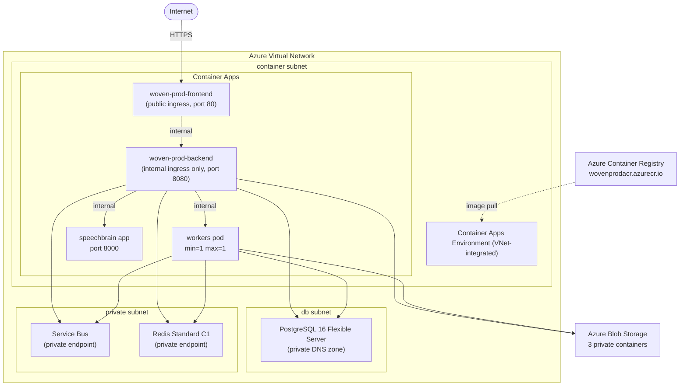
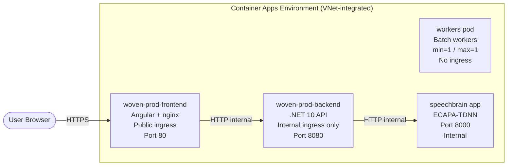
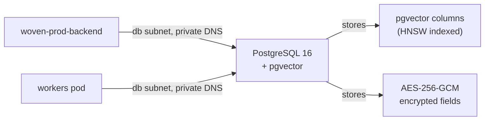
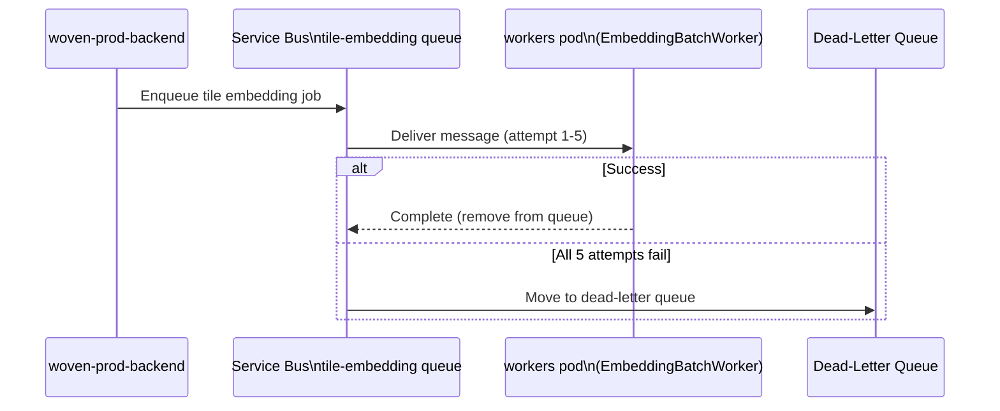
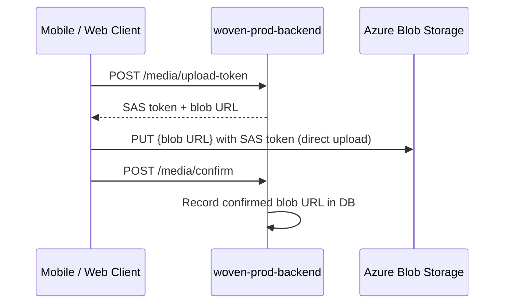
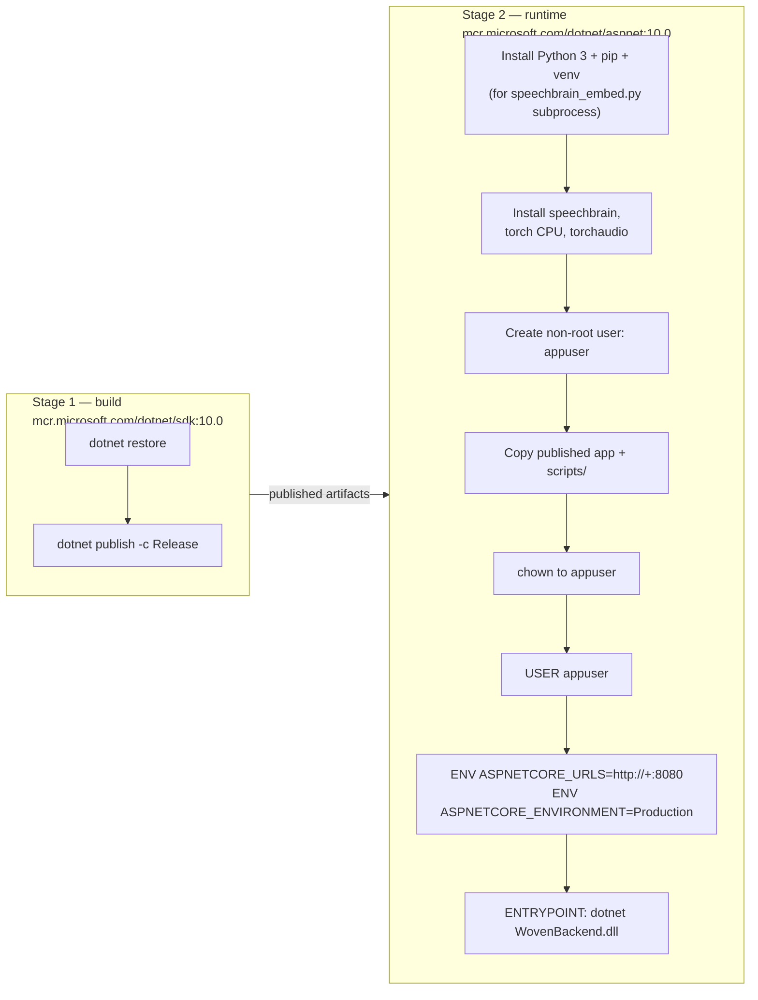
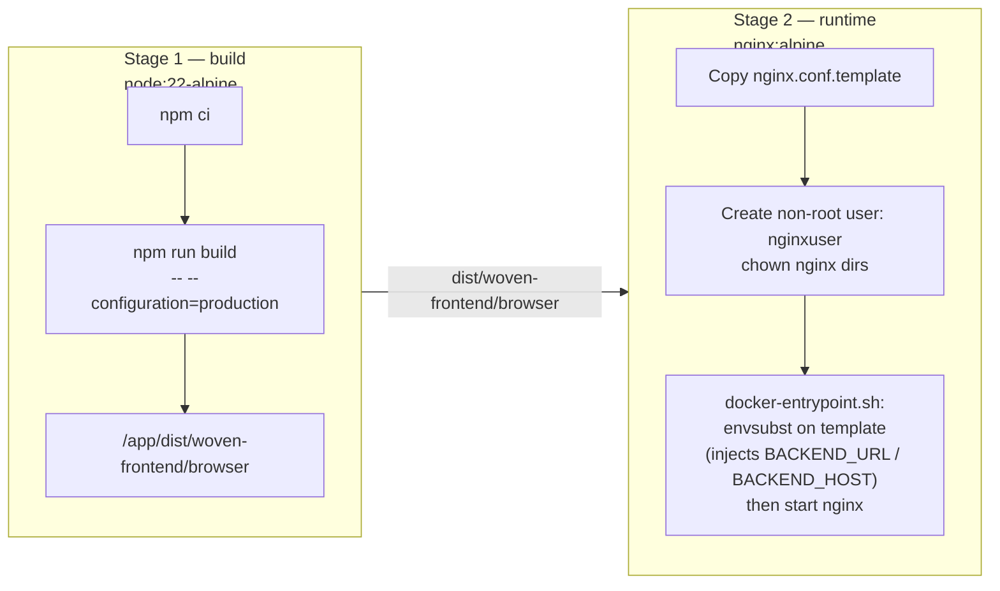
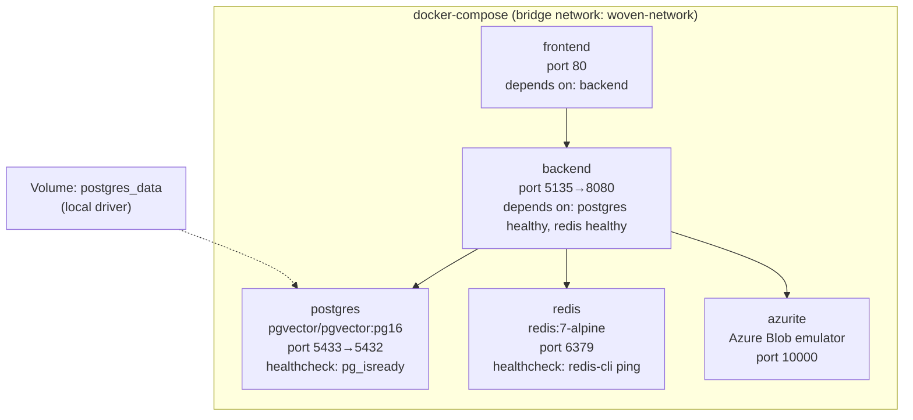
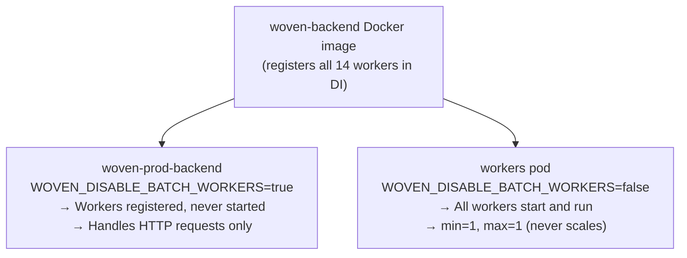

# Woven — Cloud Infrastructure

This document covers the Azure infrastructure that runs Woven in production: the virtual network topology, every hosted service, how containers are built and run, and how local development mirrors the cloud shape.

Related docs: [ARCHITECTURE.md](ARCHITECTURE.md) · [DEVOPS.md](DEVOPS.md) · [SECURITY.md](SECURITY.md) · [BACKEND_DESIGN.md](BACKEND_DESIGN.md)

---

## Table of Contents

1. [Resource Group](#resource-group)
2. [Virtual Network Topology](#virtual-network-topology)
3. [Container Apps Environment](#container-apps-environment)
4. [PostgreSQL Flexible Server](#postgresql-flexible-server)
5. [Redis Cache](#redis-cache)
6. [Azure Service Bus](#azure-service-bus)
7. [Azure Blob Storage](#azure-blob-storage)
8. [Azure Container Registry](#azure-container-registry)
9. [SpeechBrain Voice Embedding Service](#speechbrain-voice-embedding-service)
10. [Container Images](#container-images)
11. [Local Development Environment](#local-development-environment)
12. [Worker Isolation Pattern](#worker-isolation-pattern)

---

## Resource Group

All production resources live in a single Azure resource group:

```
Resource Group: woven-prod-rg
```

Every service described in this document is deployed into `woven-prod-rg`. Infrastructure is defined in `infra/main.tf` (Terraform).

---

## Virtual Network Topology

The production VNet has three dedicated subnets that enforce network-level isolation between the application tier, the database tier, and the messaging/cache tier.



### Subnet Assignments

| Subnet | Purpose | Services |
|---|---|---|
| container subnet | Application workloads | Container Apps Environment (all 4 apps) |
| db subnet | Database tier | PostgreSQL Flexible Server with private DNS zone and VNet integration |
| private subnet | Messaging and cache | Service Bus private endpoint, Redis private endpoint |

The Container Apps Environment is VNet-integrated into the container subnet. The frontend is the only publicly reachable surface — the backend Container App uses **internal ingress only** and cannot be reached from the internet directly.

---

## Container Apps Environment

The Container Apps Environment is VNet-integrated and hosts four Container Apps:



### App Details

#### woven-prod-frontend
- **Image:** `wovenprodacr.azurecr.io/woven-frontend:{sha}`
- **Ingress:** Public (internet-facing)
- **Port:** 80
- **Runtime:** nginx serving pre-built Angular bundle
- At startup, `docker-entrypoint.sh` runs `envsubst` on `nginx.conf.template` to inject `BACKEND_URL` / `BACKEND_HOST`, then starts nginx.

#### woven-prod-backend
- **Image:** `wovenprodacr.azurecr.io/woven-backend:{sha}`
- **Ingress:** Internal only — not publicly reachable
- **Port:** 8080
- **Runtime:** .NET 10 ASP.NET Core API
- `WOVEN_DISABLE_BATCH_WORKERS=true` on all API pods — 14 heavy batch workers are registered in DI but never started here.

#### workers pod
- **Image:** `wovenprodacr.azurecr.io/woven-backend:{sha}` (same image as backend)
- **Ingress:** None
- **Scale:** min=1, max=1 — always exactly one instance, never scales
- `WOVEN_DISABLE_BATCH_WORKERS=false` (or unset) — all heavy batch workers run here exclusively.
- Fixed single-instance scale prevents duplicate nightly batch runs.

#### speechbrain app
- **Image:** Custom Python image (see [SpeechBrain section](#speechbrain-voice-embedding-service))
- **Port:** 8000
- **Ingress:** Internal only
- **Runtime:** uvicorn with 2 workers
- Produces 192-dimensional voice embeddings via ECAPA-TDNN.

---

## PostgreSQL Flexible Server

- **Version:** PostgreSQL 16
- **Deployment:** Private — accessible only within the VNet via the db subnet
- **DNS:** Private DNS zone with VNet integration
- **Extension:** pgvector enabled via `azurerm_postgresql_flexible_server_configuration` (`value = "VECTOR"`)
- **HNSW indexes:** Applied via raw SQL after provisioning. EF Core migrations do not generate HNSW index syntax; they are applied manually via psql.

### pgvector Note

The pgvector extension is enabled at the server configuration level via Terraform. HNSW (Hierarchical Navigable Small World) indexes — used for approximate nearest-neighbor search on embedding vectors — cannot be expressed through EF Core and must be applied as raw SQL post-provisioning.



---

## Redis Cache

- **Tier:** Azure Cache for Redis, Standard C1
- **Memory:** 1 GB
- **SLA:** 99.9%
- **Networking:** Private endpoint in the private subnet

### What Redis Caches

| Use Case | Key Pattern | TTL |
|---|---|---|
| Session / deck state | (managed by app) | Varies |
| Deck caching | (managed by app) | Varies |
| Deduplication keys | (managed by app) | Varies |
| Nudge dismiss state | (managed by app) | Varies |
| Data export rate limiting | `data-export:{userId}` | 30 days |

---

## Azure Service Bus

- **Tier:** Standard
- **Networking:** Private endpoint in the private subnet

### Queues

#### tile-embedding
- **Max delivery attempts:** 5
- **Message TTL:** 2 days
- **Dead-letter queue (DLQ):** Enabled — messages that exhaust all delivery attempts are moved to the DLQ for inspection

**Flow:**



---

## Azure Blob Storage

- **Redundancy:** LRS (Locally Redundant Storage)
- **Public access:** None — all containers are private

### Containers

| Container | Contents |
|---|---|
| `profile-photos` | User profile images |
| `tile-media` | Commons tile images/video |
| `voice-notes` | Voice note audio files |

### Access Pattern (SAS Token Flow)

Clients never receive a direct storage credential. All uploads go through a short-lived SAS token issued by the backend:



---

## Azure Container Registry

- **Name:** `wovenprodacr`
- **Login server:** `wovenprodacr.azurecr.io`
- **Images hosted:**
  - `woven-backend` — .NET API + workers
  - `woven-frontend` — Angular + nginx

Images are built using ACR cloud build (`az acr build`), not locally. The build happens in the cloud on Azure's infrastructure. Each image is tagged with the Git commit SHA (`IMAGE_TAG=${{ github.sha }}`), giving every deployment a unique, traceable image reference.

---

## SpeechBrain Voice Embedding Service

The speechbrain app is a dedicated Python microservice that produces 192-dimensional voice embeddings using the ECAPA-TDNN speaker recognition model.

### Container Build Details

- **Base image:** `python:3.11-slim`
- **System dependencies installed:** `libsndfile1`, `ffmpeg`
- **Python dependencies:** PyTorch 2.2.2 (CPU-only — no CUDA), SpeechBrain library
- **Model:** `speechbrain/spkrec-ecapa-voxceleb` (ECAPA-TDNN) — **baked into the image at build time**
  - Model is approximately 200 MB
  - Pre-downloading at build time eliminates cold-start model download latency on first request

### Runtime

```
uvicorn main:app --host 0.0.0.0 --port 8000 --workers 2
```

Two uvicorn workers allow one worker to handle incoming requests while the other processes audio, preventing request starvation during heavy inference.

### Output

192-dimensional embedding vector per audio input. These embeddings are used for voice similarity matching in the ECHO pipeline.

---

## Container Images

### Backend (Multi-Stage Build)



Key points:
- Non-root user `appuser` — the process never runs as root
- Python + SpeechBrain installed into the runtime image so the backend can call `scripts/speechbrain_embed.py` via subprocess
- No Docker `HEALTHCHECK` — Container Apps uses its own liveness/readiness probes
- Port: 8080

### Frontend (Multi-Stage Build)



Key points:
- Non-root user `nginxuser` — nginx runs without root privileges
- `BACKEND_URL` defaults to `http://backend:8080` (for Docker Compose); Container Apps overrides this via Terraform environment variable injection
- Port: 80

---

## Local Development Environment

Local development uses Docker Compose to replicate the production shape without cloud credentials.



### Service Configuration

| Service | Image | Host Port | Notes |
|---|---|---|---|
| postgres | `pgvector/pgvector:pg16` | 5433 | pgvector image includes extension; healthcheck via `pg_isready` |
| azurite | `mcr.microsoft.com/azure-storage/azurite:latest` | 10000 | Azure Blob Storage emulator (devstoreaccount1) |
| redis | `redis:7-alpine` | 6379 | healthcheck via `redis-cli ping` |
| backend | `./backend/WovenBackend/Dockerfile` | 5135 | waits for postgres and redis to be healthy before starting |
| frontend | `./frontend/woven-frontend/Dockerfile` | 80 | waits for backend |

### Backend Environment Variables (Docker Compose)

| Variable | Value |
|---|---|
| `ASPNETCORE_ENVIRONMENT` | `Production` |
| `ConnectionStrings__DefaultConnection` | `Host=postgres;Port=5432;Database=woven;Username=woven;Password=woven` |
| `Redis__ConnectionString` | `redis:6379,abortConnect=false` |
| `Azure__Storage__ConnectionString` | Azurite connection string (devstoreaccount1) |
| `Jwt__Key` | `${JWT_KEY:-CHANGE_THIS_...}` — from env var with insecure default |
| `GoogleAuth__ClientId` | `211033152902-...` |
| `OpenAI__ApiKey` | `${OPENAI_API_KEY}` — required, no default |
| `Cors__AllowedOrigins` | `http://localhost,http://localhost:80,...` |

The `CHANGE_THIS_...` default for `Jwt__Key` is intentionally insecure and must be overridden via `.env` before running locally with any real data.

---

## Worker Isolation Pattern

Because the backend and workers pod run the same Docker image, all 14 heavy batch workers are registered in the DI container on every pod. The `WOVEN_DISABLE_BATCH_WORKERS` environment variable controls whether they actually start:



This design means:
- Multiple API pod replicas can run (for HTTP scale) without triggering duplicate batch jobs
- The workers pod is pinned to exactly 1 instance, guaranteeing each scheduled job runs exactly once
- No separate worker image to maintain — the same build artifact serves both roles

### Batch Worker Schedule

| Worker | Schedule |
|---|---|
| EmbeddingBatchWorker | Every 6 hours |
| ModerationWorker | Every 5 minutes |
| DailyDeckOrchestrator | Daily |
| ConnectionScoreBatchWorker | Nightly 03:50 UTC |
| TrustBatchWorker | Tuesday 02:00 UTC |
| WeightLearningBatchWorker | Sunday 04:00 UTC |
| (8+ additional workers) | Various schedules |

All workers run exclusively on the workers pod. The API pods handle only HTTP traffic.
