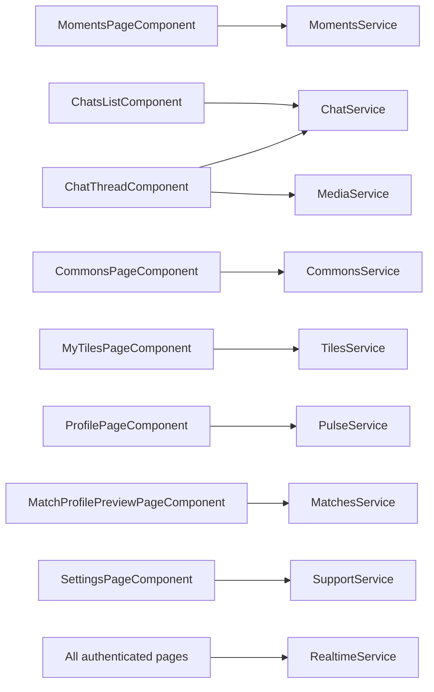
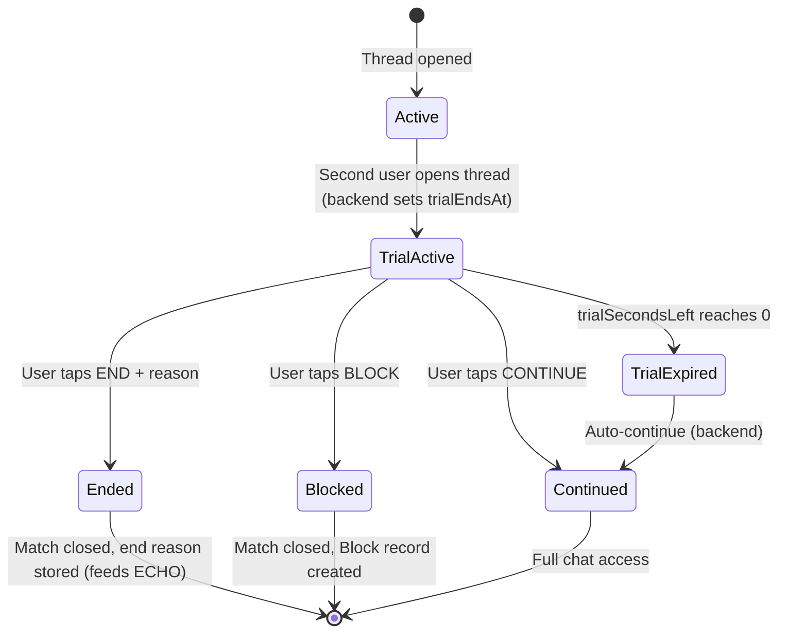
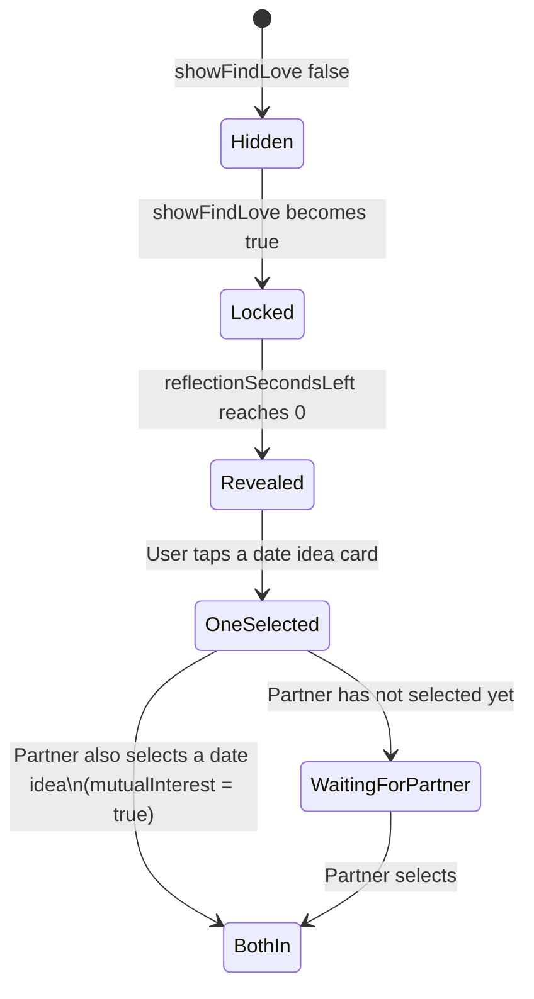

# Components, Pages, and Templates — Woven

> Part of the Woven technical documentation suite.
> Cross-references: [FRONTEND_DESIGN.md](FRONTEND_DESIGN.md) · [ARCHITECTURE.md](ARCHITECTURE.md) · [BACKEND_DESIGN.md](BACKEND_DESIGN.md)

---

## Table of Contents

1. [Component Map](#1-component-map)
2. [Shell: HomeComponent](#2-shell-homecomponent)
3. [LoginComponent](#3-logincomponent)
4. [MomentsPageComponent](#4-momentspagecomponent)
5. [ChatNoteOverlayComponent](#5-chatnoteoverlaycomponent)
6. [ChatsListComponent](#6-chatslistcomponent)
7. [ChatThreadComponent](#7-chatthreadcomponent)
8. [CommonsPageComponent](#8-commonspagecomponent)
9. [MatchProfilePreviewPageComponent](#9-matchprofilepreviewpagecomponent)
10. [ProfilePageComponent](#10-profilepagecomponent)
11. [MyTilesPageComponent](#11-mytilespagecomponent)
12. [SettingsPageComponent](#12-settingspagecomponent)
13. [Onboarding Zone](#13-onboarding-zone)
14. [OnboardingGateComponent](#14-onboardinggatecomponent)
15. [LegalComponent](#15-legalcomponent)
16. [Template Patterns Reference](#16-template-patterns-reference)

---

## 1. Component Map

The diagram below shows every named component and its position in the routing and containment hierarchy.

```mermaid
graph TD
    APP[Angular App Root]

    APP --> LOGIN[LoginComponent\n/login]
    APP --> LEGAL[LegalComponent\n/privacy · /terms · /data-policy]
    APP --> GATE[OnboardingGateComponent\n/app]
    APP --> OB[Onboarding Zone\n/onboarding/*]
    APP --> HOME[HomeComponent\n/ shell]

    OB --> OB1[WelcomeOnboardingComponent]
    OB --> OB2[BasicsOnboardingComponent]
    OB --> OB3[IntentOnboardingComponent]
    OB --> OB4[FoundationalComponent]
    OB --> OB5[PhotosPageComponent]
    OB --> OB6[DetailsOnboardingComponent]
    OB --> OB7[LifestyleOnboardingComponent]
    OB --> OB8[ReviewOnboardingComponent]
    OB --> OB9[StartOnboardingComponent]

    HOME --> MOMENTS[MomentsPageComponent\n/moments]
    HOME --> COMMONS[CommonsPageComponent\n/commons]
    HOME --> CHATS[ChatsListComponent\n/chats]
    HOME --> THREAD[ChatThreadComponent\n/chats/:threadId]
    HOME --> PREVIEW[MatchProfilePreviewPageComponent\n/matches/:matchId/profile]
    HOME --> PROFILE[ProfilePageComponent\n/you]
    HOME --> SETTINGS[SettingsPageComponent\n/you/settings]
    HOME --> TILES[MyTilesPageComponent\n/you/tiles]

    MOMENTS --> OVERLAY[ChatNoteOverlayComponent\nstandalone, rendered inline]
```



### Page-to-Service Dependency Map



---

## 2. Shell: HomeComponent

**File:** `pages/home/home.ts`
**Route:** Parent of all main app routes

`HomeComponent` is the application shell. It renders the persistent bottom navigation bar and hosts the `<router-outlet>` for all child pages. It is itself an authenticated route — `authGuard` must pass before it loads.

### Bottom Navigation

The bottom nav contains four items:

| Tab | Label | Route |
|---|---|---|
| 1 | Moments | `/moments` |
| 2 | Commons | `/commons` |
| 3 | Chats | `/chats` |
| 4 | You | `/you` |

The active tab is determined by the current router URL. Navigation is done via Angular `[routerLink]` directives. The shell itself has no significant business logic — its role is layout and navigation only.

---

## 3. LoginComponent

**File:** `pages/login/login.ts`
**Route:** `/login` (public)

### Responsibilities

- Renders the entry point for unauthenticated users
- Shows a Google Sign-In button
- Plays a GSAP-animated 2D love story animation on load
- Hosts a Three.js global particle background effect

### Visual Structure

```
┌────────────────────────────────────┐
│  [Three.js particle background]    │
│                                    │
│  [GSAP 2D love story animation]    │
│                                    │
│       [ Sign in with Google ]      │
│                                    │
└────────────────────────────────────┘
```

The Three.js particle effect covers the full viewport. The GSAP animation plays on top of it. The Google Sign-In button is the only interactive element.

### Post-Login Flow

After successful Google Sign-In, the user is redirected to `/app` → `OnboardingGateComponent`, which determines whether to send them through onboarding or directly to `/moments`.

---

## 4. MomentsPageComponent

**File:** `pages/moments/moments.page.ts`
**Route:** `/moments` (child of `HomeComponent`)

This is the primary discovery surface of the app. It presents two tabs:

- **Deck** (`today`) — the curated daily deck of candidate cards delivered by the ECHO pipeline
- **Drawn** (`liked-you`) — candidates who have already chosen the logged-in user

### State

| Property | Type | Purpose |
|---|---|---|
| `activeTab` | `'today' \| 'liked-you'` | Which tab is visible |
| `todayCards` | `MomentsCard[]` | Full deck for the Deck tab |
| `loading` | `boolean` | Deck loading state |
| `error` | `string \| null` | Deck load error |
| `budget` | `MomentsBudget \| null` | Interaction budget data |
| `sparkBalance` | `number` | Current spark wallet balance |
| `respondedUserIds` | `Set<number>` | Optimistic removal set for Deck tab |
| `cardShownAt` | `Map<number, number>` | Timestamp (ms) when each card was shown — used for dwell time |
| `likedYouCards` | `LikedYouCard[]` | Full list for Drawn tab |
| `loadingLikedYou` | `boolean` | Drawn tab loading state |
| `likedYouLoaded` | `boolean` | Whether Drawn tab has been fetched yet |
| `likedYouError` | `string \| null` | Drawn tab error |
| `respondedLikedYouIds` | `Set<number>` | Optimistic removal set for Drawn tab |
| `overlayCard` | `OverlayCard \| null` | Card driving the ChatNote overlay |
| `overlayChoice` | `'MAGICAL' \| 'LOGICAL' \| null` | Which choice opened the overlay |
| `overlaySource` | `'today' \| 'liked-you' \| null` | Which tab the overlay came from |
| `overlayTimeOnCardMs` | `number` | Dwell time at the moment overlay was opened |
| `toast` | `string` | Toast message text (auto-clears at 2500 ms) |

### Key Methods

**`switchTab(tab)`**
- Sets `activeTab`
- If switching to `'liked-you'` and `likedYouLoaded` is false, calls `loadLikedYou()` (lazy load on first switch)

**`loadToday()`**
- Calls `MomentsService.getMoments()`
- Populates `todayCards`, `budget`, `sparkBalance`
- Records show timestamp in `cardShownAt` for each card
- Calls `cdr.markForCheck()` after update

**`choose(card, action)`**
- If `action === 'PASS'`: calls `sendPass(card)` directly
- If `action === 'MAGICAL'` or `'LOGICAL'`: records current time in `overlayTimeOnCardMs`, sets `overlayCard`, `overlayChoice`, `overlaySource` to open the ChatNote overlay

**`sendPass(card)`**
- Adds `card.userId` to `respondedUserIds` (optimistic hide)
- Calls `MomentsService.respond({ userId, action: 'PASS' })`
- On failure: removes from `respondedUserIds`, shows error toast

**`onOverlaySubmit(noteText)`**
- Adds card's userId to `respondedUserIds` or `respondedLikedYouIds` (optimistic hide, depending on `overlaySource`)
- Calls `MomentsService.choose({ userId, action: overlayChoice, noteText, timeOnCardMs: overlayTimeOnCardMs })`
- If the API response indicates a match was created: navigates to the new chat thread (`/chats/{threadId}`)
- If no match yet (card is in the liked-you tab and waiting): shows a toast
- Clears overlay state

**`getRatingBarFill(side, barNumber, average)`**
- Maps a rating from -100 to 100 onto a segmented bar
- Segments are at 25 / 50 / 75 / 100 on each side (red = negative, green = positive)
- Returns a fill amount (0–1) for segment `barNumber` on `side`

**`expiryLabel(hours)`**
- Converts `expiresInHours` on a `LikedYouCard` to a human-readable label
- Examples: "Expiring in 2h", "Expiring in 3d"

**`locationLine(card)`**
- Joins city and state fields with a separator
- Returns empty string if neither is set

### Template Structure

```
MomentsPageComponent
├── Tab bar: "Deck" | "Drawn"
├── [Deck tab — activeTab === 'today']
│   ├── Budget pill (totalRemaining / totalCap)
│   ├── Loading spinner (if loading)
│   ├── Error message (if error)
│   └── Card list (todayCards filtered by respondedUserIds)
│       └── MomentsCard (per card)
│           ├── Profile photo
│           ├── Name + verification badge
│           ├── Location line
│           ├── Rating bar (if ≥5 ratings; red/green segments)
│           │   OR "New here" badge (if no rating data)
│           ├── "what caught our eye" block (if reason)
│           │   ├── Headline
│           │   └── Bullet list
│           ├── "Already in your corner." badge (if alreadyChoseYou)
│           └── Action buttons
│               ├── ◈ Magical
│               ├── ◇ Resonant
│               └── — Pass
│
├── [Drawn tab — activeTab === 'liked-you']
│   ├── "Each action costs 1 spark · ◈ {sparkBalance} left"
│   ├── Loading spinner (if loadingLikedYou)
│   ├── Error message (if likedYouError)
│   └── Card list (likedYouCards filtered by respondedLikedYouIds)
│       └── LikedYouCard (per card)
│           ├── Profile photo
│           ├── Name + verification badge
│           ├── Location line
│           ├── "Expiring in Xh/Xd" badge
│           └── Action buttons
│               ├── ◈ Magical
│               └── ◇ Resonant
│
├── Toast (auto-dismisses at 2500 ms)
└── ChatNoteOverlayComponent (rendered outside main scroll, when overlayCard !== null)
```

### Design Notes

- Age is **never** shown on any card in either tab — this is a hard design rule
- The rating bar only renders when the card has ≥5 community ratings; below that threshold, the "New here" badge is shown instead
- The rating bar segments represent a -100 to 100 scale — this is a platform-internal signal display; users see colors only, not numbers
- The budget pill is shown on the Deck tab only
- Toast duration: 2500 ms

---

## 5. ChatNoteOverlayComponent

**File:** `pages/moments/chat-note-overlay.component.ts`
**Type:** Standalone component (not routed — rendered inline in `MomentsPageComponent`)

This component collects the ChatNote text that accompanies a ◈ Magical or ◇ Resonant choice. It renders over the Moments page, outside the main scroll context.

### Inputs

| Input | Type | Description |
|---|---|---|
| `card` | `OverlayCard \| null` | The card being acted on |
| `choice` | `'MAGICAL' \| 'LOGICAL' \| null` | Which choice the user made |

### Outputs

| Output | Payload | When emitted |
|---|---|---|
| `back` | — | User taps back button |
| `submitted` | `noteText: string` | User taps send with valid note |

### Visual Structure

```
┌────────────────────────────────────┐
│ [← back button, top-left]          │
│                                    │
│  Profile photo (50dvh, full-bleed) │
│  Gradient overlay                  │
│  Name + ◈ Magical / ◇ Resonant    │
│  badge                             │
│                                    │
├────────────────────────────────────┤
│  "Need a starter?" [dropdown ▾]    │
│  ┌──────────────────────────────┐  │
│  │ Textarea (20–150 chars)      │  │
│  └──────────────────────────────┘  │
│  "X more to go" hint (< 20 chars)  │
│  Char counter (red warning > 130)  │
│                                    │
│  [ Send ◈ ] or [ Send ◇ Resonant ] │
└────────────────────────────────────┘
```

### Behavior Details

**Starter dropdown** — three preset phrases:
1. `'Your photo made me want to say…'`
2. `'I'd love to talk about…'`
3. `'Something tells me we'd…'`

Selecting a preset populates the textarea. The user can edit from there.

**Validation:**
- `canSend` is `true` only when `noteText.length >= 20`
- When `0 < length < 20`: renders "X more to go" hint below the textarea
- When `length > 130`: character counter text turns red (warning, not a hard block)
- When `length > 150`: send button is disabled (hard limit)

**Send button label:**
- Choice is `MAGICAL` → "Send ◈"
- Choice is `LOGICAL` → "Send ◇ Resonant"

**Color theming:**
- Magical choice → gold gradient (`--gold-*` tokens)
- Resonant choice → crimson gradient (`--rose-*` tokens)

The component does not make any HTTP calls. It emits `submitted(noteText)` and the parent `MomentsPageComponent` handles the API call.

---

## 6. ChatsListComponent

**File:** `pages/chats/chats-list.component.ts`
**Route:** `/chats` (child of `HomeComponent`)

### Responsibilities

- Lists all active chat threads for the logged-in user
- Each row is tappable and navigates to `/chats/:threadId`

### Thread Row Display

Each row shows:
- Other user's profile photo
- Other user's name
- Last message preview (truncated to fit one line)
  - If last message is a voice note: shows "🎤 Voice note" instead of text
- Timestamp of last activity
- Trial indicator badge (if `isTrial === true`)
- Find Love indicator (if `showFindLove === true`)

### Not Yet Built

The "Your Turn" indicator — a visual cue showing when it is the logged-in user's turn to reply — is designed but not implemented.

---

## 7. ChatThreadComponent

**File:** `pages/chats/chat-thread.component.ts`
**Route:** `/chats/:threadId` (child of `HomeComponent`)

This is the most complex component in the application. It handles text messaging, voice note recording and playback, the Trial period decision flow, and the Find Love date idea reveal.

### State

| Property | Type | Purpose |
|---|---|---|
| `data` | `ChatThreadResponse \| null` | Full thread data from API |
| `isRecording` | `boolean` | Whether MediaRecorder is active |
| `recordingMs` | `number` | Elapsed recording time in milliseconds |
| `mediaRecorder` | `MediaRecorder \| undefined` | Native browser MediaRecorder instance |
| `audioChunks` | `Blob[]` | Accumulates chunks during recording |
| `recordingTimer` | `number \| undefined` | Interval ID for elapsed-time counter |
| `recordingStartMs` | `number` | `performance.now()` at recording start |
| `listenedMessageIds` | `Set<string>` | Voice notes the user has listened to end (prevents duplicate `voiceListened` calls) |
| `selectedIdeaIndex` | `number \| null` | Which date idea the user picked |
| `mutualInterest` | `boolean` | Whether both users picked a date idea |

### Initialization

`ngOnInit()` extracts `threadId` from the full route tree using the `getThreadIdFromRouteTree()` pattern (required because this component renders inside `HomeComponent`'s outlet, so `ActivatedRoute.snapshot.params` alone does not contain the param). It then calls `loadThread()`.

### Key Methods

**`loadThread()`**
- Calls `ChatService.getThread(threadId)`
- Sets `data`
- Calls `cdr.markForCheck()`

**`sendMessage()`**
- Adds a temporary message object to `data.messages` (optimistic add)
- Calls `cdr.markForCheck()`
- Calls `ChatService.sendMessage(threadId, body)`
- On confirmation: calls `loadThread()` silently (replaces temp message with server version)
- On failure: rolls back optimistic add, shows error

**`startRecording()`**
- Requests microphone via `navigator.mediaDevices.getUserMedia`
- Instantiates `MediaRecorder`, clears `audioChunks`
- Starts recording; sets `isRecording = true`, starts `recordingTimer` interval

**`stopRecording()`**
- Stops `MediaRecorder`
- `ondataavailable` handler accumulates final chunks
- `onstop` handler calls `uploadAndSendVoice()`

**`uploadAndSendVoice()`**
- Assembles `Blob` from `audioChunks`
- Calls `MediaService.uploadVoiceNote(blob, durationSecs)`
- On success: calls `ChatService.sendVoiceMessage(threadId, fileUrl, durationSecs)`
- Calls `loadThread()` after send

**`onVoiceEnded(messageId)`**
- Called by the `<audio>` element's `onended` event
- Checks `listenedMessageIds` — if messageId is not in the set, calls `ChatService.voiceListened(threadId, messageId)`
- Adds `messageId` to `listenedMessageIds` to prevent duplicate calls

**`formatRecordingTime()`**
- Converts `recordingMs` to `mm:ss` format for the recording UI

**`isVoiceMessage(message)`**
- Returns `message.messageType === 'VOICE'`

**`getVoiceDuration(message)`**
- Parses `message.metaJson` as JSON
- Returns `durationSecs` from the parsed object

**`planIt(index)`**
- Sets `selectedIdeaIndex = index`
- Calls `ChatService.expressDateInterest(threadId, index, ideaText)`
- Sets `mutualInterest` from the response `{ mutualInterest: boolean }`
- Calls `cdr.markForCheck()`

**`revealedIdeas` (getter)**
- If `data.dateIdeas` is set and non-empty: returns `data.dateIdeas`
- Otherwise: returns `[data.dateIdea]` (single idea fallback)

**`shouldShowDateIdeaBox()`**
- Returns `true` when the Find Love feature is relevant for this thread

**`shouldRevealDateIdea()`**
- Returns `true` when `showFindLove === true` and the reflection countdown has completed (`reflectionSecondsLeft === 0`)

**`dateIdeaCountdown()`**
- Formats `data.reflectionSecondsLeft` as `mm:ss`

**`ngOnDestroy()`**
- Stops MediaRecorder if `isRecording` is true
- Clears `recordingTimer` interval

### Template Structure

```
ChatThreadComponent
├── Header: other user's name + photo
│
├── Messages list
│   └── Per message:
│       ├── Text bubble (if messageType !== 'VOICE')
│       │   └── Styled by sender (me vs other)
│       └── Voice player (if messageType === 'VOICE')
│           ├── <audio controls [src]="..." (onended)="onVoiceEnded(m.id)">
│           └── Duration label (getVoiceDuration(m))
│
├── Trial period block (if isTrial && canMakeDecision)
│   ├── Timer countdown (trialSecondsLeft formatted)
│   └── Decision buttons
│       ├── [CONTINUE] — calls trialDecision('CONTINUE')
│       ├── [END — reason picker]
│       │   ├── no_spark
│       │   ├── wrong_timing
│       │   └── not_my_type
│       └── [BLOCK] — calls trialDecision('BLOCK')
│
├── Find Love block (if shouldShowDateIdeaBox())
│   ├── Locked state (if !shouldRevealDateIdea())
│   │   └── "Unlocking in {dateIdeaCountdown()}"
│   └── Revealed state (if shouldRevealDateIdea())
│       ├── 3 × .diCard (from revealedIdeas)
│       │   ├── Selected card → .selected class + "Planned ✓"
│       │   └── Other cards → .dimmed class (when one selected)
│       └── Status text
│           ├── No selection: "Pick one if it feels right."
│           ├── Selected, mutualInterest false: "Waiting to see if they're in…"
│           └── mutualInterest true: "You're both in — make it happen."
│
└── Composer
    ├── Normal mode
    │   ├── Text input [[(ngModel)]="draftText"]
    │   └── Mic button → startRecording()
    └── Recording mode (isRecording === true)
        ├── Pulsing red dot
        ├── Elapsed time (formatRecordingTime())
        └── Send button → stopRecording()
```

### Trial Period Flow



### Find Love / Date Idea Flow



---

## 8. CommonsPageComponent

**File:** `pages/commons/commons.page.ts`
**Route:** `/commons` (child of `HomeComponent`)

The Commons tab is a scrollable feed of content tiles (posts) uploaded by other users. It is analogous to a social feed and is used as a behavioral signal source by the ECHO matching pipeline.

### Functionality

- Loads a feed of tiles via `CommonsService`
- Each tile is rendered with its media content and metadata
- **Orbit action (◈):** Users can Orbit a tile — this is an explicit positive signal recorded in the ECHO pipeline (stored as `OrbitGravity` in the backend). The Orbit is the Commons equivalent of ◈ Magical.
- **Dwell tracking:** Time spent viewing a tile is tracked and sent as a behavioral signal

### What Commons Is Not

Commons is not a rating system and it is not a social network. Orbit counts and other engagement metrics are **never** shown to users. They are platform-internal signals only.

---

## 9. MatchProfilePreviewPageComponent

**File:** `pages/matches/match-profile-preview.page.ts`
**Route:** `/matches/:matchId/profile` (child of `HomeComponent`)

### Responsibilities

- Loads the full profile of a matched user
- Route param: `matchId` (extracted from route tree using the standard tree-walk pattern)
- Calls `MatchesService` to load the profile data

### Displayed Content

- Profile photos (gallery)
- Name and verification badge
- Foundational question answers
- Tiles / highlights (content tiles from My Tiles)

### Design Notes

This page uses the dark plum theme. The profile display mirrors what a matched user sees when they tap the other person's name in a chat thread.

---

## 10. ProfilePageComponent

**File:** `pages/profile/profile.ts`
**Route:** `/you` (child of `HomeComponent`)

The logged-in user's own profile view.

### Displayed Content

- Own profile photos
- Highlights / tiles (up to 9 tiles, from `TilesService`)
- Optional profile fields (hobbies, lifestyle details)
- Weekly vibe / pulse (loaded via `PulseService`)

The profile page is the only place in the app where the user sees their own presentation as others would see it. Navigation from here to `/you/tiles` allows managing the tile highlights.

---

## 11. MyTilesPageComponent

**File:** `pages/my-tiles/my-tiles.page.ts`
**Route:** `/you/tiles` (child of `HomeComponent`)

Instagram-style tile management for the user's profile highlights.

### Functionality

- Lists the user's existing tiles in a grid
- **Upload:** Add new tiles (image/video, sourced from device)
- **Reorder:** Drag to reorder tiles (order affects profile display priority)
- **Delete:** Remove a tile

All tile CRUD operations go through `TilesService`. The page uses optimistic UI for delete (tile removed from grid immediately, confirmed by API).

### Tile Constraints

- Maximum 9 tiles per user
- Tile order is persisted on the backend

---

## 12. SettingsPageComponent

**File:** `pages/settings/settings.ts`
**Route:** `/you/settings` (child of `HomeComponent`)

### Functionality

- Profile settings (name, location, optional fields)
- Data export request
- Visual preference reset (resets the ECHO visual preference embedding)

`SupportService` is used for feedback and support form submissions from this page.

---

## 13. Onboarding Zone

Onboarding is a sequential, gated flow. Each step must be completed in order before the next is accessible. The gate is enforced by `OnboardingGateComponent` at `/app`.

### Step Sequence

```mermaid
flowchart LR
    A[/onboarding/welcome] --> B[/onboarding/basics]
    B --> C[/onboarding/intent]
    C --> D[/onboarding/foundational]
    D --> E[/onboarding/photos]
    E --> F[/onboarding/details]
    F --> G[/onboarding/lifestyle]
    G --> H[/onboarding/review]
    H --> I[/onboarding/start]
    I --> J[/moments]
```

### Step Details

| Step | Component | Fields / Content |
|---|---|---|
| 1. Welcome | `WelcomeOnboardingComponent` | Introductory screen; no data collected |
| 2. Basics | `BasicsOnboardingComponent` | Name, gender, pronouns, birthday, city/state |
| 3. Intent | `IntentOnboardingComponent` | Relationship intent, reflection sentence |
| 4. Foundational | `FoundationalComponent` | AI-generated questions based on intent (served by backend) |
| 5. Photos | `PhotosPageComponent` | Profile photo upload |
| 6. Details | `DetailsOnboardingComponent` | Optional fields (hobbies, etc.) |
| 7. Lifestyle | `LifestyleOnboardingComponent` | Diet, workout frequency, children preference, etc. |
| 8. Review | `ReviewOnboardingComponent` | Summary of all entered data for confirmation |
| 9. Start | `StartOnboardingComponent` | Final step; triggers onboarding completion flag |

### Missing Onboarding Fields

The following fields have been designed for onboarding but are not yet implemented:

| Field | Designed For | Status |
|---|---|---|
| Horoscope / birth chart | Basics step | Not built |

---

## 14. OnboardingGateComponent

**File:** (lives in the onboarding zone)
**Route:** `/app`

This is a routing-only component. On init, it reads the user's onboarding completion status from the backend and:

- If onboarding is **incomplete**: redirects to the first incomplete step
- If onboarding is **complete**: redirects to `/moments`

It renders no visible UI of its own — it is a navigation decision point only.

---

## 15. LegalComponent

**Route:** `/privacy`, `/terms`, `/data-policy` (all three map to the same component)

Renders static legal text. No authentication required. The component determines which document to display based on the current route path.

---

## 16. Template Patterns Reference

This section documents the recurring template patterns used across pages. Understanding these is required to write consistent templates for new pages or components.

### 16.1 OnPush + markForCheck Pattern

Every page loads data asynchronously and uses `ChangeDetectionStrategy.OnPush`. The standard loading pattern:

```typescript
async loadSomeData() {
  this.loading = true;
  this.cdr.markForCheck();

  try {
    const result = await firstValueFrom(this.someService.getData());
    this.items = result.items;
    this.error = null;
  } catch (e) {
    this.error = 'Could not load data.';
  } finally {
    this.loading = false;
    this.cdr.markForCheck();
  }
}
```

In the template, the loading/error/content tri-state is rendered with `@if`:

```html
@if (loading) {
  <div class="spinner">...</div>
} @else if (error) {
  <div class="error">{{ error }}</div>
} @else {
  <div class="content">...</div>
}
```

### 16.2 Optimistic Removal Pattern

Used for card-based actions where the card must disappear immediately on user action:

```typescript
// In component state
respondedIds = new Set<number>();

// On action
this.respondedIds.add(card.userId);
this.cdr.markForCheck();

// In template
@for (card of cards; track card.userId) {
  @if (!respondedIds.has(card.userId)) {
    <!-- card content -->
  }
}
```

### 16.3 Route Tree Parameter Extraction

For components rendered inside `HomeComponent`'s outlet:

```typescript
private getThreadIdFromRouteTree(route: ActivatedRoute): string | null {
  if (route.snapshot.params['threadId']) {
    return route.snapshot.params['threadId'];
  }
  if (route.firstChild) {
    return this.getThreadIdFromRouteTree(route.firstChild);
  }
  return null;
}
```

This is used in `ChatThreadComponent` to extract `threadId` and in `MatchProfilePreviewPageComponent` to extract `matchId`.

### 16.4 firstValueFrom for HTTP in async Methods

```typescript
async loadChats() {
  const chats = await firstValueFrom(this.chatService.getChats());
  this.chats = chats;
  this.cdr.markForCheck();
}
```

`firstValueFrom` converts an Observable to a Promise and resolves on the first emission. It is the standard pattern for one-shot HTTP calls inside `async` methods.

### 16.5 Voice Note Player Pattern

In `ChatThreadComponent`'s template, voice messages render as:

```html
@if (isVoiceMessage(message)) {
  <div class="voice-player">
    <audio
      controls
      [src]="message.audioUrl"
      (ended)="onVoiceEnded(message.id)">
    </audio>
    <span class="duration">{{ getVoiceDuration(message) }}s</span>
  </div>
}
```

The `(ended)` binding is what triggers `voiceListened` tracking — the signal is only sent when the user listens to the full audio clip.

### 16.6 Toast Pattern

`MomentsPageComponent` uses a simple toast:

```typescript
private showToast(message: string) {
  this.toast = message;
  this.cdr.markForCheck();
  setTimeout(() => {
    this.toast = '';
    this.cdr.markForCheck();
  }, 2500);
}
```

In template:

```html
@if (toast) {
  <div class="toast">{{ toast }}</div>
}
```

### 16.7 Recording Mode Composer Pattern

The chat composer switches between text input mode and recording mode based on `isRecording`:

```html
@if (!isRecording) {
  <div class="composer-normal">
    <input [(ngModel)]="draftText" placeholder="Message…" />
    <button (click)="startRecording()">🎤</button>
  </div>
} @else {
  <div class="composer-recording">
    <div class="pulse-dot"></div>
    <span>{{ formatRecordingTime() }}</span>
    <button (click)="stopRecording()">Send</button>
  </div>
}
```

### 16.8 Date Idea Card Pattern

The Find Love date idea reveal renders three cards. Selected state and dimmed state are applied via CSS class binding:

```html
@for (idea of revealedIdeas; track idea; let i = $index) {
  <div
    class="diCard"
    [class.selected]="selectedIdeaIndex === i"
    [class.dimmed]="selectedIdeaIndex !== null && selectedIdeaIndex !== i"
    (click)="planIt(i)">
    {{ idea }}
    @if (selectedIdeaIndex === i) {
      <span class="planned-badge">Planned ✓</span>
    }
  </div>
}

<p class="date-idea-status">
  @if (selectedIdeaIndex === null) {
    Pick one if it feels right.
  } @else if (!mutualInterest) {
    Waiting to see if they're in…
  } @else {
    You're both in — make it happen.
  }
</p>
```

The "Plan it" button is disabled once `selectedIdeaIndex !== null`:

```html
<button [disabled]="selectedIdeaIndex !== null" (click)="planIt(selectedIdeaIndex)">
  Plan it
</button>
```
