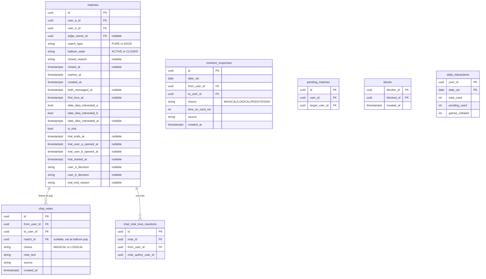
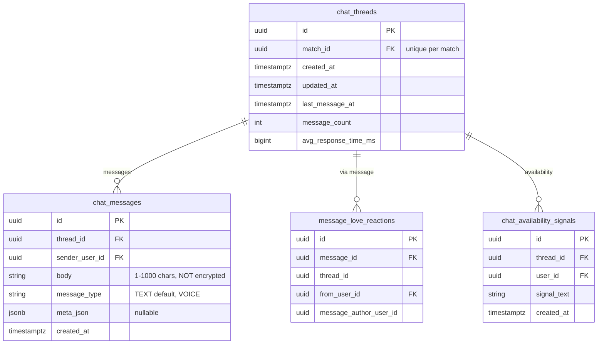
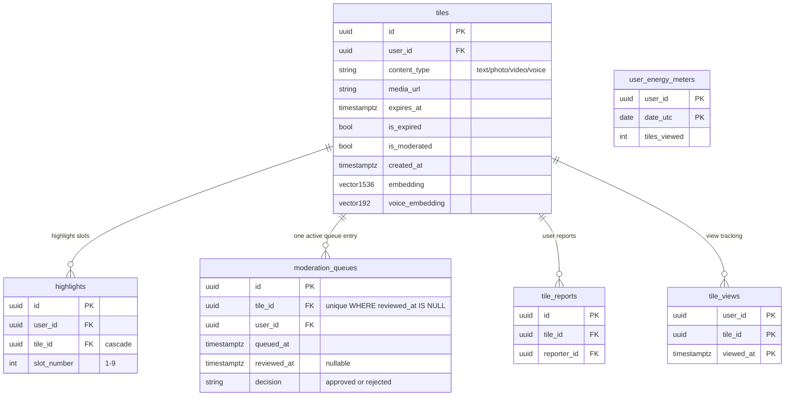
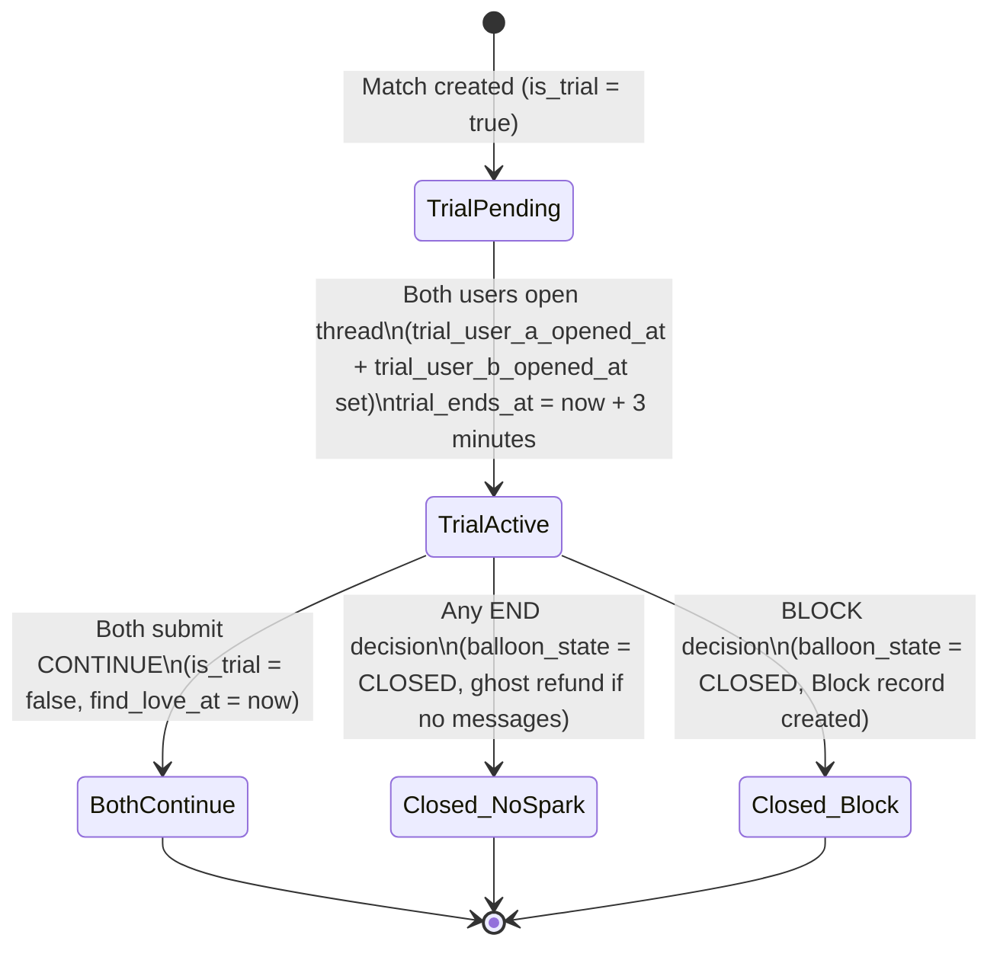
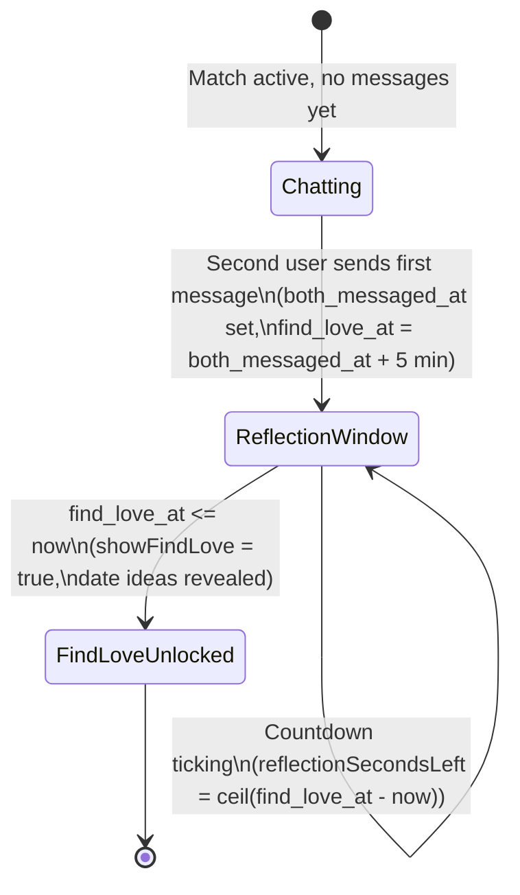
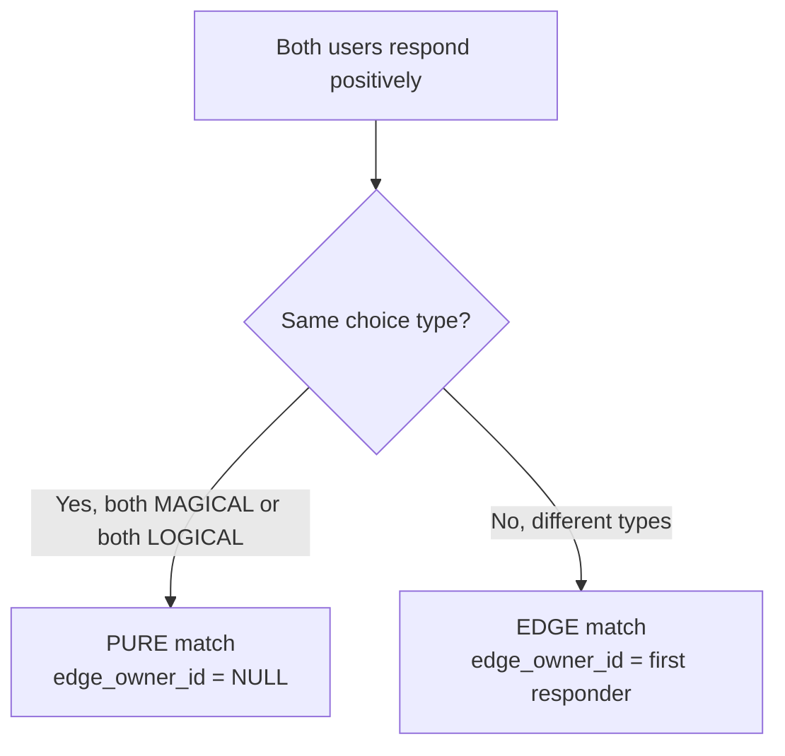

# DATABASE DESIGN

Woven database layer: PostgreSQL 16 with the pgvector extension, managed via EF Core 10, with AES-256-GCM field-level encryption on all PII columns and HNSW vector indexes added via raw SQL migrations.

Related docs: [ARCHITECTURE.md](ARCHITECTURE.md) | [BACKEND_DESIGN.md](BACKEND_DESIGN.md) | [API_DOCUMENTATION.md](API_DOCUMENTATION.md) | [AI_ML_DOCUMENTATION.md](AI_ML_DOCUMENTATION.md)

---

## Technology Stack

| Layer | Technology |
|---|---|
| Database engine | PostgreSQL 16 |
| Vector extension | pgvector |
| ORM | EF Core 10 |
| Column naming | snake_case (EF Core convention applied globally) |
| Field encryption | AES-256-GCM via `EncryptedStringConverter` |
| Timestamp source | `MomentsRules.NowUtc()` — all UTC, no `DateTime.UtcNow` direct calls |
| Migration file naming | `yyyyMMdd_DescriptiveName.cs` |

pgvector is registered on the model builder via:

```csharp
modelBuilder.HasPostgresExtension("vector");
```

HNSW index syntax is not emitted by EF Core — all HNSW indexes are applied via raw SQL in migration `Up()` methods.

---

## Field-Level Encryption

AES-256-GCM is applied in `WovenDbContext.OnModelCreating` using an `EncryptedStringConverter`. The following columns are encrypted at rest:

| Table | Column |
|---|---|
| `users` | `email` |
| `users` | `full_name` |
| `user_profiles` | `city` |
| `user_profiles` | `state` |
| `user_optional_fields` | `value` |
| `user_intents` | `reflection_sentence` |

**Notable exclusion:** `chat_messages.body` is not encrypted despite containing user-generated content. The reason is documented in source: the 1–1000 character CHECK constraint on `body` would reject AES-GCM ciphertext, which is longer than the plaintext. Widening or dropping the constraint requires a separate migration before encryption can be added.

---

## pgvector Columns

All vector columns use the `vector` PostgreSQL type provided by pgvector. HNSW indexes are applied post-migration via raw SQL for approximate nearest-neighbor search.

| Table | Column | Dimensions | Embedding Model |
|---|---|---|---|
| `user_vectors` | `pillar_embedding` | 1536 | text-embedding-3-small |
| `user_vectors` | `expression_embedding` | 1536 | text-embedding-3-small |
| `user_vectors` | `intent_embedding` | 1536 | text-embedding-3-small |
| `user_vectors` | `style_embedding` | 128 | text-embedding-3-small (truncated) |
| `user_vectors` | `humor_embedding` | 64 | text-embedding-3-small (truncated) |
| `user_vectors` | `lifestyle_embedding` | 128 | text-embedding-3-small (truncated) |
| `user_vectors` | `emotional_rhythm_embedding` | 48 | custom |
| `user_vectors` | `attachment_proxy_embedding` | 4 | custom (secure / anxious / avoidant / fearful) |
| `user_vectors` | `voice_embedding` | 192 | ECAPA-TDNN (SpeechBrain) |
| `tiles` | `embedding` | 1536 | text-embedding-3-small |
| `tiles` | `voice_embedding` | 192 | ECAPA-TDNN |
| `photo_embeddings` | `embedding` | 512 | CLIP-style |
| `user_visual_preferences` | `preference_embedding` | 512 | CLIP-style |
| `user_visual_preferences` | `aversion_embedding` | 512 | CLIP-style |
| `user_voice_preferences` | `preference_embedding` | 192 | ECAPA-TDNN |
| `reference_photo_embeddings` | `embedding` | 512 | CLIP-style |

---

## Schema Groups

The 60+ tables are organized into functional groups below.

---

### Group 1 — User & Auth

```mermaid
erDiagram
    users {
        uuid id PK
        string email "encrypted"
        string full_name "encrypted"
        bool is_verified
        float trust_score "default 0.5"
        string profile_status "enum as string"
        timestamptz created_at
    }
    auth_identities {
        uuid id PK
        uuid user_id FK
        string provider
        string provider_subject
    }
    user_profiles {
        uuid user_id PK_FK
        string city "encrypted"
        string state "encrypted"
        string gender
        string display_pronouns
    }
    user_preferences {
        uuid user_id PK_FK
        int age_min "default 18"
        int age_max "default 99"
        string relationship_structure "enum as string"
        bool reduce_motion "default false"
        bool high_contrast "default false"
    }
    user_photos {
        uuid id PK
        uuid user_id FK
        string url
        int sort_order
    }
    user_intents {
        uuid user_id PK_FK
        string reflection_sentence "encrypted"
    }
    user_foundational_v1 {
        uuid user_id PK_FK
    }
    user_foundational_question_sets {
        uuid id PK
        uuid user_id FK
        int version
        timestamptz answered_at "nullable"
    }
    user_optional_fields {
        uuid id PK
        uuid user_id FK
        string key
        string value "encrypted"
        string visibility "enum as string"
    }
    user_weekly_vibes {
        uuid user_id PK_FK
        timestamptz expires_at
    }
    user_dynamic_intake_sets {
        uuid id PK
        uuid user_id FK
        string cycle_id
    }

    users ||--o{ auth_identities : "provider logins"
    users ||--o| user_profiles : "1:1"
    users ||--o| user_preferences : "1:1"
    users ||--o{ user_photos : "ordered photos"
    users ||--o| user_intents : "1:1"
    users ||--o| user_foundational_v1 : "1:1"
    users ||--o{ user_foundational_question_sets : "versioned sets"
    users ||--o{ user_optional_fields : "key-value PII"
    users ||--o| user_weekly_vibes : "1:1"
    users ||--o{ user_dynamic_intake_sets : "intake cycles"
```

**Constraints and indexes:**
- `auth_identities`: UNIQUE(provider, provider_subject)
- `user_photos`: index on (user_id, sort_order)
- `user_foundational_question_sets`: UNIQUE(user_id, version); partial UNIQUE on user_id WHERE answered_at IS NULL — only one unanswered set per user at a time
- `user_optional_fields`: UNIQUE(user_id, key)
- `user_weekly_vibes`: index on expires_at
- `user_dynamic_intake_sets`: UNIQUE(user_id, cycle_id)

---

### Group 2 — Wallet, Subscription & Push

| Table | PK | Notable columns |
|---|---|---|
| `spark_wallets` | user_id | balance (decimal, default 5) |
| `push_subscriptions` | id | user_id FK, subscription JSON |

SparkWallet is the soft gate for the Drawn (liked-you) flow. Balance starts at 5. Each Drawn action costs 1 spark. Ghost refund: 0.5 sparks returned to both parties if a match closes with no messages exchanged.

---

### Group 3 — Moments & Matching

This is the most constraint-heavy group in the schema. The `matches` table enforces correctness at the database level.



**CHECK constraints on `matches`:**
- `ck_matches_no_self`: user_a_id <> user_b_id
- `ck_matches_state_closed_fields`: when ACTIVE → closed_reason IS NULL AND closed_at IS NULL; when CLOSED → both NOT NULL
- `ck_matches_type_edge_owner`: when PURE → edge_owner_id IS NULL; when EDGE → edge_owner_id IS NOT NULL
- `ck_matches_expires_after_created`: expires_at > created_at

**Indexes on `matches`:**
- UNIQUE(user_a_id, user_b_id, balloon_state) WHERE balloon_state = 'ACTIVE'
- (user_a_id, balloon_state, expires_at)
- (user_b_id, balloon_state, expires_at)
- (balloon_state, expires_at)

**CHECK constraints on `daily_interactions`:**
- total_used between 0 and 5
- pending_used between 0 and 2
- pending_used <= total_used
- games_initiated between 0 and 2

**Other constraints:**
- `moment_responses`: UNIQUE(date_utc, from_user_id, to_user_id); CHECK from_user_id <> to_user_id
- `pending_matches`: UNIQUE(user_id, target_user_id); CHECK no self
- `blocks`: CHECK blocker_id <> blocked_id
- `chat_note_love_reactions`: UNIQUE(from_user_id, note_id)
- `message_love_reactions`: UNIQUE(from_user_id, message_id)

---

### Group 4 — Chat Threads & Messages



**Constraints:**
- `chat_threads`: UNIQUE on match_id (one thread per match)
- `chat_messages`: CHECK length(body) >= 1 AND length(body) <= 1000
- `message_love_reactions`: UNIQUE(from_user_id, message_id)
- `chat_availability_signals`: index on thread_id

For VOICE messages, `meta_json` stores `{ audioUrl: string, durationSecs: int }`.

---

### Group 5 — ECHO Signal Pipeline

```mermaid
erDiagram
    match_signal_logs {
        uuid id PK
        uuid viewer_id FK
        uuid candidate_id FK
        string event_type
        float event_value
        timestamptz occurred_at
        jsonb metadata_json "nullable"
    }
    connection_scores {
        uuid id PK
        uuid viewer_id FK
        uuid candidate_id FK
        float score "0 to 1"
    }
    user_behavioral_fingerprints {
        uuid user_id PK_FK
        string vector_json "16-dim float array serialized"
        timestamptz computed_at
    }
    lin_ucb_user_models {
        uuid user_id PK_FK
    }

    match_signal_logs }o--|| users : "viewer"
    match_signal_logs }o--|| users : "candidate"
    connection_scores }o--|| users : "viewer"
    connection_scores }o--|| users : "candidate"
```

**Constraints and indexes on `match_signal_logs`:**
- CHECK: viewer_id <> candidate_id
- index on (viewer_id, candidate_id, occurred_at)
- index on (viewer_id, event_type, occurred_at)
- index on (occurred_at)

**Constraints and indexes on `connection_scores`:**
- UNIQUE(viewer_id, candidate_id)
- index on (viewer_id, score)

Signal types stored as strings; canonical constants live in `MatchSignalEventTypes`. `ConnectionScoreBatchWorker` aggregates signal logs nightly at 03:50. `WeightLearningBatchWorker` runs every Sunday at 04:00 to update scoring weights via logistic regression on the aggregated scores.

---

### Group 6 — Matchmaking Engine & Vectors

```mermaid
erDiagram
    user_vectors {
        uuid id PK
        uuid user_id FK
        int version
        vector1536 pillar_embedding
        vector1536 expression_embedding
        vector1536 intent_embedding
        vector128 style_embedding
        vector64 humor_embedding
        vector128 lifestyle_embedding
        vector48 emotional_rhythm_embedding
        vector4 attachment_proxy_embedding
        vector192 voice_embedding
    }
    user_vector_tags {
        uuid id PK
        uuid user_id FK
        int version
        string tag
        string tag_type
    }
    daily_decks {
        uuid id PK
        uuid user_id FK
        date date_utc
    }
    match_explanations {
        uuid id PK
        uuid user_id FK
        uuid candidate_id FK
        date date_utc
        string headline
        jsonb bullets_json
        string date_idea "legacy"
        jsonb date_ideas_json "array of 3 strings"
        string tone
        timestamptz created_at
    }
    match_outcomes {
        uuid id PK
        uuid user_id FK
        uuid match_id
        uuid candidate_id
        date date_utc
    }
    candidate_exposures {
        uuid id PK
        uuid viewer_user_id
        uuid shown_user_id
        date date_utc
        string surface
        timestamptz created_at
    }
    candidate_signals {
        uuid id PK
        uuid from_user_id
        uuid to_user_id
        string type
        timestamptz created_at
        timestamptz expires_at
    }

    user_vectors ||--o{ user_vector_tags : "tags per version"
    users ||--o{ user_vectors : "versioned vectors"
    users ||--o{ daily_decks : "one per day"
    users ||--o{ match_explanations : "per candidate per day"
```



**Constraints and indexes:**
- `user_vectors`: UNIQUE(user_id, version)
- `user_vector_tags`: index(user_id, version, tag_type); index(tag, tag_type)
- `daily_decks`: UNIQUE(user_id, date_utc)
- `match_explanations`: index(user_id, candidate_id, date_utc)
- `match_outcomes`: index(match_id); index(user_id, candidate_id, date_utc)
- `candidate_exposures`: UNIQUE(viewer_user_id, shown_user_id, date_utc, surface); index(viewer_user_id, date_utc); index(shown_user_id, created_at)
- `candidate_signals`: index(from_user_id, to_user_id, type, created_at); index(to_user_id, expires_at)

All HNSW indexes on vector columns are applied via raw SQL in migration `Up()` methods because EF Core cannot emit HNSW syntax.

---

### Group 7 — Games

| Table | PK | Key indexes / constraints |
|---|---|---|
| `game_sessions` | id | match_id FK; index(match_id, status); index(expires_at, status) |
| `game_rounds` | id | session_id FK; guesser_user_id FK; target_user_id FK; index(session_id, round_number) |
| `game_results` | id | session_id FK; match_id FK; index(match_id, created_at) |
| `game_analytics` | id | session_id FK; index(game_type, completed) |
| `game_outcomes` | id | session_id FK (UNIQUE); initiator_user_id FK; partner_user_id FK; match_id FK; all deletes RESTRICT; indexes on session_id, initiator_user_id, partner_user_id, match_id, (initiator_user_id, created_at), (partner_user_id, created_at) |

The RESTRICT delete behavior on `game_outcomes` FK references means game outcome records are never silently cascade-deleted.

---

### Group 8 — Commons (Tiles)



**Constraints:**
- `tiles`: CHECK content_type IN ('text','photo','video','voice'); CHECK expires_at > created_at; indexes on (user_id, is_expired); (expires_at, is_expired); (is_moderated, is_expired, created_at)
- `highlights`: CHECK slot_number BETWEEN 1 AND 9; UNIQUE(user_id, slot_number); index on user_id; index on tile_id; tile_id FK is cascade delete
- `moderation_queues`: UNIQUE on tile_id WHERE reviewed_at IS NULL (only one pending review per tile); CHECK decision IN ('approved','rejected'); index on queued_at WHERE reviewed_at IS NULL; index on user_id
- `tile_reports`: UNIQUE(tile_id, reporter_id)
- `user_energy_meters`: CHECK tiles_viewed >= 0

---

### Group 9 — Orbit & Social

| Table | PK | Key constraints |
|---|---|---|
| `tile_orbits` | id | UNIQUE(orbiter_id, tile_id); CHECK relationship_type IN ('romantic','social'); FK tile_owner_id uses NoAction; indexes on orbiter_id, tile_owner_id, tile_id |
| `tile_engagements` | id | CHECK engagement_type IN ('viewed','expanded','media_played','media_completed','replayed'); indexes on (user_id, created_at); on tile_id |
| `friend_bridges` | id | UNIQUE(user_a_id, user_b_id); CHECK status IN ('pending_both','a_accepted','b_accepted','active','declined'); indexes on (user_a_id, status); (user_b_id, status) |
| `orbit_gravities` | (user_id, candidate_id) | index(user_id, score) |

`OrbitGravity` is a pre-computed score representing how strongly a user's orbit pattern on tiles correlates with a candidate — used as a matchmaking signal component.

---

### Group 10 — Seasons

| Table | PK | Key constraints |
|---|---|---|
| `seasons` | id | UNIQUE(season_number); navigation: Responses |
| `user_season_responses` | id | UNIQUE(user_id, season_id, pillar_id); index(user_id, season_id) |

---

### Group 11 — Collaborative Filtering

| Table | PK | Key constraints |
|---|---|---|
| `cf_scores` | (user_id, candidate_id) | CHECK user_id <> candidate_id; index(user_id, score) |

`CollaborativeFilteringService` exists in the codebase but no batch worker runs it — `CfScore` population is not yet wired.

---

### Group 12 — Enhanced Embeddings & Learned Weights

```mermaid
erDiagram
    photo_embeddings {
        uuid id PK
        uuid user_id FK
        string photo_url
        vector512 embedding
        timestamptz embedded_at
    }
    user_visual_decisions {
        uuid id PK
        uuid viewer_user_id FK
        uuid target_user_id FK
        uuid photo_embedding_id FK "SetNull on delete"
        string choice "YES/NO/PENDING"
        timestamptz decided_at
    }
    user_visual_preferences {
        uuid user_id PK_FK
        vector512 preference_embedding
        vector512 aversion_embedding
        int yes_sample_count
        int no_sample_count
        timestamptz updated_at
    }
    user_voice_preferences {
        uuid user_id PK_FK
        vector192 preference_embedding
    }
    user_matching_weights {
        uuid user_id FK
        string component PK
        float learned_weight
        int sample_count
        timestamptz updated_at
    }
    reference_photo_embeddings {
        uuid id PK
        uuid user_id
        vector512 embedding
    }

    users ||--o{ photo_embeddings : "per photo"
    users ||--o{ user_visual_decisions : "viewer decisions"
    users ||--o| user_visual_preferences : "1:1"
    users ||--o| user_voice_preferences : "1:1"
    users ||--o{ user_matching_weights : "per component"
```

**Constraints:**
- `user_visual_decisions`: CHECK choice IN ('YES','NO','PENDING'); index(viewer_user_id, target_user_id); photo_embedding_id FK uses SetNull so deleting a photo embedding doesn't cascade-delete the decision record
- `user_matching_weights`: PK is (user_id, component); index on user_id
- `photo_embeddings`: index on user_id

---

### Group 13 — Security, Insights & Ratings

| Table | PK | Key constraints |
|---|---|---|
| `security_audit_logs` | id | user_id FK (SetNull), actor_id FK (SetNull); CHECK event_type IN ('external_api_call','pii_access','encryption_key_rotation','admin_data_access','bulk_data_export','suspicious_pattern','failed_decryption'); index(user_id, created_at) WHERE user_id IS NOT NULL; index(event_type, created_at) |
| `user_insights` | id | user_id FK; insights_json default []; computed_at default NOW() |
| `user_ratings` | id | rated_user_id FK, rater_user_id FK, match_id FK (SetNull on match delete); CHECK rating_value BETWEEN -100 AND 100; index(rated_user_id, rater_user_id, match_id); index(rated_user_id) |
| `user_verifications` | id | user_id FK; index(user_id, status) |

User ratings are platform-only signals. They are never surfaced to users directly.

---

### Group 14 — Date Feedback

| Table | PK | Key constraints |
|---|---|---|
| `date_feedbacks` | id | match_id FK, user_id FK; UNIQUE(match_id, user_id) |
| `date_feedback_prompts` | id | match_id FK, user_id FK; UNIQUE(match_id, user_id); index(scheduled_for, sent_at) |

---

### Group 15 — Analytics & A/B Testing

| Table | PK | Key constraints |
|---|---|---|
| `analytics_events` | id | user_id_hash (nullable, not a FK — hashed for privacy); index(user_id_hash) WHERE NOT NULL; index(event_type); index(created_at) |
| `ab_experiments` | id | key, variants |
| `ab_assignments` | id | experiment_id FK, user_id; UNIQUE(user_id, experiment_id); index on user_id |
| `ab_conversions` | id | experiment_id FK, user_id; index(user_id, experiment_id) |

`AnalyticsEvents` uses a hashed user ID to avoid PII in analytics tables. The field is nullable so anonymous events can be recorded.

---

## Trial Period State Machine

The trial flow is enforced at the application layer but recorded in the `matches` table columns.



---

## Find Love Unlock State Machine



---

## Match Type Decision Tree



---

## Indexing Strategy Summary

| Concern | Approach |
|---|---|
| Active match lookup by user | (user_a_id, balloon_state, expires_at) + (user_b_id, balloon_state, expires_at) |
| Duplicate active match prevention | UNIQUE(user_a_id, user_b_id) WHERE balloon_state = 'ACTIVE' |
| Signal aggregation by viewer | (viewer_id, candidate_id, occurred_at) |
| Signal aggregation by type | (viewer_id, event_type, occurred_at) |
| Vector similarity search | HNSW indexes via raw SQL on all pgvector columns |
| Candidate exposure dedup | UNIQUE(viewer_user_id, shown_user_id, date_utc, surface) |
| Tile moderation queue | Partial index: WHERE reviewed_at IS NULL |
| Analytics events | Partial index on user_id_hash WHERE NOT NULL |
| Connection score ranking | (viewer_id, score) |

---

## Naming Conventions

- All table and column names use snake_case (EF Core convention applied globally).
- Boolean columns use present-tense predicates: `is_verified`, `is_expired`, `is_moderated`, `is_trial`.
- Timestamp columns use `_at` suffix for point-in-time values and `_utc` suffix for date-only values.
- Enum columns stored as strings (EF Core `HasConversion<string>()`), not integers — makes migrations and SQL debugging readable.
- Composite PKs are used for join-table-style entities with natural uniqueness (e.g., `daily_interactions`, `tile_views`, `orbit_gravities`).
