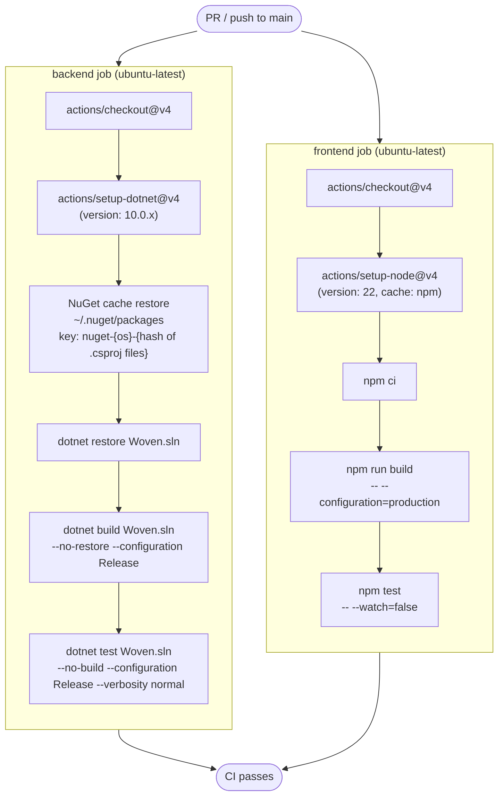
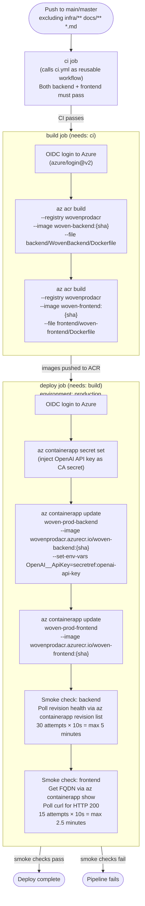
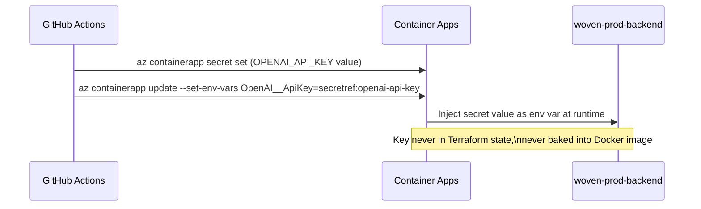

# Woven — DevOps

This document covers the CI/CD pipelines, build system, deployment process, infrastructure management, and operational tooling for Woven.

Related docs: [CLOUD_INFRASTRUCTURE.md](CLOUD_INFRASTRUCTURE.md) · [SECURITY.md](SECURITY.md) · [ARCHITECTURE.md](ARCHITECTURE.md)

---

## Table of Contents

1. [Overview](#overview)
2. [Repository Structure](#repository-structure)
3. [CI Pipeline (ci.yml)](#ci-pipeline-ciyml)
4. [Deploy Pipeline (deploy.yml)](#deploy-pipeline-deployyml)
5. [Infrastructure Pipeline (terraform.yml)](#infrastructure-pipeline-terraformyml)
6. [Supporting Workflows](#supporting-workflows)
7. [Build System](#build-system)
8. [Deployment Mechanics](#deployment-mechanics)
9. [Smoke Checks](#smoke-checks)
10. [Secrets Management](#secrets-management)
11. [Local Development](#local-development)

---

## Overview

Woven uses GitHub Actions for all CI/CD. There are three primary pipelines:

| Pipeline | File | Trigger | Purpose |
|---|---|---|---|
| CI | `ci.yml` | PR + push to main/master | Build and test both stacks |
| Deploy | `deploy.yml` | Push to main/master (app changes only) | Build images, push to ACR, update Container Apps |
| Infrastructure | `terraform.yml` | Infra changes | Apply Terraform changes to Azure |

The deploy pipeline is gated behind CI — images are never built from a failing codebase.

---

## Repository Structure

```
.github/
  workflows/
    ci.yml          # Build + test (reusable workflow)
    deploy.yml      # Image build + Container App update
    terraform.yml   # Infra changes
    codeql.yml      # Security scanning
    dependabot.yml  # Dependency updates
    pr-checks.yml   # PR validation
    stale.yml       # Stale issue/PR management
    auto-merge.yml
    auto-assign.yml
    pr-review.yml
    pr-labels.yml
    welcome.yml
infra/
  main.tf           # All Azure resources (Terraform)
backend/
  WovenBackend/
    Dockerfile
frontend/
  woven-frontend/
    Dockerfile
docker-compose.yml  # Local development
```

---

## CI Pipeline (ci.yml)

### Triggers

- `pull_request` — on any PR
- `push` to `main` or `master`
- `workflow_call` — callable as a reusable workflow (used by `deploy.yml` as its gate)

### Concurrency

```yaml
concurrency:
  group: ${{ github.ref }}
  cancel-in-progress: true
```

In-progress CI runs for the same ref are cancelled when a new push arrives, preventing queue buildup on fast-moving branches.

### Jobs



### Backend Job Details

- **Runner:** ubuntu-latest
- **Working directory:** `backend/`
- **Dotnet version:** 10.0.x
- **NuGet cache:** Keyed on OS + hash of all `.csproj` files. Cache invalidates when any project file changes.
- **Steps:**
  1. Checkout
  2. Setup .NET 10
  3. Restore NuGet cache
  4. `dotnet restore Woven.sln`
  5. `dotnet build Woven.sln --no-restore --configuration Release`
  6. `dotnet test Woven.sln --no-build --configuration Release --verbosity normal`

### Frontend Job Details

- **Runner:** ubuntu-latest
- **Working directory:** `frontend/woven-frontend/`
- **Node version:** 22
- **npm cache:** Enabled (actions/setup-node built-in)
- **Steps:**
  1. Checkout
  2. Setup Node 22 with npm cache
  3. `npm ci` (clean install from lock file)
  4. `npm run build -- --configuration=production` (production build; fails on type errors)
  5. `npm test -- --watch=false` (single-pass test run)

---

## Deploy Pipeline (deploy.yml)

### Triggers

Push to `main` or `master`, **excluding** changes to:
- `infra/**`
- `docs/**`
- `*.md` files

Pure documentation or infrastructure changes do not trigger an application deploy.

### Concurrency

```yaml
concurrency:
  group: deploy-production
  cancel-in-progress: false
```

Deploy runs **never cancel in-progress deploys**. If two pushes land close together, the second deploy queues and waits. This prevents partial deployments.

### Pipeline Overview



### Environment Variables in Pipeline

| Variable | Value | Source |
|---|---|---|
| `ACR_NAME` | `wovenprodacr` | Hardcoded in workflow |
| `ACR_LOGIN_SERVER` | `wovenprodacr.azurecr.io` | Hardcoded in workflow |
| `RESOURCE_GROUP` | `woven-prod-rg` | Hardcoded in workflow |
| `BACKEND_APP` | `woven-prod-backend` | Hardcoded in workflow |
| `FRONTEND_APP` | `woven-prod-frontend` | Hardcoded in workflow |
| `IMAGE_TAG` | `${{ github.sha }}` | Git commit SHA |

### Required GitHub Secrets

| Secret | Purpose |
|---|---|
| `AZURE_CLIENT_ID` | OIDC: Azure app registration client ID |
| `AZURE_TENANT_ID` | OIDC: Azure tenant ID |
| `AZURE_SUBSCRIPTION_ID` | OIDC: Azure subscription ID |
| `OPENAI_API_KEY` | Injected as Container App secret at deploy time |

No service principal passwords are stored. Authentication uses **OIDC federated identity** — the GitHub Actions token is exchanged for an Azure access token without any stored credentials. See [SECURITY.md](SECURITY.md) for details.

---

## Infrastructure Pipeline (terraform.yml)

A separate workflow handles infrastructure changes. It triggers on changes to `infra/**` and applies Terraform to Azure. This pipeline is decoupled from the application deploy pipeline — infrastructure and application changes deploy independently.

---

## Supporting Workflows

| Workflow | File | Purpose |
|---|---|---|
| CodeQL Security Scanning | `codeql.yml` | Static analysis for security vulnerabilities |
| Dependabot | `dependabot.yml` | Automated dependency version updates |
| PR Checks | `pr-checks.yml` | Validation on pull requests |
| Stale Management | `stale.yml` | Auto-mark stale issues and PRs |
| Auto Merge | `auto-merge.yml` | Automated merge for approved PRs |
| Auto Assign | `auto-assign.yml` | Automatic reviewer/assignee assignment |
| PR Review | `pr-review.yml` | PR review automation |
| PR Labels | `pr-labels.yml` | Automatic label assignment |
| Welcome | `welcome.yml` | First-time contributor welcome message |

---

## Build System

### Image Tagging Strategy

Every Docker image is tagged with the full Git commit SHA:

```
wovenprodacr.azurecr.io/woven-backend:{github.sha}
wovenprodacr.azurecr.io/woven-frontend:{github.sha}
```

This means:
- Every deployed image is traceable to an exact commit
- Rolling back to any previous deployment is possible by re-running `az containerapp update` with a prior SHA tag (images are not deleted from ACR automatically)
- There is no `latest` tag in the deploy pipeline

### ACR Cloud Build

Images are not built on the GitHub Actions runner and pushed. Instead, the source context is sent to Azure Container Registry and built in the cloud:

```
az acr build --registry wovenprodacr \
             --image woven-backend:{sha} \
             --file backend/WovenBackend/Dockerfile \
             .
```

This offloads the compute to ACR's build agents and avoids needing Docker-in-Docker or large runner instances.

### Build Steps per Image

**Backend:**
1. Stage 1 (`dotnet/sdk:10.0`): `dotnet restore` → `dotnet publish -c Release -o /app/publish --no-restore`
2. Stage 2 (`dotnet/aspnet:10.0`): Install Python + pip + venv + speechbrain + torch (CPU) + torchaudio → create `appuser` → copy artifacts → set ownership → switch to `appuser`

**Frontend:**
1. Stage 1 (`node:22-alpine`): `npm ci` → `npm run build -- --configuration=production`
2. Stage 2 (`nginx:alpine`): Copy build output + `nginx.conf.template` + `docker-entrypoint.sh` → create `nginxuser` → chown nginx dirs

---

## Deployment Mechanics

### How a Deploy Unfolds

1. **CI gate:** The deploy pipeline calls `ci.yml` as a reusable workflow. If any test or build step fails, the pipeline stops before building images.

2. **Image build:** Both images are built in ACR using the commit SHA as the image tag. The build job runs in a GitHub Actions environment with OIDC credentials scoped to ACR push permissions.

3. **Production environment gate:** The deploy job requires the `production` GitHub environment. This allows environment-level protection rules (e.g., required reviewers, wait timers) to be configured without changing the workflow file.

4. **Secret injection:** Before updating the Container App, the OpenAI API key is set as a Container App secret via `az containerapp secret set`. The secret is then referenced by name in the environment variable (`secretref:openai-api-key`). The key value never appears in Terraform state or in any Docker image layer.

5. **Container App update:** `az containerapp update` points each app to the new image tag. Container Apps performs a blue-green revision rollout — traffic shifts to the new revision only after health probes pass.

6. **Smoke checks:** After each update, the pipeline polls for a healthy state before declaring success (see [Smoke Checks](#smoke-checks)).

### Blue-Green Revision Rollout (Container Apps native behavior)

Container Apps creates a new revision for each image update. The platform shifts traffic to the new revision only after its liveness and readiness probes pass. If probes never pass, traffic stays on the previous revision. The smoke check scripts in the deploy pipeline detect this failure state and fail the pipeline.

---

## Smoke Checks

Both smoke checks run after the container updates and use polling loops to wait for health.

### Backend Smoke Check

```
az containerapp revision list \
  --name woven-prod-backend \
  --resource-group woven-prod-rg
```

- Polls the revision list for a revision with health state `Healthy`
- **30 attempts × 10 seconds = maximum 5 minutes**
- Exits 0 (success) as soon as a healthy revision is found
- Exits non-zero (pipeline failure) if no healthy revision after 30 attempts

### Frontend Smoke Check

```
FQDN=$(az containerapp show --name woven-prod-frontend ... --query properties.configuration.ingress.fqdn)
curl -f https://{FQDN}
```

- Gets the public FQDN from the Container App configuration
- Polls `curl` for an HTTP 200 response
- **15 attempts × 10 seconds = maximum 2.5 minutes**
- Exits 0 on first HTTP 200
- Exits non-zero if no 200 after 15 attempts

---

## Secrets Management

### What Is and Is Not Stored in GitHub Secrets

| Item | Stored Where |
|---|---|
| `AZURE_CLIENT_ID` | GitHub secret (non-sensitive — OIDC app registration ID) |
| `AZURE_TENANT_ID` | GitHub secret (non-sensitive — tenant ID) |
| `AZURE_SUBSCRIPTION_ID` | GitHub secret (non-sensitive — subscription ID) |
| `OPENAI_API_KEY` | GitHub secret → injected as Container App secret at deploy time |
| Database password | Azure infrastructure only (never in GitHub) |
| JWT signing key | Azure Container App environment variable (set via Terraform or `az containerapp update`) |

### OIDC vs. Service Principal

The deploy pipeline uses **OIDC federated credentials** (`azure/login@v2` with `client-id`, `tenant-id`, `subscription-id`). No service principal password or certificate is stored. GitHub's OIDC token is exchanged for an Azure access token scoped to the minimum required permissions for the deploy workflow.

### OpenAI API Key Flow



---

## Local Development

Local development uses Docker Compose. See [CLOUD_INFRASTRUCTURE.md — Local Development Environment](CLOUD_INFRASTRUCTURE.md#local-development-environment) for the full service map and environment variable reference.

### Dev Build Commands

```bash
# Backend
cd backend/WovenBackend
dotnet build                  # verify 0 errors
dotnet run                    # start API on port 5135

# Frontend
cd frontend/woven-frontend
npx ng serve --port 4202      # dev server (hot reload)
npx ng build --configuration development   # type-check + bundle
```

Both `dotnet build` and `npx ng build` must produce 0 errors before considering any change complete.

### Dev vs. Production Differences

| Concern | Local (Docker Compose) | Production (Azure) |
|---|---|---|
| Blob storage | Azurite emulator (port 10000) | Azure Blob Storage (private) |
| Database | pgvector/pgvector:pg16 (port 5433) | PostgreSQL Flexible Server (private VNet) |
| Redis | redis:7-alpine (port 6379) | Azure Cache for Redis Standard C1 (private endpoint) |
| Service Bus | Not emulated | Azure Service Bus Standard |
| Backend reachability | `http://localhost:5135` | Internal ingress only (not public) |
| Frontend | `http://localhost:80` or `npx ng serve` on port 4202 | Public Container App |
| JWT key | `CHANGE_THIS_...` default (insecure) | Proper signing key via Container App env var |
| OpenAI API key | Must be set in `.env` | Injected as Container App secret |
| Batch workers | Depend on `WOVEN_DISABLE_BATCH_WORKERS` | Isolated to workers pod (min=1, max=1) |
