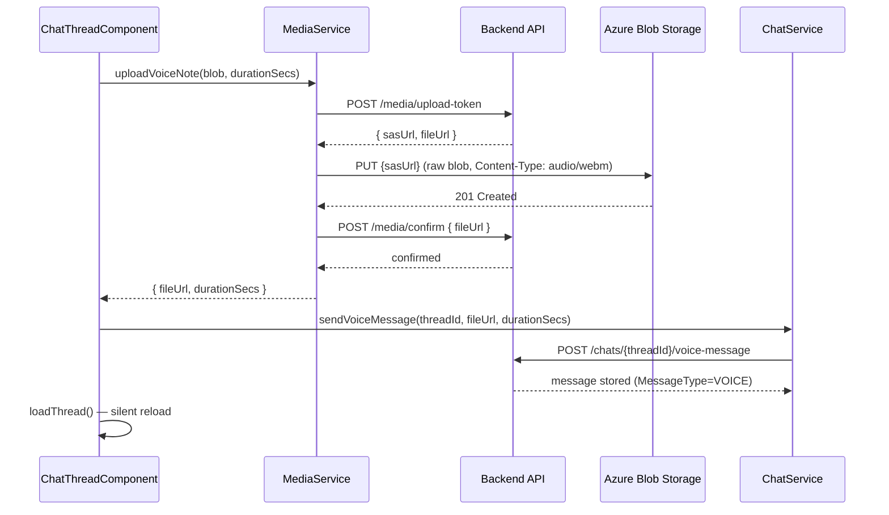

# Frontend Design — Woven

> Part of the Woven technical documentation suite.
> Cross-references: [ARCHITECTURE.md](ARCHITECTURE.md) · [BACKEND_DESIGN.md](BACKEND_DESIGN.md) · [COMPONENTS_PAGES_TEMPLATES.md](COMPONENTS_PAGES_TEMPLATES.md)

---

## Table of Contents

1. [Tech Stack](#1-tech-stack)
2. [Project Layout](#2-project-layout)
3. [Build and Dev Commands](#3-build-and-dev-commands)
4. [Routing Architecture](#4-routing-architecture)
5. [Angular Architecture Patterns](#5-angular-architecture-patterns)
6. [Service Layer](#6-service-layer)
7. [Real-Time Layer (SignalR)](#7-real-time-layer-signalr)
8. [Media Upload Pipeline](#8-media-upload-pipeline)
9. [Design System](#9-design-system)
10. [Change Detection Strategy](#10-change-detection-strategy)
11. [Authentication and Guards](#11-authentication-and-guards)
12. [Known Frontend Gaps](#12-known-frontend-gaps)

---

## 1. Tech Stack

| Concern | Technology |
|---|---|
| Framework | Angular 21 (SSR enabled) |
| Language | TypeScript |
| Styles | CSS (component-scoped) |
| Animations | GSAP (login page) |
| 3D / particles | Three.js (login background) |
| Real-time | SignalR (`@microsoft/signalr`) |
| HTTP | Angular `HttpClient` via service wrappers |
| Dev server port | **4202** |
| API base URL | `http://localhost:5135` (absolute, stored in `environment.ts`) |

There is no proxy configuration. Every HTTP call uses the absolute API base URL defined in `environment.ts`. This means CORS must be configured on the backend for all local development origins.

Angular 21 has Server-Side Rendering (SSR) enabled, though the app's primary deployment mode and SSR usage details are tracked separately in infrastructure documentation.

---

## 2. Project Layout

```
frontend/woven-frontend/src/app/
├── pages/                     # Full-page route components
│   ├── login/                 # LoginComponent — /login
│   ├── home/                  # HomeComponent — shell with bottom nav
│   ├── moments/               # MomentsPageComponent + ChatNoteOverlayComponent
│   ├── chats/                 # ChatsListComponent + ChatThreadComponent
│   ├── commons/               # CommonsPageComponent
│   ├── matches/               # MatchProfilePreviewPageComponent
│   ├── profile/               # ProfilePageComponent (/you)
│   ├── my-tiles/              # MyTilesPageComponent (/you/tiles)
│   ├── settings/              # SettingsPageComponent (/you/settings)
│   └── onboarding/            # All /onboarding/* step components
│       ├── welcome/
│       ├── basics/
│       ├── intent/
│       ├── foundational/
│       ├── photos/
│       ├── details/
│       ├── lifestyle/
│       ├── review/
│       └── start/
├── components/                # Shared UI components (woven-bg, etc.)
├── services/                  # HTTP + real-time service layer
│   ├── moments.service.ts
│   ├── chat.service.ts
│   ├── commons.service.ts
│   ├── tiles.service.ts
│   ├── games.service.ts
│   ├── matches.service.ts
│   ├── media.service.ts
│   ├── realtime.service.ts
│   ├── pulse.service.ts
│   ├── feedback.service.ts
│   ├── push.service.ts
│   └── support.service.ts
├── app.routes.ts              # All route definitions
├── environment.ts             # API base URL and environment flags
└── styles.scss                # Global design token definitions (CSS variables)
```

---

## 3. Build and Dev Commands

```bash
# Start the dev server (port 4202)
npx ng serve --port 4202

# Type-check and bundle (dev configuration)
npx ng build --configuration development

# Production build (used in CI)
npm run build -- --configuration=production
```

Both build commands must produce **0 errors** before changes are considered complete. `npx ng build` is the gate — it catches type errors that the dev server tolerates.

---

## 4. Routing Architecture

All routes are **flat** (no lazy-loading is applied). The route tree has three distinct zones:

```mermaid
flowchart TD
    A[Browser Request] --> B{Route match}
    B --> C[Public Zone]
    B --> D[Onboarding Zone]
    B --> E[App Gate]
    B --> F[Main Shell Zone]
    B --> G[Catch-all → /login]

    C --> C1[/login → LoginComponent]
    C --> C2[/privacy → LegalComponent]
    C --> C3[/terms → LegalComponent]
    C --> C4[/data-policy → LegalComponent]

    D --> D1[authGuard]
    D1 --> D2[/onboarding/welcome → WelcomeOnboardingComponent]
    D1 --> D3[/onboarding/basics → BasicsOnboardingComponent]
    D1 --> D4[/onboarding/intent → IntentOnboardingComponent]
    D1 --> D5[/onboarding/foundational → FoundationalComponent]
    D1 --> D6[/onboarding/photos → PhotosPageComponent]
    D1 --> D7[/onboarding/details → DetailsOnboardingComponent]
    D1 --> D8[/onboarding/lifestyle → LifestyleOnboardingComponent]
    D1 --> D9[/onboarding/review → ReviewOnboardingComponent]
    D1 --> D10[/onboarding/start → StartOnboardingComponent]

    E --> E1[/app → OnboardingGateComponent]
    E1 --> E2{onboarding complete?}
    E2 -->|No| D2
    E2 -->|Yes| F

    F --> F1[authGuard]
    F1 --> F2[HomeComponent shell]
    F2 --> F3[/ → redirect to /moments]
    F2 --> F4[/moments → MomentsPageComponent]
    F2 --> F5[/commons → CommonsPageComponent]
    F2 --> F6[/chats → ChatsListComponent]
    F2 --> F7[/chats/:threadId → ChatThreadComponent]
    F2 --> F8[/matches/:matchId/profile → MatchProfilePreviewPageComponent]
    F2 --> F9[/you → ProfilePageComponent]
    F2 --> F10[/you/settings → SettingsPageComponent]
    F2 --> F11[/you/tiles → MyTilesPageComponent]
```

### Route Table

#### Public (no auth required)

| Path | Component |
|---|---|
| `/login` | `LoginComponent` |
| `/privacy` | `LegalComponent` |
| `/terms` | `LegalComponent` |
| `/data-policy` | `LegalComponent` |

#### Onboarding (auth required, outside shell)

| Path | Component |
|---|---|
| `/onboarding/welcome` | `WelcomeOnboardingComponent` |
| `/onboarding/basics` | `BasicsOnboardingComponent` |
| `/onboarding/intent` | `IntentOnboardingComponent` |
| `/onboarding/foundational` | `FoundationalComponent` |
| `/onboarding/photos` | `PhotosPageComponent` |
| `/onboarding/details` | `DetailsOnboardingComponent` |
| `/onboarding/lifestyle` | `LifestyleOnboardingComponent` |
| `/onboarding/review` | `ReviewOnboardingComponent` |
| `/onboarding/start` | `StartOnboardingComponent` |

#### Post-Login Gate

| Path | Component | Behavior |
|---|---|---|
| `/app` | `OnboardingGateComponent` | Reads onboarding status, redirects to first incomplete step or to `/moments` |

#### Main App Shell (auth required, under `HomeComponent`)

| Path | Component |
|---|---|
| `/` | Redirect → `/moments` |
| `/moments` | `MomentsPageComponent` |
| `/commons` | `CommonsPageComponent` |
| `/chats` | `ChatsListComponent` |
| `/chats/:threadId` | `ChatThreadComponent` |
| `/matches/:matchId/profile` | `MatchProfilePreviewPageComponent` |
| `/you` | `ProfilePageComponent` |
| `/you/settings` | `SettingsPageComponent` |
| `/you/tiles` | `MyTilesPageComponent` |

**Catch-all:** `**` → redirects to `/login`

### Route Parameter Extraction

Because child routes under `HomeComponent` are nested in the router outlet, `ActivatedRoute.snapshot.params` may not contain params from a child segment. The pattern used across the codebase is to walk the full route tree:

```typescript
// Pattern: getThreadIdFromRouteTree()
// Used in: ChatThreadComponent
function getThreadIdFromRouteTree(route: ActivatedRoute): string | null {
  // Walks route.firstChild recursively until params.threadId is found
}
```

This pattern is required for any component that reads a route parameter while rendered inside `HomeComponent`'s outlet.

---

## 5. Angular Architecture Patterns

### 5.1 Change Detection

Every page component uses `ChangeDetectionStrategy.OnPush`. This is a hard project convention — new page components must follow it.

Consequence: Angular will not automatically re-render after async operations complete. After every `await` that changes state visible in the template, the component must call:

```typescript
this.cdr.markForCheck();     // schedules a check in the next CD cycle
// or
this.cdr.detectChanges();    // runs CD immediately (use sparingly)
```

Failure to call one of these after async state changes results in stale UI with no error.

### 5.2 HTTP in Components

HTTP calls **never** go directly in components. All HTTP communication goes through the service layer. Components call service methods and `await` the result:

```typescript
// Correct
const result = await firstValueFrom(this.momentsService.getMoments());

// Forbidden
const result = await firstValueFrom(this.http.get('/moments'));
```

`firstValueFrom()` is used for one-shot HTTP calls inside `async` methods. It converts an Observable to a Promise, completing after the first emission.

### 5.3 Optimistic UI

The pattern for user actions that must feel instant:

1. Apply change to local state immediately (e.g., add a temp message to the list, remove a card from the deck)
2. Call the service method to persist the change to the backend
3. On confirmation, optionally do a silent background reload to sync server state
4. On failure, roll back the optimistic change and show an error

This pattern is used for:
- Sending chat messages (optimistic add → confirm → reload)
- Passing/choosing Moments cards (optimistic removal from deck)
- Drawn tab responses (optimistic removal)

The sets `respondedUserIds` and `respondedLikedYouIds` in `MomentsPageComponent` are the primary mechanism for optimistic removal — a card whose userId is in the set is filtered out of the rendered list before the API response returns.

### 5.4 Service Injection Pattern

Services are injected via constructor injection (Angular's standard DI). Each service corresponds to one backend domain — there is a one-to-one correspondence between service files and backend endpoint groups.

---

## 6. Service Layer

All services live in `frontend/woven-frontend/src/app/services/`. Each wraps a domain of the backend API. Components never construct HTTP requests; they call typed service methods.

### MomentsService (`moments.service.ts`)

Wraps the `/moments` endpoint group.

| Method | HTTP | Path | Returns |
|---|---|---|---|
| `getMoments()` | GET | `/moments` | `MomentsResponse` |
| `getLikedYou()` | GET | `/moments/liked-you` | `LikedYouResponse` |
| `respond(req)` | POST | `/moments/respond` | `RespondResult` |
| `choose(req)` | POST | `/moments/choose` | `ChooseResult` |

Key exported types:

**`MomentsCard`**
```typescript
{
  userId: number;
  fullName: string;
  profilePhoto?: string;
  gender?: string;
  displayPronouns?: string;
  location?: string;
  isVerified?: boolean;
  score?: number;
  bucket?: string;
  alreadyChoseYou?: boolean;
  reason?: { headline: string; bullets: string[]; tone: string };
  rating?: number;
}
```
Note: no `age` field. Age is deliberately excluded per design rules.

**`LikedYouCard`**
```typescript
{
  userId: number;
  fullName: string;
  profilePhoto?: string;
  location?: string;
  isVerified?: boolean;
  likedAt: string;
  expiresInHours: number;
}
```

**`MomentsBudget`**
```typescript
{
  totalCap: number;
  totalUsed: number;
  totalRemaining: number;
}
```

**`ChooseResult`** — requires `noteText` between 20 and 150 characters (ChatNote sent with the choice).

### ChatService (`chat.service.ts`)

Wraps the `/chats` endpoint group.

| Method | HTTP | Path | Returns |
|---|---|---|---|
| `getChats()` | GET | `/chats` | — |
| `start(matchId)` | POST | `/chats/start` | — |
| `getThread(threadId)` | GET | `/chats/{threadId}` | `ChatThreadResponse` |
| `sendMessage(threadId, body)` | POST | `/chats/{threadId}/messages` | — |
| `closeGracefully(threadId)` | POST | `/chats/{threadId}/close-gracefully` | — |
| `trialDecision(threadId, decision, endReason?)` | POST | `/chats/{threadId}/trial-decision` | — |
| `sendVoiceMessage(threadId, audioUrl, durationSecs)` | POST | `/chats/{threadId}/voice-message` | — |
| `voiceListened(threadId, messageId)` | POST | `/chats/{threadId}/messages/{messageId}/voice-listened` | — |
| `expressDateInterest(threadId, ideaIndex, ideaText)` | POST | `/chats/{threadId}/date-interest` | `{ mutualInterest: boolean }` |
| `loveChatNote(noteId)` | POST | `/chats/chatnotes/{noteId}/love` | — |
| `loveMessage(threadId, messageId)` | POST | `/chats/{threadId}/messages/{messageId}/love` | — |
| `getNudge(threadId)` | GET | `/chats/{threadId}/nudge` | — |
| `dismissNudge(threadId)` | POST | `/chats/{threadId}/nudge/dismiss` | — |

**`ChatThreadResponse`** — the central type for a loaded thread:
```typescript
{
  meUserId: number;
  threadId: string;
  matchId: number;
  matchType: string;
  balloonState: string;
  expiresAt: string;
  bothMessagedAt?: string;
  findLoveAt?: string;
  showBalloonTimer: boolean;
  reflectionSecondsLeft: number;
  showFindLove: boolean;
  dateIdea?: string;
  dateIdeas?: string[];
  chatNotes: ChatNote[];
  other: OtherUser;
  messages: Message[];
  isTrial: boolean;
  trialEndsAt?: string;
  trialSecondsLeft: number;
  canMakeDecision: boolean;
  isUserA: boolean;
  userADecision?: string;
  userBDecision?: string;
}
```

### CommonsService (`commons.service.ts`)

Wraps the `/commons` endpoint group — feed and tile interactions for the Commons tab.

### TilesService (`tiles.service.ts`)

Wraps tile CRUD operations and the My Tiles management flow at `/you/tiles`.

### GamesService (`games.service.ts`)

Wraps the game session lifecycle — KnowMe and RedGreenFlag game endpoints.

### MatchesService (`matches.service.ts`)

Wraps match profile data, used by `MatchProfilePreviewPageComponent`.

### MediaService (`media.service.ts`)

Handles the three-step voice note upload pipeline. See [Section 8](#8-media-upload-pipeline) for the full flow.

| Method | Description |
|---|---|
| `uploadVoiceNote(blob, durationSecs)` | Full pipeline: SAS token → Azure PUT → confirm → returns `{ fileUrl, durationSecs }` |

### RealtimeService (`realtime.service.ts`)

Manages the SignalR hub connection. See [Section 7](#7-real-time-layer-signalr).

- Hub URL: `/hubs/woven`

### PulseService (`pulse.service.ts`)

Weekly vibe / pulse data, used by `ProfilePageComponent`.

### FeedbackService (`feedback.service.ts`)

Date feedback flows — post-date rating and reflection submissions.

### PushService (`push.service.ts`)

Push notification subscription management. Note: as of the current build, no service worker or VAPID key infrastructure exists — this service is a stub for future Web Push integration.

### SupportService (`support.service.ts`)

Support and feedback form submissions.

---

## 7. Real-Time Layer (SignalR)

`RealtimeService` maintains a persistent SignalR connection to `/hubs/woven` on the backend. This enables server-push events for:

- New message arrivals in chat threads
- Match state changes (balloon state, trial status)
- Nudge events

The service is injected into components that need live updates. Components subscribe to hub events and call `cdr.markForCheck()` after updating state (required by OnPush strategy).

---

## 8. Media Upload Pipeline

Voice notes do not upload directly to the backend API. The flow is a three-step Azure Blob Storage direct-upload pattern:



The backend never receives raw audio bytes. It receives only the Azure Blob URL after the client has uploaded directly. Voice note listen tracking is a separate call: `POST /chats/{threadId}/messages/{messageId}/voice-listened`, which fires when the `<audio>` element raises its `onended` event in the template.

---

## 9. Design System

### 9.1 CSS Variable Tokens

All visual styling uses CSS custom properties (variables) defined in `styles.scss`. No component may use raw hex color values or raw pixel values that are not already part of the token system. This is a hard project rule enforced in code review.

#### Token Categories

**Backgrounds**
- `--bg-base` — page background
- `--bg-elevated` — cards, panels elevated above base
- `--bg-sunken` — inset areas, input fields
- `--bg-surface` — generic surface

**Text**
- `--text-primary` — main readable text
- `--text-secondary` — supporting text
- `--text-muted` — tertiary, hints
- `--text-dim` — de-emphasized labels

**Borders**
- `--border-subtle` — hairline separators
- `--border-soft` — slightly more visible borders

**Brand Colors**
- `--gold-300`, `--gold-400`, `--gold-500` — Magical / ◈ color family (gold gradient)
- `--rose-300` — Resonant / ◇ color family; also used for warnings and character-count danger state

**Shape**
- `--radius-lg` — standard card corner radius
- `--radius-xl` — larger rounded elements

**Typography**
- `--font-ui` — interface labels, buttons
- `--font-data` — numeric readouts, timestamps

### 9.2 Color Theme

The app uses a **dark plum** primary theme: dark backgrounds with gold accents for Magical interactions and rose/crimson accents for Resonant interactions.

The login page has a GSAP-animated 2D love story sequence layered over a Three.js global particle background.

### 9.3 Hard Design Rules

These rules are non-negotiable and enforced in all UI work:

| Rule | Detail |
|---|---|
| No hover `translateY` lifts | Hover states use glow, shadow, or color change only. `:active` scale transforms are allowed. |
| No age on Moments cards | Cards show name, verification badge, ECHO explanation, and action buttons. No age field. |
| Background drift stays on | The `woven-bg` component is not modified unless explicitly tasked. |
| No community ratings shown | The rating bar (red/green segments) is a platform-internal display. Raw scores are never surfaced to users. |
| No paywalls | Spark economy is the soft gate. No hard feature lock behind payment. |
| ChatNote data is background signal only | Users never see their own ChatNotes or others' notes directly. |

### 9.4 Interaction Vocabulary

The UI uses two action types throughout, always referred to by their internal names:

| User-facing symbol | Name | Internal ID | Color |
|---|---|---|---|
| ◈ | Magical | `MAGICAL` | Gold gradient (`--gold-*`) |
| ◇ | Resonant | `LOGICAL` | Crimson/rose gradient (`--rose-*`) |
| — | Pass | `PASS` | Neutral |

---

## 10. Change Detection Strategy

All page components use `ChangeDetectionStrategy.OnPush`. This means Angular only runs change detection for a component when:

1. An `@Input()` reference changes
2. An event originates from the component or its children
3. An `Observable` bound with `async` pipe emits
4. `cdr.markForCheck()` or `cdr.detectChanges()` is called explicitly

Because most state updates come from `async/await` chains (not from Observables with `async` pipe), the manual call pattern is required everywhere. The typical pattern:

```typescript
async loadData() {
  this.loading = true;
  this.cdr.markForCheck();

  try {
    const result = await firstValueFrom(this.someService.getData());
    this.data = result;
  } finally {
    this.loading = false;
    this.cdr.markForCheck();
  }
}
```

---

## 11. Authentication and Guards

- Authentication token: **JWT stored in `localStorage`** (dev convenience; not moved to in-memory or cookies)
- `authGuard` protects all routes in the onboarding zone and main shell zone
- Public routes (`/login`, `/privacy`, `/terms`, `/data-policy`) have no guard
- Post-login flow: after Google Sign-In on `/login`, the user is redirected to `/app` → `OnboardingGateComponent` reads onboarding completion status → redirects to the first incomplete onboarding step or to `/moments`

The JWT is attached to outgoing HTTP requests by an HTTP interceptor (standard Angular `HttpInterceptor` pattern — implementation lives in the services layer).

---

## 12. Known Frontend Gaps

The following features have been designed and appear in specifications but are not yet implemented in the frontend codebase:

| Feature | Status | Notes |
|---|---|---|
| "Your Turn" indicator in chat list | Not built | Designed — shows when it's the logged-in user's turn to reply |
| Active / online indicator | Not built | Designed — no presence tracking endpoint or UI |
| Push notification service worker | Not built | `PushService` is a stub; no VAPID key, no service worker registration, no Web Push endpoint |
| Horoscope onboarding field | Not built | Designed for the onboarding basics step; field does not exist |
