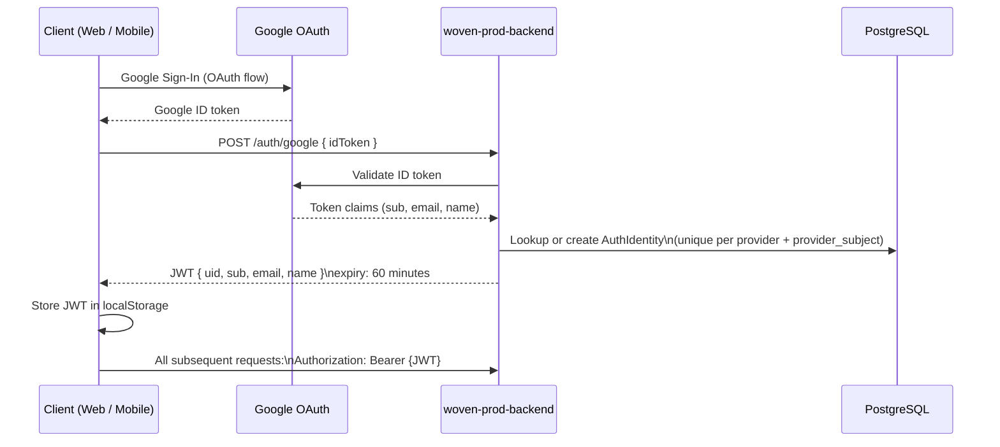
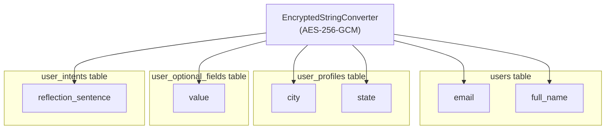
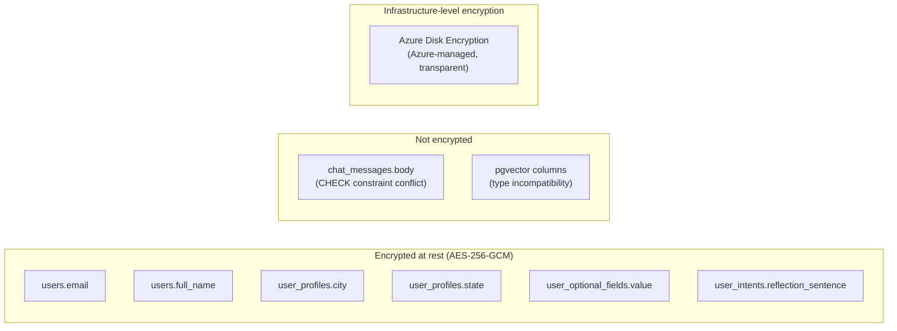
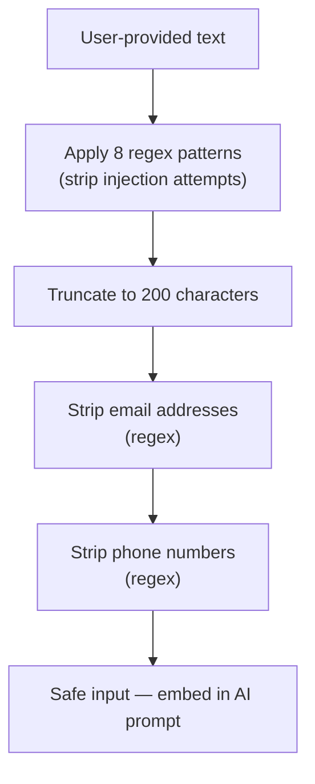
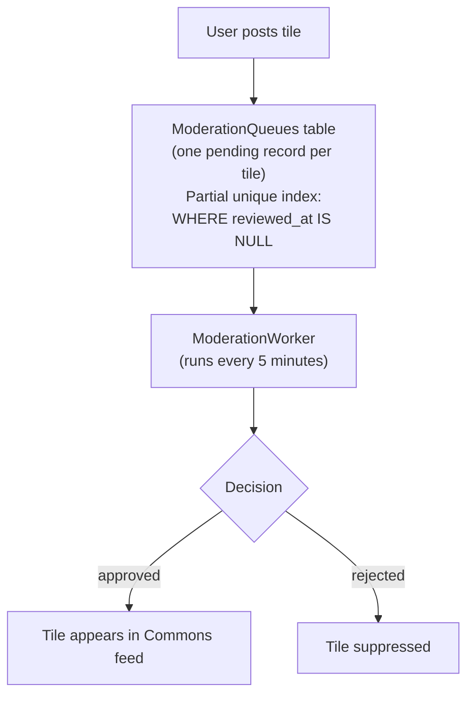
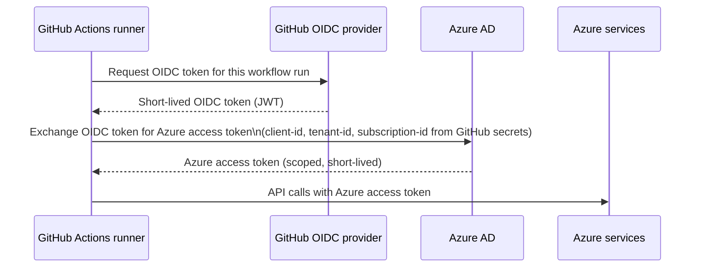
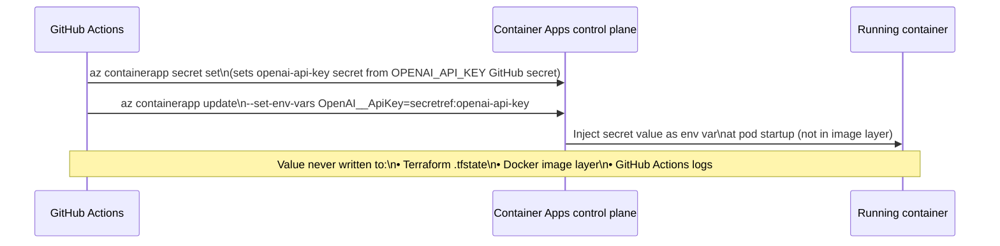

# Woven — Security

This document covers every security control present in the Woven codebase and infrastructure: authentication, authorization, encryption at rest, prompt injection protection, content moderation, trust scoring, the audit log, container hardening, and CI/CD security.

Related docs: [CLOUD_INFRASTRUCTURE.md](CLOUD_INFRASTRUCTURE.md) · [DEVOPS.md](DEVOPS.md) · [BACKEND_DESIGN.md](BACKEND_DESIGN.md) · [DATABASE_DESIGN.md](DATABASE_DESIGN.md)

---

## Table of Contents

1. [Authentication](#authentication)
2. [Authorization](#authorization)
3. [Encryption at Rest](#encryption-at-rest)
4. [Prompt Injection Protection](#prompt-injection-protection)
5. [PII Sanitization in AI Prompts](#pii-sanitization-in-ai-prompts)
6. [Security Audit Log](#security-audit-log)
7. [Data Export and Privacy](#data-export-and-privacy)
8. [Content Moderation](#content-moderation)
9. [Trust Scoring and Catfish Detection](#trust-scoring-and-catfish-detection)
10. [Block System](#block-system)
11. [Community Ratings (Platform-Only)](#community-ratings-platform-only)
12. [ChatNote Privacy](#chatnote-privacy)
13. [Container Security](#container-security)
14. [CI/CD Security](#cicd-security)
15. [Known Gaps and Flagged Items](#known-gaps-and-flagged-items)

---

## Authentication

### Flow

Woven uses Google OAuth exclusively for identity. There is no username/password authentication.



### JWT Claims

| Claim | Content |
|---|---|
| `uid` | Internal `userId` (primary lookup key) |
| `sub` | Google subject identifier |
| `email` | User email |
| `name` | User display name |

### JWT Expiry

60 minutes (`Jwt__ExpiryMinutes=60`).

### JWT Storage

JWT is stored in **localStorage**. This was chosen as a development convenience and is explicitly flagged for revisit before production. localStorage is accessible to JavaScript on the same origin and is not protected against XSS the way `HttpOnly` cookies would be.

---

## Authorization

### Default Policy

All endpoints require `.RequireAuthorization()`. This is applied as the default at the route group level — there is no opt-out path. Endpoints that must be public are explicitly marked as exceptions.

### Public Endpoints (No Auth Required)

| Endpoint | Reason |
|---|---|
| `GET /health` | Load balancer health check |
| `GET /health/live` | Liveness probe |
| `GET /health/ready` | Readiness probe |
| `POST /auth/google` | Authentication initiation |
| `/login` (frontend route) | Login page |

### User Identity Extraction

Every authenticated endpoint extracts the requesting user's ID via:

```csharp
GetUserId(ClaimsPrincipal)
```

This reads claims in priority order:
1. `uid` claim (primary — set by Woven's JWT issuance)
2. `sub` claim (fallback)
3. `ClaimTypes.NameIdentifier` (secondary fallback)

### Participant Check on Match/Chat Endpoints

Every endpoint that accesses chat or match data performs an explicit participant check before returning or mutating data:

```csharp
if (match.UserAId != me && match.UserBId != me)
    return Results.Forbid();
```

This check is not delegated to a middleware — it is applied at the endpoint level for every match and chat access path. A user cannot read or write to a conversation they are not a party to.

---

## Encryption at Rest

### Mechanism

Field-level encryption uses **AES-256-GCM** applied via an `EncryptedStringConverter` registered in EF Core. The converter transparently encrypts on write and decrypts on read. The encryption key is provided via application configuration (not hardcoded).

### Encrypted Fields



### Fields NOT Encrypted

| Field | Reason |
|---|---|
| `chat_messages.body` | An existing `CHECK` constraint limits body to 1–1000 characters. AES-256-GCM ciphertext is longer than 1000 characters, so the constraint blocks encrypted values. Fixing this requires a migration to widen or drop the constraint first. |
| pgvector columns | The `EncryptedStringConverter` is a `string→string` converter; pgvector columns store `float[]` and are incompatible. |

### Encryption Coverage Diagram



---

## Prompt Injection Protection

All user-provided text passes through a screening layer in `AiProfileService` before being embedded in any AI prompt.

### Screened Patterns

Eight regex patterns are applied to user inputs:

| Pattern | What It Catches |
|---|---|
| `ignore previous` | Classic prompt injection opener |
| `system:` | System role injection |
| `endoftext` token sequences | Token-boundary injection |
| `assistant:` | Assistant role injection |
| `human:` | Human role injection |
| `[INST]` | Llama/instruction-tuning injection marker |
| (2 additional patterns) | Other injection vectors |

Any input matching these patterns is sanitized before use.

### Input Truncation

All user-provided text is truncated to **200 characters maximum** before embedding in an AI prompt, regardless of whether injection patterns were found.

### Flow



---

## PII Sanitization in AI Prompts

In addition to prompt injection screening, user inputs are sanitized to strip PII before being sent to external AI services:

| PII Type | Method |
|---|---|
| Email addresses | Regex pattern removal |
| Phone numbers | Regex pattern removal |

The 200-character truncation is applied after PII stripping. This creates a defense-in-depth approach: even if PII slips through the regex (e.g., an unusual phone format), the truncation limits how much context can be exfiltrated.

---

## Security Audit Log

All security-relevant events write to the `SecurityAuditLogs` table. The event type is enforced by a `CHECK` constraint — only the defined event types can be inserted.

### Event Types

| EventType | When It Is Written |
|---|---|
| `external_api_call` | Outbound calls to external APIs (OpenAI, Google, etc.) |
| `pii_access` | Access to PII data |
| `encryption_key_rotation` | Encryption key management events |
| `admin_data_access` | Admin-level data access |
| `bulk_data_export` | Every call to `GET /me/data-export` |
| `suspicious_pattern` | Anomaly detection triggers |
| `failed_decryption` | Decryption failures (possible key mismatch or corruption) |

### Notable Behaviors

- `bulk_data_export` is written on **every** data export request, not just rate-limited ones. This creates an audit trail even when the request is rejected by the rate limiter.
- `failed_decryption` events can indicate data corruption, key rotation issues, or — in aggregate — a probing attack.

---

## Data Export and Privacy

### Endpoint

```
GET /me/data-export
```

### What Is Returned

- User profile
- Tiles (Commons posts)
- Chat messages
- Visual preferences

### Rate Limiting

- Maximum 1 export per 30 days per user
- Rate limit enforced via Redis key: `data-export:{userId}`
- TTL: 30 days

### Third-Party Disclosure

The data export response includes a disclosure of third-party processors:

> "OpenAI (semantic embeddings)", "Replicate (photo embeddings)"

This is surfaced in the export payload itself, giving users visibility into which external services have processed their data.

---

## Content Moderation

All Commons tiles go through a moderation queue before appearing in the feed.

### Flow



### Schema Notes

- Decision values: `'approved'` or `'rejected'` — enforced by CHECK constraint
- Partial unique index on `(tile_id) WHERE reviewed_at IS NULL` ensures only one pending moderation record exists per tile at a time

### Tile Reports

Users can report tiles. `TileReports` enforces one report per `(tile_id, reporter_id)` pair — a user cannot report the same tile multiple times.

---

## Trust Scoring and Catfish Detection

### Trust Score

- Stored on `User.TrustScore`
- Default: `0.5`
- Range: `0.0` to `1.0`
- Updated by `TrustBatchWorker` (runs Tuesday 02:00 UTC)

### Identity Verification

| Component | Details |
|---|---|
| `ReferencePhotoEmbedding` | 512-dimensional CLIP embedding stored per user for identity verification comparison |
| `UserVerification` table | Stores verification state |
| `User.IsVerified` | Boolean flag |
| Verification badge (✓) | Shown on Moments cards and in chat thread headers |

The CLIP embedding enables comparison between a user's reference photo and submitted verification images, enabling catfish detection without storing raw photos for comparison purposes.

### `TrustBatchWorker`

Runs Tuesday 02:00 UTC. Aggregates behavioral signals and updates `TrustScore` for all users. Low trust scores can suppress a user from appearing in decks.

---

## Block System

### Schema

`Blocks` table with composite primary key `(blocker_id, blocked_id)` — enforces uniqueness and prevents duplicate block records.

### Creation Paths

A block is created when:
1. A user selects `BLOCK` as their trial decision — this immediately closes the match and creates a `Block` record
2. (Other explicit block actions)

### Enforcement

Block checks are applied bidirectionally — if user A has blocked user B **or** user B has blocked user A:
- User B does not appear in user A's Moments deck
- User A does not appear in user B's Liked-You (Drawn) tab
- No new matches can be created between the pair

Both directions are checked at query time, not at insertion time.

---

## Community Ratings (Platform-Only)

`UserRatings` are a platform-internal signal and are never exposed to users as raw scores.

| Property | Value |
|---|---|
| Scale | -100 to +100 |
| Visibility threshold | Minimum 5 votes before any rating surface is shown |
| Display format | Segment bar (red/negative side, green/positive side) — never a raw number |
| Shown to | Deck card viewers only, and only when threshold is met |

The rating bar is a discovery aid, not a public score. Users cannot see their own rating. The raw numeric value is never surfaced anywhere in the UI.

---

## ChatNote Privacy

ChatNotes (opening notes that capture a user's initial impression of a match) are background signals only:

- **Not shown to either party** — not surfaced in any UI
- Linked to the match record for ECHO signal processing
- Opaque to both parties in the match

This prevents users from gaming their behavior based on how they think they're being evaluated, and prevents distress from seeing negative impressions.

---

## Container Security

### Backend Container

| Control | Implementation |
|---|---|
| Non-root user | `appuser` created and set via `USER appuser` |
| File ownership | All app files and scripts chowned to `appuser` before switching user |
| No Docker HEALTHCHECK | Container Apps uses its own liveness/readiness probes |
| Port | 8080 (non-privileged) |

### Frontend Container

| Control | Implementation |
|---|---|
| Non-root user | `nginxuser` created |
| nginx dir ownership | nginx cache, log, pid, and config directories chowned to `nginxuser` |
| Port | 80 |

Both containers run as non-root users. No container runs processes as UID 0.

---

## CI/CD Security

### OIDC Authentication (No Stored Secrets)

The deploy pipeline does not store Azure service principal passwords in GitHub secrets. It uses **OIDC federated credentials**:



Required GitHub secrets for OIDC:

| Secret | Sensitivity |
|---|---|
| `AZURE_CLIENT_ID` | Non-sensitive (app registration ID, not a credential) |
| `AZURE_TENANT_ID` | Non-sensitive (Azure tenant identifier) |
| `AZURE_SUBSCRIPTION_ID` | Non-sensitive (subscription identifier) |

The only sensitive secret stored in GitHub is:

| Secret | Sensitivity | How Used |
|---|---|---|
| `OPENAI_API_KEY` | Sensitive | Injected as Container App secret at deploy time; never in Terraform state or Docker image layers |

### OpenAI API Key Injection



### Production Environment Gate

The `deploy` job in `deploy.yml` declares `environment: production`. GitHub environments can enforce:
- Required reviewer approvals before a deploy proceeds
- Wait timers
- Environment-specific secrets

This gate applies even for direct pushes to `main` — the job will pause at the environment check before executing any Azure commands.

### CodeQL Security Scanning

`codeql.yml` runs CodeQL static analysis. This catches common vulnerability patterns (injection, deserialization issues, insecure API usage) in both the C# backend and TypeScript frontend before code merges.

### Dependabot

`dependabot.yml` monitors NuGet and npm dependencies for known CVEs and opens automated PRs to update affected packages.

---

## Known Gaps and Flagged Items

These items are documented as known issues or explicitly flagged for revisit:

| Item | Status | Notes |
|---|---|---|
| JWT in localStorage | Flagged | Dev convenience; susceptible to XSS. Flagged for revisit before production. HttpOnly cookie is the standard alternative. |
| `chat_messages.body` not encrypted | Known gap | CHECK constraint (1–1000 chars) conflicts with ciphertext length. Requires a migration to widen or drop the constraint before encryption can be applied. |
| pgvector columns not encrypted | Architectural constraint | `EncryptedStringConverter` is string-to-string; pgvector stores float arrays. No current path to field-level encryption for these columns. |
| No Web Push / VAPID | Missing feature | Push notification infrastructure does not exist. No service worker, no Web Push endpoint. |
