# Woven — System Design

> End-to-end technical reference. Covers every major data flow, state machine, subsystem interaction, and design decision in the Woven platform. Written for a senior engineer onboarding to the codebase or an investor doing technical due diligence. Cross-references: [BACKEND_DESIGN.md](BACKEND_DESIGN.md) | [ARCHITECTURE.md](ARCHITECTURE.md)

---

## Table of Contents

1. [System Overview](#system-overview)
2. [Core Design Principles](#core-design-principles)
3. [Authentication Flow](#authentication-flow)
4. [Moments and Daily Deck](#moments-and-daily-deck)
5. [ECHO Matching Pipeline](#echo-matching-pipeline)
6. [Match State Machine](#match-state-machine)
7. [Trial Period System](#trial-period-system)
8. [Chat System](#chat-system)
9. [Voice Notes System](#voice-notes-system)
10. [Commons and Tile System](#commons-and-tile-system)
11. [Spark Economy](#spark-economy)
12. [AI and Game Features](#ai-and-game-features)
13. [Embedding Architecture](#embedding-architecture)
14. [Trust and Moderation](#trust-and-moderation)
15. [Analytics and A/B Testing](#analytics-and-ab-testing)
16. [Background Worker Lifecycle](#background-worker-lifecycle)
17. [End-to-End: From Swipe to Conversation](#end-to-end-from-swipe-to-conversation)
18. [Known Gaps and Future Work](#known-gaps-and-future-work)

---

## System Overview

Woven is a dating app built on behavioral signals rather than stated preferences. Users interact through three surfaces:

- **Moments** — a curated daily deck of candidate profiles (the Deck tab) and a list of people who chose them (the Drawn tab).
- **Commons** — a content feed where users post Tiles (text, photo, video, or voice).
- **Chats** — match-gated conversations that open when a Balloon pops (mutual like or EDGE match resolution).

The ECHO pipeline observes user behavior across all three surfaces and continuously learns what predicts successful connections for each individual user. No raw compatibility scores, community ratings, or feedback are ever shown to users — AI is invisible UX, not a feature.

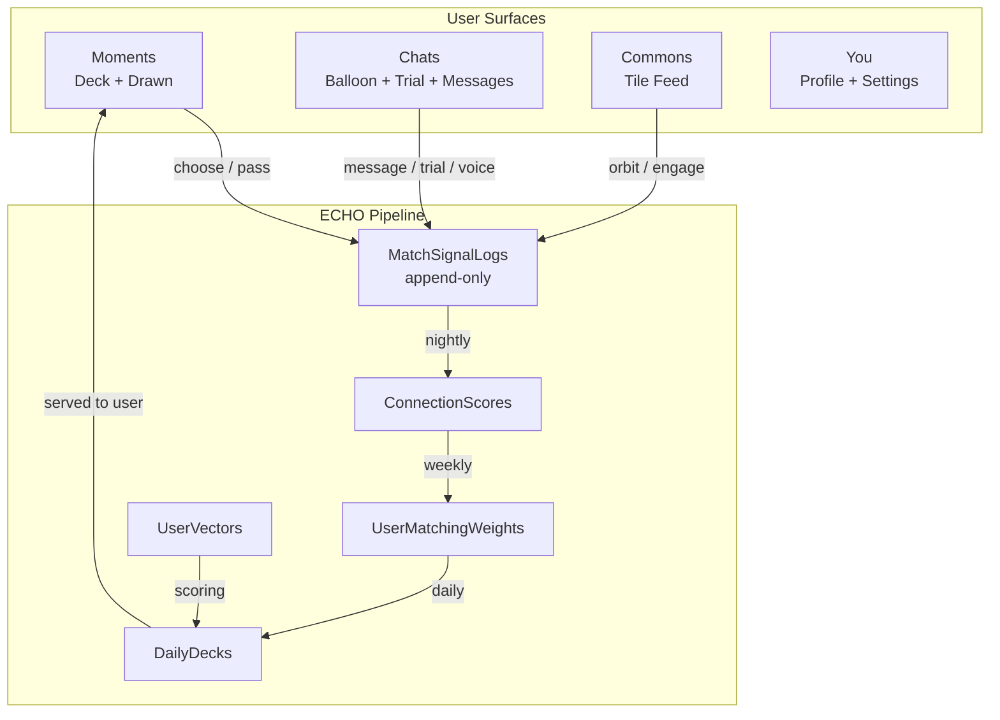

---

## Core Design Principles

### 1. Behavioral signals only

ECHO learns from what users do, not what they say they want. Stated preferences inform early filtering; behavioral outcomes drive weight learning.

### 2. AI is invisible

No feature is labeled "AI-powered." No scores are shown to users. The explanation shown when a Balloon pops is crafted to feel personal, not algorithmic.

### 3. Append-only signal ledger

`MatchSignalLogs` is never updated or deleted — only appended. This preserves the full history of behavioral events for retrospective weight learning and debugging.

### 4. Spark economy as the soft gate

There are no paywalls. The spark economy (5 sparks/day, 10 max) is the only scarcity mechanism. Drawn actions cost 1 spark. Ghost refunds (0.5 sparks) are automatic when matches end without any conversation.

### 5. PII is encrypted at rest

AES-256-GCM via `EncryptionService` applied transparently in EF Core via `EncryptedStringConverter`. Email, full name, city, state, and reflection sentences are encrypted. See [BACKEND_DESIGN.md — Encryption](BACKEND_DESIGN.md#encryption).

### 6. Worker isolation

The `WOVEN_DISABLE_BATCH_WORKERS` env var gates all background workers. API pods never run workers. The single workers pod runs with min=max=1. See [ARCHITECTURE.md — Worker Isolation](ARCHITECTURE.md#backend-architecture).

---

## Authentication Flow

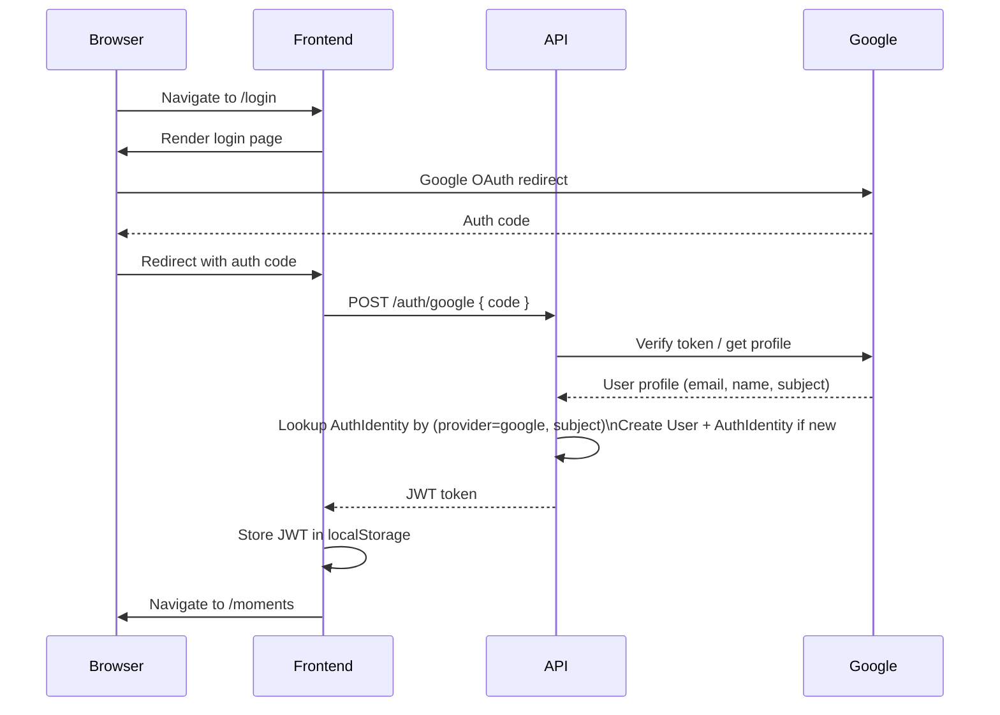

`AuthIdentities` has a unique constraint on (provider, subject). Google is the only provider in the current build. JWT is stored in `localStorage` — this is an acknowledged dev convenience that should be revisited before production hardening.

---

## Moments and Daily Deck

The Deck is the primary discovery surface. Each day, every active user receives a curated deck generated by the `DailyDeckOrchestrator`.

### Deck Generation Flow

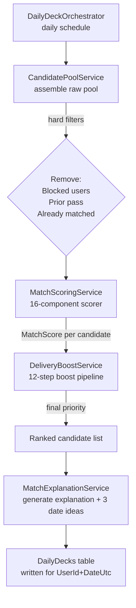

### Interaction Budget

`DailyInteractions` enforces the spark economy at the database level via CHECK constraint:
- `total_used`: 0–5 (total choices today)
- `pending_used`: 0–2 (pending EDGE matches today)

PK = (UserId, DateUtc). This prevents races in concurrent requests.

### User Choice: Magical / Resonant / Pass

When a user makes a choice on a deck card (`POST /moments/{candidateId}/choose`):
1. A `MomentResponse` record is written with `Choice = MAGICAL | LOGICAL | PASS`.
2. If MAGICAL or LOGICAL: check for a reciprocal response.
   - If reciprocal exists from the same day: create a `PURE` match → balloon pops.
   - If no reciprocal: create a `PendingMatch` with `EdgeOwnerId = current user`.
3. Behavioral signal recorded via `IMatchSignalService.RecordAsync`.
4. Spark wallet updated if applicable.

### Drawn Tab

`GET /moments/liked-you` returns the Drawn tab — candidates who chose the current user with MAGICAL or LOGICAL but whom the user has not yet seen. Acting on a Drawn candidate costs 1 spark.

---

## ECHO Matching Pipeline

ECHO is the behavioral ML pipeline that powers match quality. It has three phases running on different schedules.

### Phase 1: Signal Collection (continuous)

Every behavioral event records to `MatchSignalLogs` via `IMatchSignalService.RecordAsync(...)`. The ledger is append-only. Key event types:

| EventType | Trigger | Weight in outcome |
|---|---|---|
| `TimeToFirstMessageMs` | First message sent after match | Primary outcome proxy |
| `ChatDepthMessages` | Total messages in thread | Secondary outcome |
| `TrialContinued` | User continued after 3-min trial | Positive signal |
| `TrialEndedNoSpark` | Trial ended, no spark reason | Negative signal |
| `DateIdeaAccepted` | Date idea selected in chat | Engagement signal |
| `VoiceNoteListenComplete` | Voice note played to end | Voice engagement |
| `MutualVoiceExchange` | Both users sent + listened | Strong engagement |
| `UserFlagged` | Safety flag | Never in compatibility scoring |

### Phase 2: Outcome Scoring (nightly 03:50 UTC)

`ConnectionScoreBatchWorker` aggregates signals per (ViewerId, CandidateId) pair into a composite `ConnectionScore`. This score represents how well the connection went, normalized across signal types.

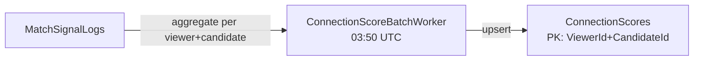

### Phase 3: Weight Learning (Sunday 04:00 UTC)

`WeightLearningBatchWorker` calls `WeightLearningService`, which runs logistic regression over `ConnectionScores` and `UserBehavioralFingerprints` to update per-user component weights in `UserMatchingWeights`.

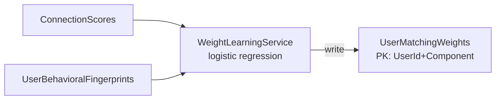

### 16-Component Scorer

`MatchScoringService` computes a `MatchScore` from 16 components. Base weights are in `appsettings.json`. Per-user weights from `UserMatchingWeights` override base weights when enough data exists. The 16 components draw on:
- Pillar embedding similarity (1536-dim cosine distance)
- Expression / writing style similarity
- Intent alignment
- Communication style compatibility
- Humor signature alignment
- Lifestyle compatibility
- Emotional rhythm alignment
- Attachment style compatibility (4-dim)
- Voice signature similarity (192-dim, when available)
- Visual preference alignment (512-dim)
- Behavioral fingerprint similarity (16-dim)
- Delivery freshness (time since last shown)
- Prior exposure counts
- Geographic proximity (when available)
- Collaborative filtering score (CfScores, when populated)
- Tile affinity (SharedTileAffinity, when CfScore is populated)

### 12-Step Delivery Boost

`DeliveryBoostService` applies a 12-step post-scoring pipeline to the ranked candidate list before writing to `DailyDecks`. This accounts for:
- Freshness (recently joined users get a temporary boost)
- Prior exposure suppression (reduce re-showing candidates seen recently)
- Delivery diversity (prevent clustering by demographic or embedding similarity)
- Other platform health signals

---

## Match State Machine

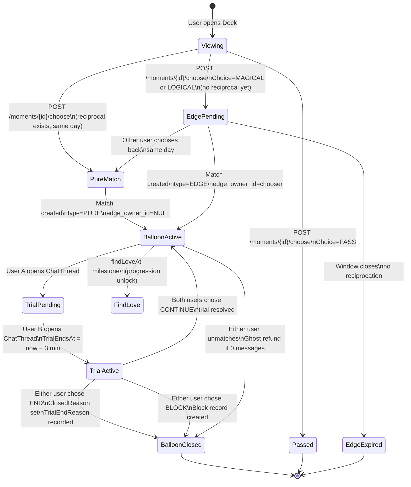

### Match Record Constraints

All enforced by PostgreSQL CHECK constraints in the migration:

| Constraint | Rule |
|---|---|
| ACTIVE state | `closed_reason IS NULL AND closed_at IS NULL` |
| CLOSED state | `closed_reason IS NOT NULL AND closed_at IS NOT NULL` |
| PURE type | `edge_owner_id IS NULL` |
| EDGE type | `edge_owner_id IS NOT NULL` |
| Time validity | `expires_at > created_at` |

These constraints make invalid match states unrepresentable in the database — no application-layer guard is needed.

---

## Trial Period System

The trial is a 3-minute window that activates when both users have opened the shared chat thread.

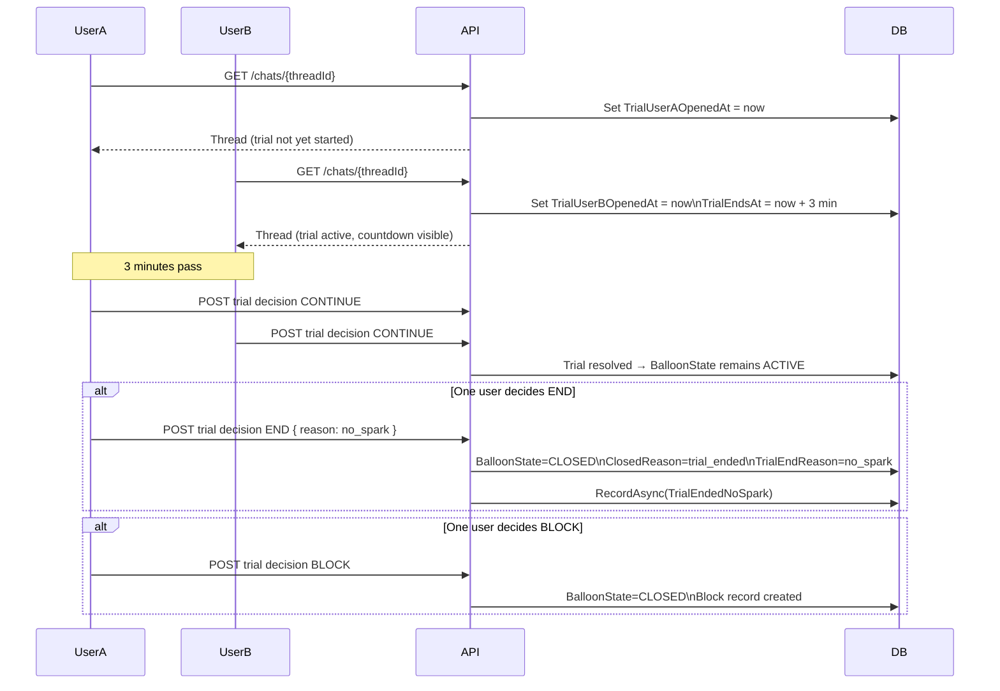

**End reasons** feed the ECHO pipeline as negative preference signals and inform the weight learner over time. The three reasons (`no_spark`, `wrong_timing`, `not_my_type`) are stored in `TrialEndReason` on the `Match` entity.

---

## Chat System

Chat threads are 1:1 between matched users. Each match has exactly one `ChatThread` (unique constraint).

### Message Types

| MessageType | Storage |
|---|---|
| `TEXT` | `Body` column |
| `VOICE` | `MetaJson = { audioUrl, durationSecs }` |

### Thread Detail Response

`GET /chats/{threadId}` returns:
- All messages in the thread
- Current match state (BalloonState, trial state)
- Generated date ideas (from `MatchExplanations`)

### Optimistic Send

The frontend appends a temporary message immediately on send, then confirms with the API response, then silently reloads the thread to reconcile order and IDs.

### Date Ideas

`MatchExplanationService` generates 3 date ideas per match using `gpt-4.1-mini`. Ideas are surfaced in the thread detail. When a user selects one (`POST /chats/{threadId}/date-interest`), a `DateIdeaAccepted` signal is recorded.

### Chat Notes

`ChatNotes` are background signal records attached to threads. They are never shown to users — they are internal signals used by the ECHO pipeline. `ChatNoteLoveReactions` and `MessageLoveReactions` are also internal signals.

---

## Voice Notes System

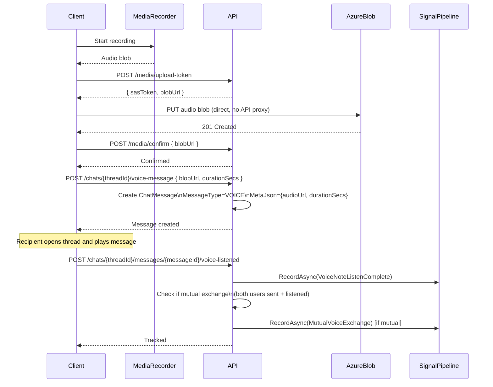

Voice notes are never proxied through the API. The 3-step upload flow (token → direct PUT → confirm) keeps API bandwidth negligible.

The `voice-listened` endpoint tracks listen-to-completion (not just play start). It auto-detects mutual exchange by checking whether both users have both sent a voice note and listened to the other's voice note in the same thread.

---

## Commons and Tile System

Commons is the content feed. Users post Tiles — individual content items in four formats: text, photo, video, or voice. The `content_type` column has a CHECK constraint enforcing `IN ('text', 'photo', 'video', 'voice')`.

### Tile Lifecycle

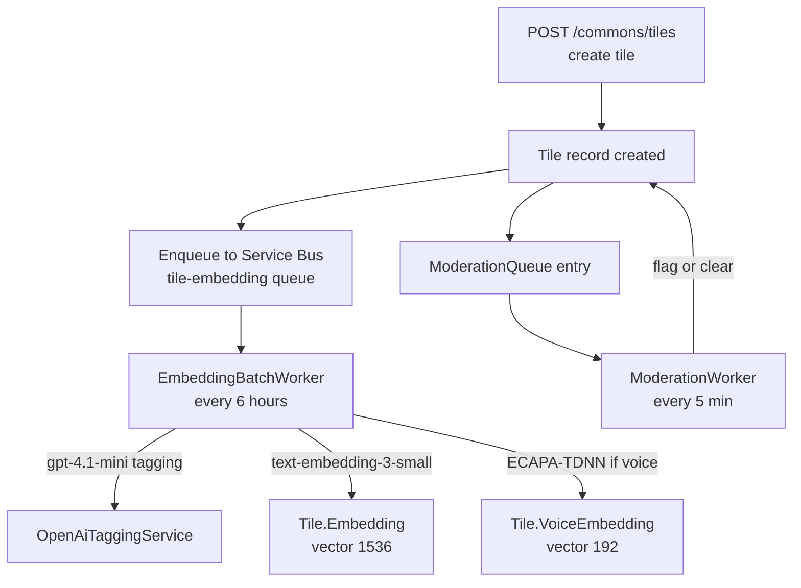

### Orbit Feature

An Orbit is an explicit ◈ action on a Tile (not a profile). When a user Orbits a tile:
1. A `TileOrbit` record is created with `relationship_type = romantic | social`.
2. `OrbitGravity` (PK = UserId+CandidateId) is upserted — aggregating orbit signal for the pair.
3. A signal is recorded for the ECHO pipeline.

### Highlights

Users can pin up to 9 tiles as Highlights (slots 1–9) on their profile. `Highlights` table with slot constraint.

### Tile Embeddings in Matchmaking

`Tile.Embedding` (1536-dim) enables semantic similarity between what users post and what other users engage with. This feeds the `SharedTileAffinity` matchmaking component — currently gated on `CfScores` data being populated (see [Known Gaps](#known-gaps-and-future-work)).

---

## Spark Economy

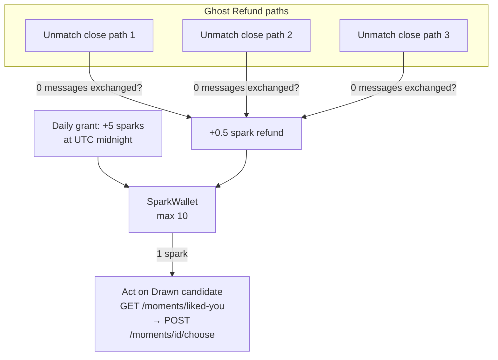

**Rules:**
- 5 sparks granted per day. Wallet maximum is 10 (sparks do not accumulate beyond 10).
- Acting on a Drawn candidate costs 1 spark.
- If a match closes (via any of the 3 unmatch paths) with zero messages exchanged, 0.5 sparks are refunded automatically.
- The ghost refund is wired to all three close paths — it cannot be missed.

`SparkWallets` has PK = UserId. Balance is updated atomically within the same transaction as the action that triggers cost or refund.

---

## AI and Game Features

### AiProfileService — Pillar Scoring

Computes personality/values pillar scores from foundational question answers. Key design decisions:
- **PairContext**: both users' pillar data is passed together into a single LLM prompt, enabling relative comparison rather than absolute scoring.
- **DataCompleteness**: a completeness metric determines when a user has enough answered questions for reliable scoring. Sparse profiles fall back to cohort distributions rather than returning null.
- **Cohort fallback**: when pillar data is too sparse, scores are drawn from cohort-level distributions for users with similar foundational answers.

### KnowMeAgent

The Know Me mini-game generates 3 questions per session:
- **Difficulty**: EASY / MEDIUM / HARD
- **Tone**: PLAYFUL / THOUGHTFUL / BALANCED
- Questions are tuned to the specific pair's match context (not generic).
- Outcomes feed `GameOutcomeService`, which records signals to the ECHO pipeline.

### RedGreenFlagAgent

The Red/Green Flag mini-game generates 3 statements per session. Users respond with:
- **GREEN** — this is a green flag for me
- **YELLOW** — neutral / depends
- **RED** — this is a red flag for me
- **DEPENDS** — context-dependent

Responses feed back as preference signals and inform the ECHO weight learner.

### MatchExplanationService

Generates the match explanation shown when a Balloon pops. Also generates 3 date ideas. Includes a tone feedback loop: after generating an explanation, the service evaluates the tone bias and may regenerate to better match the intended voice (personal, not algorithmic).

All LLM calls use `gpt-4.1-mini` via `IOpenAiResilientClient`.

---

## Embedding Architecture

```mermaid
flowchart TD
    subgraph Input Sources
        FA[Foundational Answers]
        EX[Expression / Writing Style]
        INT[Intent Statement]
        PHOTOS[Profile Photos]
        VN[Voice Notes]
        TILES[Tile Content]
    end

    subgraph Embedding Models
        OAI_E[OpenAI text-embedding-3-small\n1536-dim]
        CLIP[CLIP-style model\n512-dim]
        ECAPA[SpeechBrain ECAPA-TDNN\n192-dim]
        CUSTOM[Custom models\n4-dim / 48-dim / 64-dim / 128-dim]
        ATTACH[AttachmentProxyService\n4-dim]
    end

    subgraph Storage - UserVectors
        PIE[PillarEmbedding 1536]
        EXE[ExpressionEmbedding 1536]
        INE[IntentEmbedding 1536]
        STE[StyleEmbedding 128]
        HUE[HumorEmbedding 64]
        LFE[LifestyleEmbedding 128]
        EME[EmotionalRhythmEmbedding 48]
        APE[AttachmentProxyEmbedding 4]
        VCE[VoiceEmbedding 192]
    end

    subgraph Storage - Other Tables
        PHE[PhotoEmbeddings\nvector 512]
        UVP[UserVisualPreference\nPreference 512 + Aversion 512]
        UVoP[UserVoicePreference\nvector 192]
        TE[Tile.Embedding\nvector 1536]
        TVE[Tile.VoiceEmbedding\nvector 192]
        RPE[ReferencePhotoEmbedding\nvector 512]
    end

    FA --> OAI_E --> PIE
    EX --> OAI_E --> EXE
    INT --> OAI_E --> INE
    FA --> CUSTOM --> STE
    FA --> CUSTOM --> HUE
    FA --> CUSTOM --> LFE
    FA --> CUSTOM --> EME
    FA --> ATTACH --> APE
    VN --> ECAPA --> VCE
    PHOTOS --> CLIP --> PHE
    PHOTOS --> CLIP --> UVP
    PHOTOS --> CLIP --> RPE
    VN --> ECAPA --> UVoP
    TILES --> OAI_E --> TE
    TILES --> ECAPA --> TVE
```

HNSW indexes are added via raw SQL in migrations (pgvector must be installed on the database server; locally provided by the `pgvector/pgvector:pg16` Docker image).

---

## Trust and Moderation

### Catfish Detection

`ReferencePhotoEmbeddings` stores 512-dim CLIP-style embeddings of a user's reference photos. The trust system compares newly uploaded profile photos against the reference set. The `TrustBatchWorker` runs this comparison on Tuesdays at 02:00 UTC and updates trust scores.

`UserVerifications` records verification state per user.

### Content Moderation

Every new Tile creates a `ModerationQueue` entry. `ModerationWorker` runs every 5 minutes and processes the queue. Flagged content is held; cleared content becomes visible. `TileReports` tracks user-submitted reports.

`UserRatings` are platform-internal signals (never displayed to users).

---

## Analytics and A/B Testing

The analytics system is built on three tables:

| Table | Purpose |
|---|---|
| `AnalyticsEvents` | Raw event log for all tracked user actions |
| `AbExperiments` | Experiment definitions (name, hypothesis, variants) |
| `AbAssignments` | Per-user experiment assignments |
| `AbConversions` | Conversion events tied to experiment assignments |

`AnalyticsService` handles event recording. A/B assignment is done at request time based on `AbAssignments`; conversion tracking is event-driven via `AbConversions`.

`SecurityAuditLogs` is a separate, immutable audit trail for security-sensitive actions (auth events, data access, admin actions).

---

## Background Worker Lifecycle

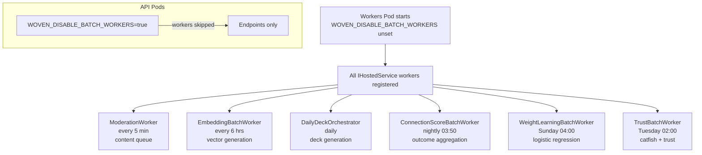

Workers share access to PostgreSQL and Redis with the API pods. Workers pod has `min=max=1` in Azure Container Apps to prevent concurrent batch execution.

---

## End-to-End: From Swipe to Conversation

This traces the complete flow from a user swiping on a candidate to having their first conversation.

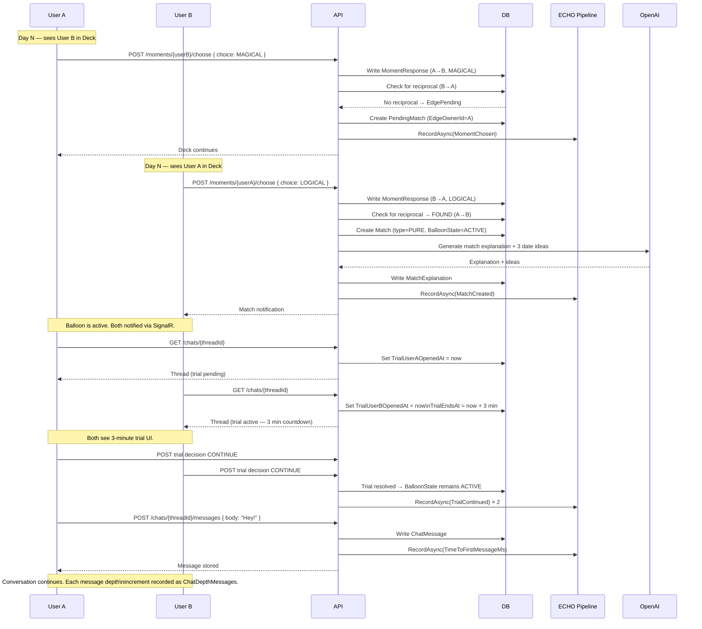

---

## Known Gaps and Future Work

These are features designed or partially built but not yet complete.

| Gap | Current State | Impact |
|---|---|---|
| Push notifications | No service worker, no VAPID, no Web Push endpoint in `NotificationService` | Users must have app open to receive match/message notifications |
| CfScore batch job | `CollaborativeFilteringService` exists; no worker triggers it | `CfScores` table stays empty; `SharedTileAffinity` matchmaking component and collaborative filtering both inactive |
| SharedTileAffinity matchmaking component | Depends on `CfScores` data | One of 16 scorer components is zero-valued for all users |
| PreferenceEmbedding from ChatNotes | Worker stub exists, not wired | ChatNote content not feeding back into preference embeddings |
| Ambition pillar coverage | No foundational question covers the Ambition pillar | Ambition-based matching has no data |
| `ChatMessages.Body` encryption | Blocked by CHECK constraint (1–1000 chars); AES-256-GCM ciphertext exceeds this | Message bodies stored in plaintext; requires schema migration to widen constraint |
| "Your Turn" chat list indicator | Designed, not built | Chat list does not distinguish whose turn it is to reply |
| Active/online indicator | Designed, not built | No presence system |
| Horoscope onboarding field | Designed, not built | No zodiac/horoscope data collected |
| SignalR backplane | Not configured | Horizontal API scaling would break realtime for users on different replicas |

---

*See also: [BACKEND_DESIGN.md](BACKEND_DESIGN.md) for detailed backend internals and entity reference, [ARCHITECTURE.md](ARCHITECTURE.md) for infrastructure topology and CI/CD.*
